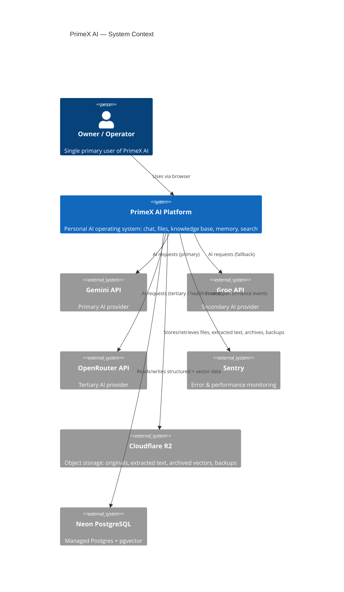
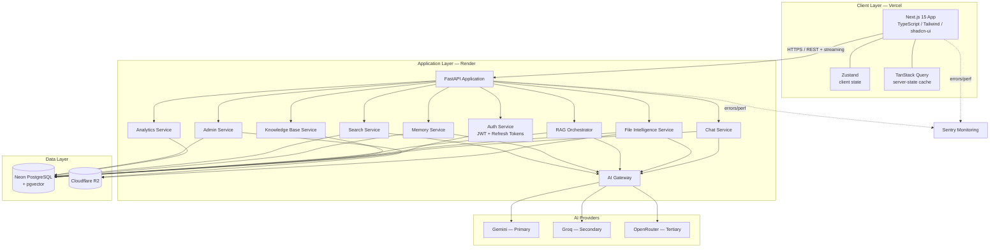
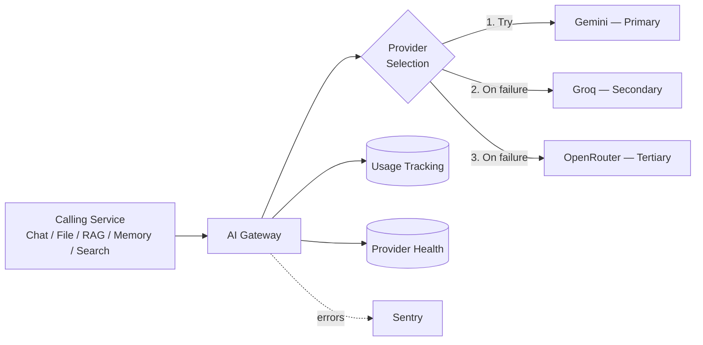
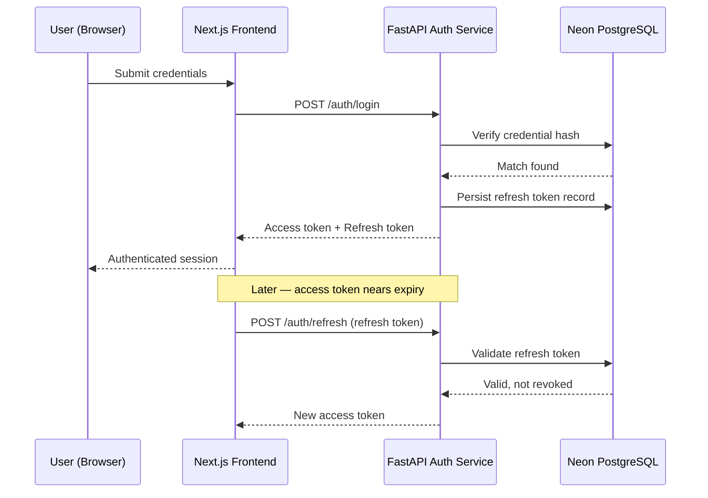
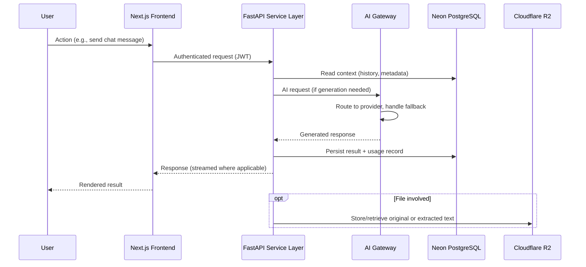
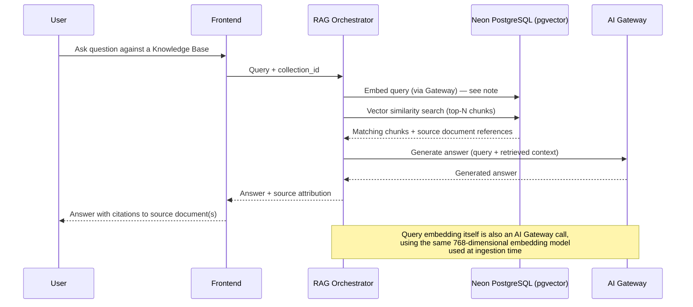
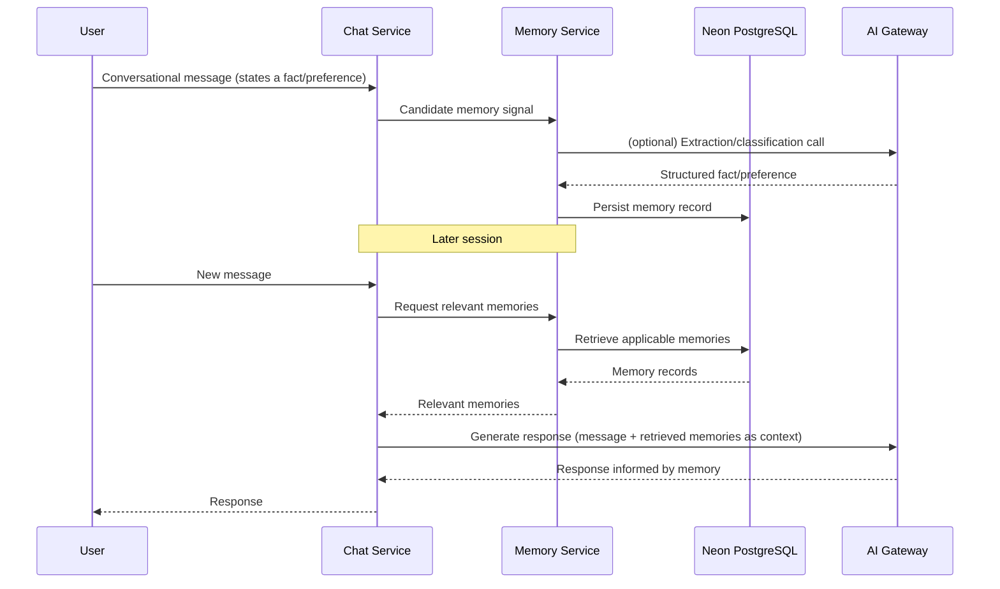
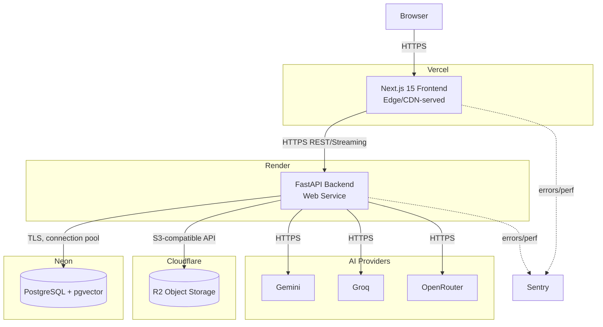

# PrimeX AI — Final Architecture

> Document 3 of 3 (core series) — Final Architecture
> Status: Draft for approval
> Source of truth: PrimeX AI Architecture Review, 01_Project_Vision.md, 02_Product_Requirements.md

---

# Executive Summary

This document is the definitive technical architecture reference for PrimeX AI. It translates the approved architecture review and the functional/non-functional requirements in `02_Product_Requirements.md` into concrete system structure: components, data flow, deployment topology, and the strategies that make the platform scalable, secure, and maintainable across a 3–5 year horizon.

No technology choice in this document deviates from the architecture review. The stack is fixed:

- **Frontend:** Next.js 15, TypeScript, Tailwind CSS, shadcn/ui, Zustand, TanStack Query
- **Backend:** FastAPI, Python, SQLAlchemy, Alembic
- **Database:** Neon PostgreSQL with pgvector
- **Storage:** Cloudflare R2
- **Deployment:** Vercel (frontend), Render (backend)
- **AI Providers:** Gemini (Primary), Groq (Secondary), OpenRouter (Tertiary) — accessed exclusively through an AI Gateway
- **Monitoring:** Sentry
- **Authentication:** JWT access tokens + refresh tokens

This document's purpose is to make that stack's *structure* explicit enough that a new developer could understand the entire platform — every component, every data flow, every deployment boundary — from this document alone.

---

# Architecture Overview

PrimeX AI is structured as three cooperating layers, consistent with the approved architecture:

1. **Client Layer** — a Next.js 15 application (deployed on Vercel) that renders the chat interface, file/knowledge-base management UI, memory views, search interface, and the admin dashboard.
2. **Application Layer** — a FastAPI backend (deployed on Render) that owns all business logic: authentication, conversation/message handling, file processing orchestration, RAG orchestration, memory management, and the AI Gateway itself.
3. **Data Layer** — Neon PostgreSQL (with pgvector) for structured/operational/active-vector data, and Cloudflare R2 for original files, extracted text, archived vectors, and database backups.

External to these three layers sit the **AI Providers** (Gemini, Groq, OpenRouter), accessed only through the AI Gateway component inside the Application Layer, and **Sentry**, which receives error/performance signals from both Client and Application layers.

This structure directly satisfies the architecture principles established in the review: **Modular Architecture** and **Separation of Concerns** (three distinct layers, each independently deployable and replaceable), **Vendor Independence** (no layer talks to an AI provider except through the Gateway), and **Cost Optimization / Free-Tier Compatibility** (every component maps to a service with a usable free tier: Vercel, Render, Neon, Cloudflare R2).

---

# System Context Diagram

**Reading this diagram:** PrimeX AI is the only system the owner interacts with directly. Every other box is a managed external dependency, each replaceable in principle without changing what the owner experiences — this is the practical expression of Vendor Independence.

---

# High-Level Architecture Diagram

---

# Frontend Architecture

The frontend is a single Next.js 15 application using the App Router, TypeScript throughout, and Tailwind CSS with shadcn/ui as the component layer.

**State management split:**
- **Zustand** owns purely client-side, ephemeral UI state — e.g., active conversation selection, sidebar/panel open state, streaming-in-progress flags.
- **TanStack Query** owns all server-derived state — conversations, messages, files, knowledge bases, memories, search history, and analytics — providing caching, background refetch, and optimistic updates against the FastAPI backend.

This split keeps the two state systems from overlapping responsibility: Zustand never caches server data, and TanStack Query never holds purely local UI state.

**Key frontend modules (mapped to functional domains in `02_Product_Requirements.md`):**

| Module | Responsibility |
|---|---|
| Auth | Login/register forms, token refresh handling, route protection |
| Chat | Conversation list, message thread, streaming response rendering |
| Files | Upload UI, file status, summary/Q&A interface |
| Knowledge Bases | Collection management, document membership, vector search UI |
| Memory | Memory list, edit/delete UI |
| Search | Search input, cited results view, search history |
| Admin Dashboard | Provider health, storage usage, error feed, usage analytics (owner-only) |

**Streaming:** Chat and other generation-backed UI consume streamed responses from FastAPI using standard fetch-based streaming (e.g., Server-Sent Events or chunked HTTP responses), rendered incrementally rather than buffered.

---

# Backend Architecture

The backend is a single FastAPI application, organized into service modules that mirror the functional domains defined in the PRD. Each service is responsible for one domain's business logic and is the only code permitted to read/write that domain's tables directly.

**Service boundaries:**

| Service | Owns | Calls Out To |
|---|---|---|
| Auth Service | users, sessions, refresh tokens | Neon PostgreSQL only |
| Chat Service | conversations, messages | Neon PostgreSQL, AI Gateway |
| File Intelligence Service | file metadata, extraction | Neon PostgreSQL, Cloudflare R2, AI Gateway |
| Knowledge Base Service | collections, document membership | Neon PostgreSQL, File Intelligence Service |
| RAG Orchestrator | chunk retrieval, context assembly | Neon PostgreSQL (pgvector), AI Gateway |
| Memory Service | memories, preferences | Neon PostgreSQL, AI Gateway |
| Search Service | search history, citations | AI Gateway |
| Analytics Service | usage aggregation (read-mostly) | Neon PostgreSQL |
| Admin Service | dashboard composition | Analytics Service, AI Gateway (health), Cloudflare R2 (storage stats) |
| AI Gateway | provider routing, fallback, usage logging | Gemini, Groq, OpenRouter |

**Why this matters for maintainability:** because every domain has exactly one owning service, a new developer (or the project owner returning after months away) can locate the code responsible for any requirement in `02_Product_Requirements.md` by its functional domain name alone — there is no cross-cutting service that silently owns pieces of multiple domains.

**ORM and migrations:** SQLAlchemy models define the schema in code; Alembic manages all schema evolution. No table is created or altered outside an Alembic migration (formalized further in `04_Database_Design.md`).

---

# Database Architecture

Neon PostgreSQL (with the pgvector extension) is the system of record for all structured, operational, and *active* vector data: Users, Chats, Messages, Memories, Metadata, Active Vectors, and Usage Tracking, per the architecture review.

pgvector stores embeddings as native vector columns, enabling similarity search via SQL rather than a separate vector database — this is a deliberate **Vendor Independence** and **Cost Optimization** decision: one managed Postgres instance serves both relational and vector workloads, avoiding the operational and financial overhead of running a dedicated vector store.

**Active vs. archived vectors:** Active vectors (currently in use by Knowledge Bases / RAG) live in Neon. Archived vectors (e.g., from deleted or long-inactive Knowledge Base content) are moved to Cloudflare R2, keeping the active pgvector index lean as the system scales — directly supporting the Scalability and Free-Tier Compatibility principles.

A full table-by-table schema is the dedicated subject of `04_Database_Design.md`; this document defines the database's *role* in the architecture, not its column-level design.

---

# Storage Architecture

Cloudflare R2 holds everything that does not need to be queried relationally or by vector similarity in its raw form:

| R2 Content | Purpose |
|---|---|
| Original Files | The exact file the user uploaded (PDF/DOCX/TXT, later ZIP/CSV/XLSX/PPTX) |
| Extracted Text | Normalized text pulled from original files — the input to summarization, Q&A, and embedding |
| Archived Vectors | Inactive/cold embeddings moved out of the active pgvector index |
| Database Backups | Periodic Neon PostgreSQL backups |

**Why this split:** storing large binary originals in Postgres would bloat the operational database and undermine free-tier sustainability. R2's low-cost, S3-compatible object storage is the correct home for anything large, infrequently queried, or write-once — while Neon remains fast and lean for the data that genuinely needs relational or vector querying.

---

# AI Gateway Architecture

The AI Gateway is the single point through which every AI request flows, regardless of which feature initiates it (Chat, File Intelligence, RAG, Memory, Search). No service holds a provider SDK dependency except the Gateway itself.

**Routing logic:**
1. Request enters the Gateway with a normalized internal request shape (prompt/context, parameters, requesting service identity).
2. The Gateway attempts the Primary provider (Gemini).
3. On a retryable failure class (timeout, rate limit, 5xx), the Gateway fails over to the Secondary provider (Groq).
4. If Secondary also fails, the Gateway fails over to the Tertiary provider (OpenRouter).
5. Every attempt — successful or not — is logged to Usage Tracking with provider, model, latency, and outcome.
6. From Phase 5 onward, routing also consults live Provider Health data to route proactively rather than purely reactively (e.g., skipping a provider already known to be degraded rather than waiting for it to fail in real time).

**Why this satisfies Vendor Independence:** adding a fourth provider, reordering priority, or removing OpenRouter entirely requires changes only inside the Gateway's routing table — zero changes to Chat, File Intelligence, RAG, Memory, or Search service code.

---

# Authentication Architecture

Authentication is JWT-based with a short-lived access token and a longer-lived refresh token, exactly as specified in the architecture review and PRD. The refresh token is the only credential persisted server-side as a revocable record, enabling logout-time invalidation without needing to track every issued access token.

**Security boundary:** the Auth Service is the only service permitted to read the `users` table's credential fields. All other services receive an already-authenticated user identity (from validated JWT claims) and never touch raw credentials.

---

# Data Flow

**General request flow (any authenticated feature):**

This single pattern — frontend → FastAPI service → (optional Gateway call) → persistence → response — governs every feature in the platform. Knowledge Bases, RAG, Memory, and Search all specialize this same shape rather than introducing a different request lifecycle.

---

# RAG Flow

**Key invariant:** the embedding model and dimension used to embed a query must match the embedding model/dimension stored against the chunks being searched (`embedding_model`, `embedding_dimension` — tracked per the architecture review's Embedding Strategy). This is what makes pgvector similarity search meaningful rather than comparing incompatible vector spaces.

---

# Memory Flow

Memory is deliberately decoupled from any single conversation: it is written once (when a fact/preference is identified) and read by *any* future conversation, which is what makes "stated once, remembered forever" (per the Vision document) possible without re-deriving facts from raw chat history every time.

---

# Deployment Architecture

**Deployment characteristics:**
- Frontend and backend are deployed and scaled independently — a frontend traffic spike does not require backend redeployment, and vice versa.
- All environment-specific configuration (provider API keys, database connection strings, R2 credentials) is injected via environment variables at the platform level (Vercel/Render), never committed to source.
- Neon's serverless Postgres model and Render's web service model are both compatible with the free-tier sustainability requirement at personal-scale usage.

---

# Scalability Strategy

| Dimension | Strategy |
|---|---|
| Conversation/message volume | Paginated retrieval (per PRD Chat System requirements); no full-history loads |
| File volume | Originals and extracted text in R2 (cheap, scalable object storage); only metadata in Postgres |
| Vector/Knowledge Base growth | Active vectors in pgvector; cold/inactive vectors archived to R2, keeping the active index performant |
| AI request volume | AI Gateway's provider abstraction allows horizontal distribution across three providers rather than bottlenecking on one |
| Backend compute | FastAPI service is stateless per-request; Render can scale the web service instance count without code changes |
| Database connections | Connection pooling (e.g., via SQLAlchemy's pool, sized for Neon's connection limits) prevents exhaustion under concurrent load |

Scalability here means "remains personal-scale-appropriate and free-tier-compatible as usage grows over years," not "ready for millions of users" — consistent with the Vision document's explicit single-owner scope.

---

# Reliability Strategy

- **AI Gateway failover** (Primary → Secondary → Tertiary) ensures a single provider outage does not constitute a platform outage.
- **Sentry monitoring** across both Frontend and Backend ensures unhandled exceptions are visible immediately rather than discovered later through user-reported symptoms.
- **Streaming response resilience**: a dropped stream preserves partial content rather than silently discarding generated output (per PRD Chat System requirements).
- **Database backups** (weekly, stored in R2 — detailed in `04_Database_Design.md`) bound the worst-case data loss window.
- **Idempotent-safe retries** at the Gateway layer ensure fallback attempts do not duplicate side effects (e.g., double-logging usage records) when a provider fails mid-response.

---

# Security Architecture

- **Authentication:** short-lived JWT access tokens, revocable long-lived refresh tokens, no plaintext credential storage.
- **Transport:** HTTPS enforced end-to-end — Browser↔Vercel, Vercel↔Render, Render↔Neon, Render↔R2, Render↔AI providers.
- **Secrets management:** provider API keys, database credentials, and R2 credentials exist only as environment variables on Render/Vercel — never in client-side bundles, never in source control.
- **Service-level data ownership:** each backend service is the only code path permitted to access its own domain's tables (see Backend Architecture), limiting the blast radius of any single service-level bug.
- **Single-owner data isolation:** even though the platform currently has one user, every table that stores user-owned data carries an owner/user reference, so the isolation model is already correct if multi-user support is ever introduced (see Future Architecture Evolution) — without requiring a retrofit.
- **Monitoring without leakage:** Sentry captures error context but is configured to exclude sensitive payload fields (credentials, tokens, raw file content) from error reports.

---

# Design Principles

Carried forward unchanged from the architecture review and Vision document, and reflected concretely in every section above:

1. **Modular Architecture** — three layers, ten backend service modules, each independently reasoned about.
2. **Separation of Concerns** — one owning service per data domain; the Gateway is the only AI-provider-aware code.
3. **Scalability** — stateless backend, pooled connections, tiered storage, provider distribution.
4. **Maintainability** — domain-aligned services map directly to PRD functional requirements.
5. **Security First** — short-lived credentials, HTTPS everywhere, scoped data access.
6. **Cost Optimization** — pgvector instead of a dedicated vector database; R2 instead of Postgres blobs.
7. **Free-Tier Compatibility** — every managed service (Vercel, Render, Neon, R2) chosen with a usable free tier.
8. **Production-Ready Design** — monitoring, backups, and failover are present from Phase 1, not retrofitted.
9. **Vendor Independence** — AI Gateway abstraction; no provider SDK leaks outside it.
10. **Future Extensibility** — "generous schema, lazy code" reflected in the deployment and service architecture: new services (Search, Admin, future Voice/Agents) attach to the same three-layer structure without altering it.

---

# Architecture Constraints

- Frontend must remain Next.js 15 / TypeScript / Tailwind / shadcn-ui / Zustand / TanStack Query.
- Backend must remain FastAPI / Python / SQLAlchemy / Alembic.
- Database must remain Neon PostgreSQL with pgvector — no separate vector database (e.g., Pinecone, ChromaDB) introduced.
- Object storage must remain Cloudflare R2.
- Deployment must remain Vercel (frontend) and Render (backend).
- All AI provider access must route through the AI Gateway — no exceptions per feature.
- No new infrastructure component (cache layer, message queue, separate search engine, etc.) is introduced unless a future architecture review explicitly justifies and approves it.

---

# Future Architecture Evolution

| Phase | Architectural Addition | Structural Impact |
|---|---|---|
| Phase 5 | Health-aware provider routing matures inside AI Gateway | Internal to Gateway; no new service boundary |
| Phase 6 | Search Service and Admin Service become fully active; Admin Dashboard composes Analytics + Gateway health + R2 storage stats | New services attach to existing FastAPI app; no layer change |
| Phase 7 | File Intelligence Service gains ZIP/CSV/XLSX/PPTX processing capability | Extends existing service; same R2/Postgres split |
| Phase 8 | Voice Service and Agent/Automation Service introduced | New services following the same service-boundary pattern as existing ones; Agent runs likely consume the AI Gateway exactly as other services do, preserving Vendor Independence |

At no point in this roadmap does the three-layer (Client / Application / Data) structure change, and at no point does an AI-provider-aware code path appear outside the Gateway. This is the architectural continuity promised in the Vision document made concrete.

---

# Architectural Tradeoffs

| Decision | Benefit | Tradeoff Accepted |
|---|---|---|
| pgvector inside Neon instead of a dedicated vector database | Lower cost, one less managed service, simpler ops | Less specialized vector-search performance tuning than a purpose-built vector DB at very large scale — acceptable given personal-scale assumption |
| Three-provider Gateway (Gemini/Groq/OpenRouter) instead of single-provider integration | Vendor independence, resilience | More routing/fallback logic to build and test than a single-provider integration |
| Storing originals/extracted text/archives in R2 rather than Postgres | Keeps Neon lean and free-tier-friendly | An extra network hop (Render↔R2) for file-heavy operations versus an all-in-one database |
| Single-owner data model (with owner references, but no current multi-tenant enforcement) | Simpler initial implementation | Future multi-user support requires additional access-control work, not just schema additions |
| FastAPI service-per-domain boundaries within one deployable app (not separate microservices) | Simpler deployment (one Render service) while keeping logical separation | Less deployment-level isolation than true microservices — acceptable at personal scale; logical modularity still achieved in code |

---

# Conclusion

PrimeX AI's final architecture is a three-layer system — Next.js client, FastAPI application, and a Neon/R2 data layer — built around one non-negotiable abstraction: the AI Gateway. Every functional domain defined in `02_Product_Requirements.md` maps to exactly one backend service, every service maps to exactly one data-ownership boundary, and every AI-provider interaction flows through exactly one routing layer.

This structure is what allows the platform to grow through all eight roadmap phases — from authentication and chat through voice and agentic automation — without architectural rework: new capability is added by attaching new services to an unchanged three-layer skeleton, not by redesigning the skeleton itself.

The next document, `04_Database_Design.md`, will take the Database Architecture and Vector Storage concepts introduced here and specify them down to the table, column, index, and migration level.

---

*End of Document 3 — 03_Final_Architecture.md*
*Awaiting approval before proceeding to Document 4: 04_Database_Design.md*
