# PrimeX AI — Database Design

> Document 4 — Database Design (Master Database Reference)
> Status: Draft for approval
> Source of truth: PrimeX AI Architecture Review, 01_Project_Vision.md, 02_Product_Requirements.md, 03_Final_Architecture.md

---

# Executive Summary

This document is the master database reference for PrimeX AI. It specifies, at the table, column, index, and migration level, the Neon PostgreSQL (with pgvector) schema that implements every functional domain defined in `02_Product_Requirements.md` and every data-layer responsibility assigned in `03_Final_Architecture.md`.

**Database goals**
- Support every approved functional domain (Authentication, Chat, AI Gateway, File Intelligence, Knowledge Bases, RAG, Memory, Search, Analytics, Monitoring) with a schema that is correct on day one and additive thereafter.
- Keep the active database lean enough to operate within Neon's free tier at personal-scale usage indefinitely.
- Make every table's purpose, growth pattern, and archival path explicit, so schema decisions made today remain understandable in year five.

**Design philosophy**
This schema follows **"generous schema, lazy code"** directly: tables and columns needed by later phases (Memory, Search, future Voice/Agents) are designed now, in full, even though the code that populates and consumes some of them ships in later phases. This avoids destructive schema rewrites at phase boundaries, at the cost of some tables sitting structurally ready but functionally idle until their phase arrives — an explicitly accepted tradeoff, not an oversight.

**Architectural alignment**
This schema implements, and does not deviate from, the Database Architecture and Storage Architecture defined in `03_Final_Architecture.md`: Neon PostgreSQL + pgvector is the system of record for structured and active-vector data; Cloudflare R2 holds originals, extracted text, archived vectors, and backups. No table in this design stores large binary content — every large or cold artifact is a pointer (`r2_object_key` or similar) into R2.

**Scalability assumptions**
- Single-owner, personal-scale usage for the 3–5 year planning horizon (per `01_Project_Vision.md`); the schema is not designed for multi-tenant scale, but every user-owned table already carries an owner reference, so it does not block that future without a redesign.
- Vector growth is the dimension most likely to threaten Neon free-tier limits over time; the Vector Storage Domain and Storage Lifecycle Strategy sections specifically address this with archival, not just indexing.
- Conversation, file, and memory volumes are expected to grow linearly and slowly (one user's accumulated activity), not explosively.

---

# Database Architecture Overview

**PostgreSQL's role:** Neon PostgreSQL is the single relational system of record for all structured, operational data — users, sessions, conversations, messages, file metadata, knowledge base structure, active vectors, memories, search history, usage tracking, and monitoring records. Every feature's "current truth" about what exists and how it relates lives here.

**pgvector's role:** pgvector is installed as a PostgreSQL extension inside the same Neon instance, not as a separate service. It provides the `vector` column type and similarity-search operators used by the Vector Storage Domain to power RAG and semantic search. There is no dedicated vector database in this architecture.

**Relationship to R2:** PostgreSQL never stores original file bytes, full extracted-text bodies for large documents, archived/cold vectors, or database backup artifacts. Each of those lives in Cloudflare R2, referenced from PostgreSQL by an object key column (e.g., `r2_object_key`, `r2_text_key`). PostgreSQL is the index and metadata layer; R2 is the bulk-content layer.

**Relationship to the AI Gateway:** The AI Gateway (in the Application Layer) is the only component that calls external AI providers, but it is also a primary *writer* into this database — every Gateway request produces a `request_logs` row (and, where applicable, a `token_usage` row), and Gateway health checks produce `provider_health` rows. The database does not call the Gateway; the Gateway calls the database.

**Relationship to FastAPI:** Every table in this document is owned by exactly one backend service, per the service-boundary table in `03_Final_Architecture.md`. SQLAlchemy models define these tables in code; no service reads or writes another service's tables directly — cross-domain data needs are satisfied by service-to-service calls, not cross-domain SQL joins initiated from the wrong service.

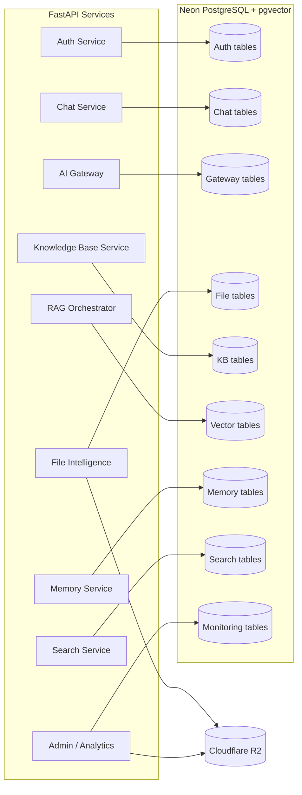

---

# Entity Relationship Diagram (ERD)

The diagram below shows every entity and its primary relationships. For readability, entity blocks show identifying and structurally significant columns only — full column definitions are in the Schema Design sections that follow. Pure system/operational tables with no direct foreign key into user-owned data (`provider_health`, `model_usage`, `provider_usage`, `vector_metadata`, `search_cache`, `system_events`, `background_jobs`) are listed but shown without relationship lines, consistent with their role as platform-level, not user-owned, records.

```mermaid
erDiagram
    USERS ||--o{ USER_SESSIONS : has
    USERS ||--o{ REFRESH_TOKENS : has
    USERS ||--o{ PASSWORD_RESET_TOKENS : has
    USERS ||--o{ EMAIL_VERIFICATION_TOKENS : has
    USERS ||--o{ CONVERSATIONS : owns
    USERS ||--o{ FILES : uploads
    USERS ||--o{ KNOWLEDGE_BASES : owns
    USERS ||--o{ MEMORIES : owns
    USERS ||--o{ SEARCH_HISTORY : performs
    USERS ||--o{ AUDIT_LOGS : generates
    USERS ||--o{ VOICE_SESSIONS : has
    USERS ||--o{ AGENT_RUNS : initiates
    USERS ||--o{ REQUEST_LOGS : initiates

    CONVERSATIONS ||--o{ MESSAGES : contains
    CONVERSATIONS ||--o| CONVERSATION_SETTINGS : configures
    CONVERSATIONS ||--o{ CONVERSATION_ARCHIVES : archived_as
    CONVERSATIONS ||--o{ MEMORIES : sources
    CONVERSATIONS ||--o{ VOICE_SESSIONS : associated_with
    MESSAGES ||--o{ MEMORIES : sources

    FILES ||--o{ FILE_VERSIONS : has
    FILES ||--o{ FILE_EXTRACTIONS : has
    FILES ||--o{ FILE_PROCESSING_JOBS : has
    FILES ||--o{ KNOWLEDGE_BASE_DOCUMENTS : referenced_by
    FILES ||--o{ DOCUMENT_CHUNKS : chunked_into

    KNOWLEDGE_BASES ||--o{ COLLECTIONS : contains
    KNOWLEDGE_BASES ||--o{ KNOWLEDGE_BASE_DOCUMENTS : contains
    KNOWLEDGE_BASES ||--o{ KNOWLEDGE_BASE_MEMBERSHIPS : has
    COLLECTIONS ||--o{ KNOWLEDGE_BASE_DOCUMENTS : groups
    COLLECTIONS ||--o{ DOCUMENT_CHUNKS : groups

    DOCUMENT_CHUNKS ||--o{ EMBEDDINGS : has

    MEMORY_CATEGORIES ||--o{ MEMORIES : categorizes
    MEMORIES ||--o{ MEMORY_SCORES : scored_by
    MEMORIES ||--o{ MEMORY_REFERENCES : referenced_in

    SEARCH_HISTORY ||--o{ SEARCH_SOURCES : cites

    REQUEST_LOGS ||--o{ TOKEN_USAGE : has

    AGENT_RUNS ||--o{ AGENT_TASKS : contains

    USERS {
        uuid id PK
        string email
        string password_hash
        bool is_active
        bool is_verified
        timestamptz created_at
    }
    CONVERSATIONS {
        uuid id PK
        uuid user_id FK
        string title
        bool is_archived
        timestamptz last_message_at
    }
    MESSAGES {
        uuid id PK
        uuid conversation_id FK
        string role
        text content
        string provider
        string model
        timestamptz created_at
    }
    FILES {
        uuid id PK
        uuid user_id FK
        string original_filename
        string r2_object_key
        string status
    }
    DOCUMENT_CHUNKS {
        uuid id PK
        uuid file_id FK
        uuid collection_id FK
        int chunk_index
        text content
    }
    EMBEDDINGS {
        uuid id PK
        uuid chunk_id FK
        string embedding_model
        int embedding_dimension
        vector vector
        bool is_active
    }
    KNOWLEDGE_BASES {
        uuid id PK
        uuid user_id FK
        string name
    }
    COLLECTIONS {
        uuid id PK
        uuid knowledge_base_id FK
        string name
    }
    MEMORIES {
        uuid id PK
        uuid user_id FK
        uuid memory_category_id FK
        text content
        bool is_active
    }
    REQUEST_LOGS {
        uuid id PK
        uuid user_id FK
        string provider
        string model
        string status
        int latency_ms
    }
```

---

# Core Database Principles

**Source of Truth philosophy.** For any given piece of content, exactly one location is authoritative, and every other copy is derived or disposable:
- The **original uploaded file**, stored in R2, is authoritative for what the user actually submitted.
- **Extracted text** (R2) is authoritative for everything downstream — summarization, chunking, embedding, Q&A. Once extraction succeeds, downstream processes never re-read the original file.
- **Active embeddings** (pgvector) are authoritative for *current* similarity search, but are explicitly not authoritative in the durable sense — see below.

**Embeddings are disposable.** An embedding is a derived artifact of extracted text plus a specific embedding model/dimension. It carries no information that cannot be regenerated from extracted text. This means: embeddings can be deleted and regenerated (re-embedding strategy, see pgvector Strategy) without data loss, embedding storage can be aggressively archived/pruned under storage pressure, and a corrupted or lost embedding is a performance incident, never a data-loss incident.

**Extracted text is authoritative.** Because embeddings are disposable but extracted text is not, extracted text is retained durably in R2 even after a file's embeddings are archived or pruned. Losing extracted text (without the original) is treated as a real data-loss event; losing only embeddings is not.

**Archival strategy.** Data moves from "hot" (Neon, actively queried) to "cold" (R2, retained but not actively indexed) along defined paths: inactive embeddings → R2 archive; old conversation data → `conversation_archives`; weekly full-database backups → R2. Archival is always a move, never a silent duplicate-and-forget — once archived, the Neon-side active copy is removed to keep the active dataset lean.

**User ownership model.** Every table that stores user-generated or user-owned content carries a direct or indirect `user_id` reference. Even though PrimeX AI currently has a single owner, this means: (1) no query pattern needs to change if multi-user support is ever introduced, and (2) the owner can always answer "what does this system store about me?" (supporting the PRD's Memory Editing and Admin Dashboard "User Data" requirements) via a consistent ownership trail rather than ad hoc joins.

---

# Schema Design

Every table in the domains below is documented with: **Purpose**, **Columns** (name, type, constraints), **Indexes**, **Relationships**, and **Expected Growth**. All tables use:
- `UUID` primary keys generated via `gen_random_uuid()` (PostgreSQL `pgcrypto`/built-in `gen_random_uuid()`), for safe client-side ID generation and merge-friendly distributed-feeling IDs without a separate ID service.
- `TIMESTAMPTZ` for all timestamps, stored in UTC.
- `created_at` on every table; `updated_at` on every mutable table, maintained via an `ON UPDATE` trigger or application-layer assignment.
- Soft-delete (`is_active` / `revoked_at` / `deleted_at`, as appropriate) preferred over hard delete for any table that supports user-facing "undo" or auditability needs (e.g., memories, sessions); hard delete used only where retention has no value (e.g., expired cache rows).

---

# Authentication Domain

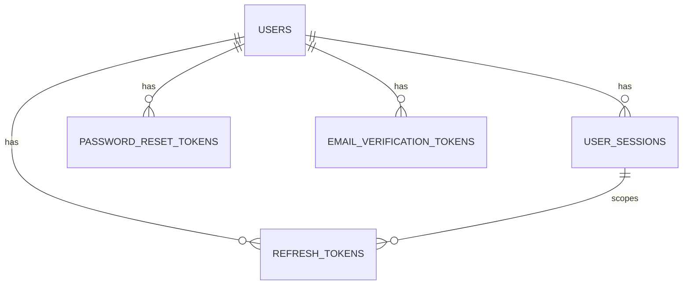

### `users`

**Purpose:** The single source of truth for account identity and credentials.

| Column | Type | Constraints |
|---|---|---|
| id | UUID | PK, default `gen_random_uuid()` |
| email | TEXT | NOT NULL, UNIQUE (case-insensitive via functional index) |
| password_hash | TEXT | NOT NULL |
| display_name | TEXT | NULL |
| is_active | BOOLEAN | NOT NULL, DEFAULT TRUE |
| is_verified | BOOLEAN | NOT NULL, DEFAULT FALSE |
| created_at | TIMESTAMPTZ | NOT NULL, DEFAULT now() |
| updated_at | TIMESTAMPTZ | NOT NULL, DEFAULT now() |
| last_login_at | TIMESTAMPTZ | NULL |

**Indexes:** unique index on `lower(email)`; index on `is_active`.
**Relationships:** parent of nearly every user-owned table in the schema (conversations, files, knowledge_bases, memories, search_history, etc.).
**Expected Growth:** one row per account. At personal scale, this table never meaningfully grows beyond a handful of rows; it is never a performance concern.

### `user_sessions`

**Purpose:** Tracks logical login sessions (device/client context), independent of the specific refresh token issued within that session — supports "log out this device" semantics distinct from "rotate this token."

| Column | Type | Constraints |
|---|---|---|
| id | UUID | PK |
| user_id | UUID | NOT NULL, FK → `users.id` |
| device_info | TEXT | NULL |
| ip_address | INET | NULL |
| user_agent | TEXT | NULL |
| created_at | TIMESTAMPTZ | NOT NULL, DEFAULT now() |
| last_active_at | TIMESTAMPTZ | NOT NULL, DEFAULT now() |
| revoked_at | TIMESTAMPTZ | NULL |

**Indexes:** index on `user_id`; index on `(user_id, revoked_at)` for "active sessions" lookups.
**Relationships:** parent of `refresh_tokens` (a session may issue multiple tokens over its life via rotation).
**Expected Growth:** low — proportional to login frequency, not usage volume. Old revoked sessions are candidates for periodic pruning (see Storage Lifecycle Strategy).

### `refresh_tokens`

**Purpose:** The only long-lived credential, stored as a hash so logout/rotation can revoke specific tokens without ever persisting a usable raw token.

| Column | Type | Constraints |
|---|---|---|
| id | UUID | PK |
| user_id | UUID | NOT NULL, FK → `users.id` |
| session_id | UUID | NULL, FK → `user_sessions.id` |
| token_hash | TEXT | NOT NULL, UNIQUE |
| issued_at | TIMESTAMPTZ | NOT NULL, DEFAULT now() |
| expires_at | TIMESTAMPTZ | NOT NULL |
| revoked_at | TIMESTAMPTZ | NULL |
| replaced_by_token_id | UUID | NULL, FK → `refresh_tokens.id` (self-referential rotation chain) |

**Indexes:** unique index on `token_hash`; index on `(user_id, revoked_at)`.
**Security Considerations:** never store a raw refresh token value; `token_hash` uses a cryptographic hash (e.g., SHA-256) of the token. Rotation chains (`replaced_by_token_id`) allow detection of refresh-token reuse after rotation — a strong signal of token theft.
**Expected Growth:** proportional to login frequency and token lifetime; expired/revoked rows are pruned periodically.

### `password_reset_tokens`

**Purpose:** Single-use, time-boxed tokens for the password-reset flow.

| Column | Type | Constraints |
|---|---|---|
| id | UUID | PK |
| user_id | UUID | NOT NULL, FK → `users.id` |
| token_hash | TEXT | NOT NULL, UNIQUE |
| expires_at | TIMESTAMPTZ | NOT NULL |
| used_at | TIMESTAMPTZ | NULL |
| created_at | TIMESTAMPTZ | NOT NULL, DEFAULT now() |

**Indexes:** unique index on `token_hash`; index on `user_id`.
**Security Considerations:** hashed at rest like refresh tokens; `used_at` enforces single use at the application layer (a used or expired token is rejected even if presented again).
**Expected Growth:** negligible at personal scale; safe to prune rows past `expires_at` after a retention window.

### `email_verification_tokens`

**Purpose:** Single-use tokens confirming control of the account's email address.

| Column | Type | Constraints |
|---|---|---|
| id | UUID | PK |
| user_id | UUID | NOT NULL, FK → `users.id` |
| token_hash | TEXT | NOT NULL, UNIQUE |
| expires_at | TIMESTAMPTZ | NOT NULL |
| verified_at | TIMESTAMPTZ | NULL |
| created_at | TIMESTAMPTZ | NOT NULL, DEFAULT now() |

**Indexes:** unique index on `token_hash`; index on `user_id`.
**Expected Growth:** negligible; pruned the same way as password reset tokens.

---

# Chat Domain

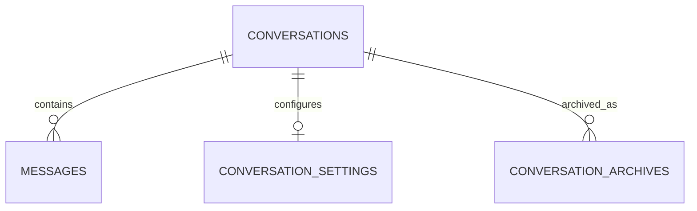

### `conversations`

**Purpose:** The top-level container for a chat thread.

| Column | Type | Constraints |
|---|---|---|
| id | UUID | PK |
| user_id | UUID | NOT NULL, FK → `users.id` |
| title | TEXT | NULL |
| is_archived | BOOLEAN | NOT NULL, DEFAULT FALSE |
| created_at | TIMESTAMPTZ | NOT NULL, DEFAULT now() |
| updated_at | TIMESTAMPTZ | NOT NULL, DEFAULT now() |
| last_message_at | TIMESTAMPTZ | NULL (denormalized for fast list-sorting) |

**Indexes:** index on `(user_id, last_message_at DESC)` for the conversation list view; index on `(user_id, is_archived)`.
**Relationships:** parent of `messages`, `conversation_settings` (1:1), `conversation_archives`.
**Expected Growth:** unbounded but slow — proportional to how many distinct chat threads the owner starts over years, not message volume.

### `messages`

**Purpose:** Individual turns within a conversation; the durable chat history.

| Column | Type | Constraints |
|---|---|---|
| id | UUID | PK |
| conversation_id | UUID | NOT NULL, FK → `conversations.id` |
| role | TEXT | NOT NULL, CHECK IN (`user`,`assistant`,`system`) |
| content | TEXT | NOT NULL |
| provider | TEXT | NULL (set for assistant messages: `gemini`/`groq`/`openrouter`) |
| model | TEXT | NULL |
| token_count | INTEGER | NULL |
| is_streaming_complete | BOOLEAN | NOT NULL, DEFAULT TRUE |
| created_at | TIMESTAMPTZ | NOT NULL, DEFAULT now() |

**Indexes:** index on `(conversation_id, created_at)` for ordered, paginated retrieval.
**Relationships:** child of `conversations`; referenced by `memories` and `memory_references` as a source.
**Retention Strategy:** retained indefinitely for active conversations; eligible for archival once the parent conversation is archived (see `conversation_archives`).
**Expected Growth:** the fastest-growing table in the Chat Domain — proportional to total conversational turns over the platform's life. Pagination (per PRD Chat System requirements) keeps any single query bounded regardless of table size.

### `conversation_settings`

**Purpose:** Per-conversation overrides (provider preference, generation parameters) distinct from platform-wide defaults.

| Column | Type | Constraints |
|---|---|---|
| id | UUID | PK |
| conversation_id | UUID | NOT NULL, UNIQUE, FK → `conversations.id` |
| preferred_provider | TEXT | NULL |
| system_prompt_override | TEXT | NULL |
| temperature | NUMERIC(3,2) | NULL |
| generation_params | JSONB | NULL |
| updated_at | TIMESTAMPTZ | NOT NULL, DEFAULT now() |

**Indexes:** unique index on `conversation_id` (enforces 1:1).
**Expected Growth:** at most one row per conversation; negligible size.

### `conversation_archives`

**Purpose:** Records that a conversation has been archived, and where its full export lives if moved out of the hot path.

| Column | Type | Constraints |
|---|---|---|
| id | UUID | PK |
| conversation_id | UUID | NOT NULL, FK → `conversations.id` |
| archived_at | TIMESTAMPTZ | NOT NULL, DEFAULT now() |
| archive_reason | TEXT | NULL |
| r2_archive_key | TEXT | NULL (pointer to a full JSON export in R2) |
| restored_at | TIMESTAMPTZ | NULL |

**Indexes:** index on `conversation_id`.
**Archival Strategy:** archiving a conversation does not immediately delete its `messages` rows; it flags the conversation and, on a scheduled job, exports the full message history to R2 (`r2_archive_key`) before optionally pruning the hot-path `messages` rows for conversations archived past a defined age threshold. `restored_at` supports re-hydrating an archived conversation back into the active table if the user reopens it.
**Expected Growth:** one row per archive event (a conversation could be archived/restored more than once over its life); negligible size.

---

# AI Gateway Domain

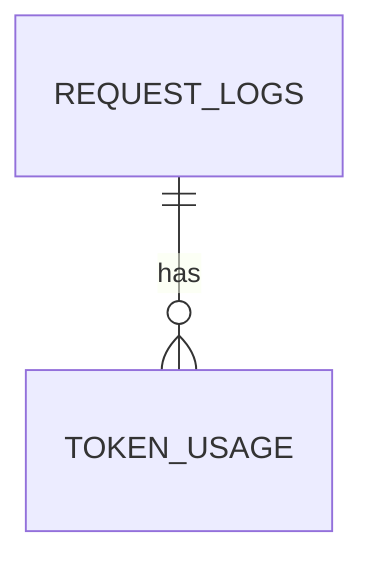

### `request_logs`

**Purpose:** The canonical per-request record of every AI Gateway call — the implementation of the architecture review's "Usage Tracking" requirement.

| Column | Type | Constraints |
|---|---|---|
| id | UUID | PK |
| user_id | UUID | NULL, FK → `users.id` |
| service_name | TEXT | NOT NULL (`chat`,`file_intelligence`,`rag`,`memory`,`search`) |
| provider | TEXT | NOT NULL (`gemini`,`groq`,`openrouter`) |
| model | TEXT | NOT NULL |
| status | TEXT | NOT NULL, CHECK IN (`success`,`failure`,`fallback_triggered`) |
| latency_ms | INTEGER | NULL |
| error_class | TEXT | NULL |
| request_metadata | JSONB | NULL (sanitized — no raw prompt/response content) |
| created_at | TIMESTAMPTZ | NOT NULL, DEFAULT now() |

**Indexes:** index on `(provider, created_at)` for health/analytics rollups; index on `(user_id, created_at)`; index on `status`.
**Usage Tracking Strategy:** every single Gateway attempt — including ones that trigger fallback — produces a row here, so fallback frequency is directly queryable rather than inferred.
**Expected Growth:** the highest-volume table in the system over time, growing with every AI request across every feature. This is the primary candidate for time-based partitioning if/when volume warrants it (see Performance Optimization Strategy).

### `token_usage`

**Purpose:** Token- and cost-level detail for a request, kept separate from `request_logs` so the high-frequency log table stays narrow.

| Column | Type | Constraints |
|---|---|---|
| id | UUID | PK |
| request_log_id | UUID | NOT NULL, FK → `request_logs.id` |
| prompt_tokens | INTEGER | NULL |
| completion_tokens | INTEGER | NULL |
| total_tokens | INTEGER | NULL |
| estimated_cost_usd | NUMERIC(10,6) | NULL |

**Indexes:** index on `request_log_id`.
**Expected Growth:** roughly 1:1 with `request_logs` rows that successfully return token data; same growth profile.

### `model_usage`

**Purpose:** Daily rollup of usage per provider/model, so Analytics queries don't need to aggregate raw `request_logs` on every dashboard load.

| Column | Type | Constraints |
|---|---|---|
| id | UUID | PK |
| provider | TEXT | NOT NULL |
| model | TEXT | NOT NULL |
| usage_date | DATE | NOT NULL |
| request_count | INTEGER | NOT NULL, DEFAULT 0 |
| total_tokens | BIGINT | NOT NULL, DEFAULT 0 |
| total_cost_usd | NUMERIC(12,4) | NOT NULL, DEFAULT 0 |

**Indexes:** unique index on `(provider, model, usage_date)`.
**Analytics Requirements:** populated by a scheduled aggregation job reading `request_logs`/`token_usage`; this is the table the Admin Dashboard's "Provider Usage" view queries directly.
**Expected Growth:** one row per provider/model/day — extremely small and bounded regardless of request volume.

### `provider_usage`

**Purpose:** Coarser daily rollup at the provider level only (no model breakdown), used for top-line health/cost views.

| Column | Type | Constraints |
|---|---|---|
| id | UUID | PK |
| provider | TEXT | NOT NULL |
| usage_date | DATE | NOT NULL |
| request_count | INTEGER | NOT NULL, DEFAULT 0 |
| success_count | INTEGER | NOT NULL, DEFAULT 0 |
| failure_count | INTEGER | NOT NULL, DEFAULT 0 |
| fallback_count | INTEGER | NOT NULL, DEFAULT 0 |
| avg_latency_ms | NUMERIC(8,2) | NULL |

**Indexes:** unique index on `(provider, usage_date)`.
**Rate Limit Tracking:** `fallback_count` against `request_count` directly shows how often a given day's traffic pushed past the Primary provider, supporting capacity/rate-limit awareness without needing provider-side dashboards.
**Expected Growth:** one row per provider/day; negligible size.

### `provider_health`

**Purpose:** Point-in-time health check results, consumed by Phase 5's health-aware routing and surfaced on the Admin Dashboard.

| Column | Type | Constraints |
|---|---|---|
| id | UUID | PK |
| provider | TEXT | NOT NULL |
| checked_at | TIMESTAMPTZ | NOT NULL, DEFAULT now() |
| is_healthy | BOOLEAN | NOT NULL |
| latency_ms | INTEGER | NULL |
| error_message | TEXT | NULL |
| consecutive_failures | INTEGER | NOT NULL, DEFAULT 0 |

**Indexes:** index on `(provider, checked_at DESC)` for "latest health" lookups.
**Provider Monitoring:** the Gateway's routing logic reads the most recent row per provider before deciding whether to route proactively away from a degraded provider (Phase 5). Older rows are retained briefly for trend display, then pruned (see Storage Lifecycle Strategy).
**Expected Growth:** proportional to health-check frequency (e.g., one row per provider per check interval); bounded by retention policy, not by usage volume.

---

# File Intelligence Domain

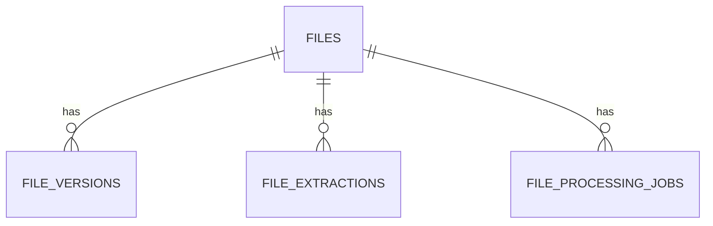

### `files`

**Purpose:** Metadata for every uploaded file; the original bytes live in R2, referenced here.

| Column | Type | Constraints |
|---|---|---|
| id | UUID | PK |
| user_id | UUID | NOT NULL, FK → `users.id` |
| original_filename | TEXT | NOT NULL |
| mime_type | TEXT | NOT NULL |
| file_size_bytes | BIGINT | NOT NULL |
| r2_object_key | TEXT | NOT NULL |
| status | TEXT | NOT NULL, CHECK IN (`uploaded`,`processing`,`extracted`,`failed`), DEFAULT `uploaded` |
| created_at | TIMESTAMPTZ | NOT NULL, DEFAULT now() |
| updated_at | TIMESTAMPTZ | NOT NULL, DEFAULT now() |

**Indexes:** index on `(user_id, created_at DESC)`; index on `status`.
**Relationships:** parent of `file_versions`, `file_extractions`, `file_processing_jobs`, `knowledge_base_documents`, `document_chunks`.
**File Lifecycle / Status Tracking:** `status` reflects the file's position in the pipeline: `uploaded` → `processing` (extraction in flight) → `extracted` (ready for summarization/Q&A/embedding) or `failed`.
**R2 Integration:** `r2_object_key` is the only pointer needed to retrieve the original; no original content is ever duplicated into Postgres.
**Expected Growth:** proportional to total files ever uploaded; grows slowly relative to messages but each row's *associated* R2 content can be large, which is precisely why it isn't stored here.

### `file_versions`

**Purpose:** Supports re-upload of an updated version of the same logical file without losing history of prior versions.

| Column | Type | Constraints |
|---|---|---|
| id | UUID | PK |
| file_id | UUID | NOT NULL, FK → `files.id` |
| version_number | INTEGER | NOT NULL |
| r2_object_key | TEXT | NOT NULL |
| created_at | TIMESTAMPTZ | NOT NULL, DEFAULT now() |
| replaced_at | TIMESTAMPTZ | NULL |

**Indexes:** unique index on `(file_id, version_number)`.
**Expected Growth:** typically 1 row per file unless the owner explicitly re-uploads a revised version; low growth.

### `file_extractions`

**Purpose:** The authoritative record of extracted text for a file/version — implements "Extracted text is authoritative" from Core Database Principles.

| Column | Type | Constraints |
|---|---|---|
| id | UUID | PK |
| file_id | UUID | NOT NULL, FK → `files.id` |
| file_version_id | UUID | NULL, FK → `file_versions.id` |
| r2_text_key | TEXT | NOT NULL (pointer to extracted text in R2) |
| extraction_method | TEXT | NOT NULL (e.g., `pdf-text`, `docx-parser`, `plain-text`) |
| character_count | INTEGER | NULL |
| status | TEXT | NOT NULL, CHECK IN (`pending`,`complete`,`failed`), DEFAULT `pending` |
| extracted_at | TIMESTAMPTZ | NULL |

**Indexes:** index on `file_id`; index on `status`.
**Processing Pipeline:** created when a `file_processing_jobs` extraction job completes; this row is what `document_chunks` ultimately derive from.
**Expected Growth:** roughly 1:1 with `file_versions`; small table relative to the text volume it points to (which lives in R2, not here).

### `file_processing_jobs`

**Purpose:** Tracks asynchronous processing work (extraction, summarization, embedding) per file, so failures are visible and retryable rather than silent.

| Column | Type | Constraints |
|---|---|---|
| id | UUID | PK |
| file_id | UUID | NOT NULL, FK → `files.id` |
| job_type | TEXT | NOT NULL (`extraction`,`summarization`,`embedding`) |
| status | TEXT | NOT NULL, CHECK IN (`queued`,`running`,`complete`,`failed`), DEFAULT `queued` |
| attempts | INTEGER | NOT NULL, DEFAULT 0 |
| last_error | TEXT | NULL |
| created_at | TIMESTAMPTZ | NOT NULL, DEFAULT now() |
| started_at | TIMESTAMPTZ | NULL |
| completed_at | TIMESTAMPTZ | NULL |

**Indexes:** index on `(status, job_type)` for worker polling; index on `file_id`.
**Expected Growth:** several rows per file (one per pipeline stage); old completed rows are pruning candidates after a short retention window.

---

# Knowledge Base Domain

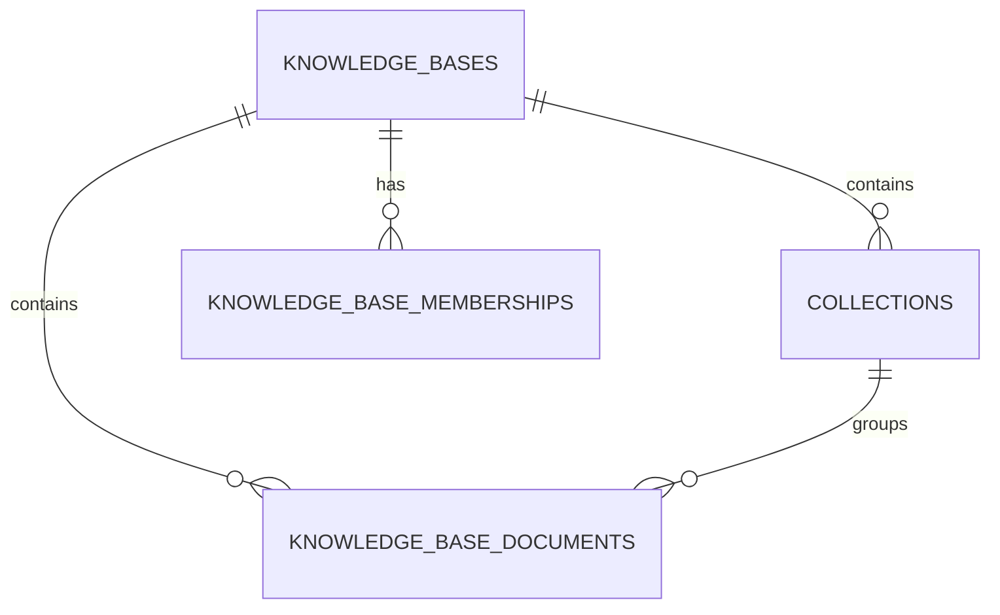

**Document Organization Strategy:** a `knowledge_base` is the top-level, user-named grouping ("Work", "Tax Records 2025"); a `collection` is an optional sub-grouping inside a knowledge base for finer organization. A `file` becomes part of a knowledge base via a `knowledge_base_documents` row, optionally placed into a specific `collection`. This two-level structure satisfies the PRD's Knowledge Base requirements (Collections, Documents, Management Operations) without requiring deep, arbitrary nesting that would overcomplicate the schema.

### `knowledge_bases`

| Column | Type | Constraints |
|---|---|---|
| id | UUID | PK |
| user_id | UUID | NOT NULL, FK → `users.id` |
| name | TEXT | NOT NULL |
| description | TEXT | NULL |
| created_at | TIMESTAMPTZ | NOT NULL, DEFAULT now() |
| updated_at | TIMESTAMPTZ | NOT NULL, DEFAULT now() |

**Indexes:** index on `user_id`.
**Expected Growth:** small — a handful to a few dozen knowledge bases per user over years, not a high-volume table.

### `collections`

| Column | Type | Constraints |
|---|---|---|
| id | UUID | PK |
| knowledge_base_id | UUID | NOT NULL, FK → `knowledge_bases.id` |
| name | TEXT | NOT NULL |
| created_at | TIMESTAMPTZ | NOT NULL, DEFAULT now() |
| updated_at | TIMESTAMPTZ | NOT NULL, DEFAULT now() |

**Indexes:** index on `knowledge_base_id`.
**Expected Growth:** low; bounded by how granularly the user chooses to organize each knowledge base.

### `knowledge_base_documents`

**Purpose:** Join table placing a `file` into a `knowledge_base` (and optionally a `collection`).

| Column | Type | Constraints |
|---|---|---|
| id | UUID | PK |
| knowledge_base_id | UUID | NOT NULL, FK → `knowledge_bases.id` |
| collection_id | UUID | NULL, FK → `collections.id` |
| file_id | UUID | NOT NULL, FK → `files.id` |
| added_at | TIMESTAMPTZ | NOT NULL, DEFAULT now() |

**Indexes:** unique index on `(knowledge_base_id, file_id)`; index on `collection_id`.
**Relationships:** a single file may belong to multiple knowledge bases (re-used across contexts) via multiple rows here, but only once per knowledge base.
**Expected Growth:** proportional to total (file × knowledge base) memberships — moderate, grows with active knowledge base usage.

### `knowledge_base_memberships`

**Purpose:** Forward-looking access table for the Future Users scenario described in `02_Product_Requirements.md` — today, every knowledge base has exactly one `owner` row here; this is what allows future sharing without a schema change.

| Column | Type | Constraints |
|---|---|---|
| id | UUID | PK |
| knowledge_base_id | UUID | NOT NULL, FK → `knowledge_bases.id` |
| user_id | UUID | NOT NULL, FK → `users.id` |
| role | TEXT | NOT NULL, CHECK IN (`owner`,`viewer`), DEFAULT `owner` |
| created_at | TIMESTAMPTZ | NOT NULL, DEFAULT now() |

**Indexes:** unique index on `(knowledge_base_id, user_id)`.
**Expected Growth:** exactly one row per knowledge base today (the owner); grows only if/when sharing is introduced.

---

# Vector Storage Domain

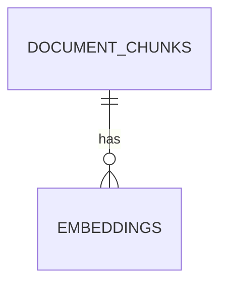

This domain implements the architecture review's Embedding Strategy (768-dimensional embeddings; store `embedding_model`, `embedding_dimension`, `created_at`) and is the most performance- and growth-sensitive part of the schema.

### `document_chunks`

**Purpose:** Retrieval-sized units of a document's extracted text — the thing RAG actually searches over and cites.

| Column | Type | Constraints |
|---|---|---|
| id | UUID | PK |
| file_id | UUID | NOT NULL, FK → `files.id` (source_document) |
| collection_id | UUID | NULL, FK → `collections.id` (denormalized for fast scoping of vector search to a collection) |
| chunk_index | INTEGER | NOT NULL |
| content | TEXT | NOT NULL |
| chunk_metadata | JSONB | NULL (e.g., page number, section heading) |
| token_count | INTEGER | NULL |
| created_at | TIMESTAMPTZ | NOT NULL, DEFAULT now() |

**Indexes:** unique index on `(file_id, chunk_index)`; index on `collection_id`.
**Relationships:** parent of `embeddings`; child of `files` and (optionally, denormalized) `collections`.
**Chunk Lifecycle:** created once per file at ingestion/embedding time; re-created (replacing prior chunks) only if extraction is redone (e.g., a corrected extraction method) — not on every query.
**Expected Growth:** the second-fastest-growing table in the schema after `request_logs` / `messages` — proportional to total ingested document volume × chunks per document. This is the table most exposed to the Vector Growth risk (see Database Risks).

### `embeddings`

**Purpose:** The actual pgvector embedding for a chunk, explicitly designed as disposable/regenerable per Core Database Principles.

| Column | Type | Constraints |
|---|---|---|
| id | UUID | PK |
| chunk_id | UUID | NOT NULL, FK → `document_chunks.id` |
| embedding_model | TEXT | NOT NULL |
| embedding_dimension | INTEGER | NOT NULL, CHECK (`embedding_dimension` = 768) |
| vector | VECTOR(768) | NOT NULL |
| is_active | BOOLEAN | NOT NULL, DEFAULT TRUE |
| created_at | TIMESTAMPTZ | NOT NULL, DEFAULT now() |

**Indexes:** HNSW index on `vector` using cosine distance (`vector_cosine_ops`); index on `(chunk_id, is_active)`.
**Relationships:** child of `document_chunks`. Multiple rows per chunk are permitted (not unique on `chunk_id`) to support re-embedding without destroying the prior embedding until the new one is verified — `is_active` marks the current one.
**Re-embedding Strategy:** see pgvector Strategy section below.
**Archival Strategy:** rows with `is_active = FALSE` older than a retention threshold are exported to R2 and deleted from Neon — this is the primary lever for keeping the active pgvector index lean (see Storage Lifecycle Strategy).
**Expected Growth:** the single largest growth risk in the database. Directly proportional to total chunks × number of embedding-model generations ever applied to them.

### `vector_metadata`

**Purpose:** A small control/registry table tracking which embedding models are in use and the state of the vector index — not a per-vector table.

| Column | Type | Constraints |
|---|---|---|
| id | UUID | PK |
| embedding_model | TEXT | NOT NULL |
| embedding_dimension | INTEGER | NOT NULL |
| index_type | TEXT | NOT NULL, DEFAULT `hnsw` |
| distance_metric | TEXT | NOT NULL, DEFAULT `cosine` |
| total_active_vectors | BIGINT | NOT NULL, DEFAULT 0 |
| last_reindexed_at | TIMESTAMPTZ | NULL |
| created_at | TIMESTAMPTZ | NOT NULL, DEFAULT now() |

**Indexes:** unique index on `(embedding_model, embedding_dimension)`.
**pgvector design:** this table is what the Admin Dashboard and any re-embedding job consult to know "what model are we currently standardized on, and how many active vectors exist" without scanning `embeddings` directly.
**Expected Growth:** effectively static — one row per distinct embedding model/dimension ever used by the platform (expected to be a small number over the platform's life).

---

# Memory Domain

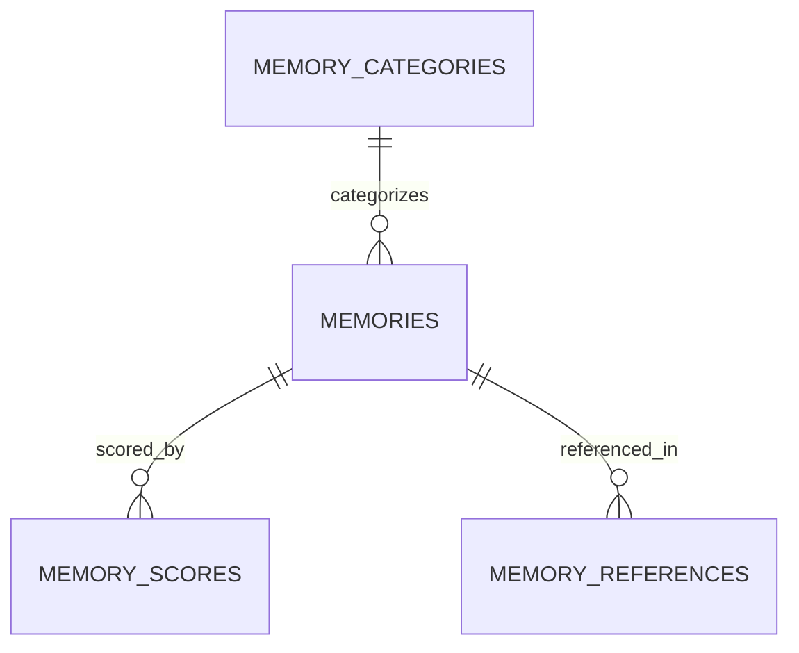

### `memories`

**Purpose:** Durable, cross-session facts and preferences about the user — the core of the Memory System.

| Column | Type | Constraints |
|---|---|---|
| id | UUID | PK |
| user_id | UUID | NOT NULL, FK → `users.id` |
| memory_category_id | UUID | NULL, FK → `memory_categories.id` |
| content | TEXT | NOT NULL |
| source_conversation_id | UUID | NULL, FK → `conversations.id` |
| source_message_id | UUID | NULL, FK → `messages.id` |
| is_active | BOOLEAN | NOT NULL, DEFAULT TRUE |
| created_at | TIMESTAMPTZ | NOT NULL, DEFAULT now() |
| updated_at | TIMESTAMPTZ | NOT NULL, DEFAULT now() |

**Indexes:** index on `(user_id, is_active)`; index on `memory_category_id`.
**Relationships:** optionally traceable back to the exact conversation/message that produced it (supporting transparency — the user can see *why* a memory exists).
**Short-term vs. Long-term memory:** short-term memory is simply recent `messages` rows within the active conversation (no separate table needed); `memories` rows are, by definition, the long-term layer — written once, read across any future conversation.
**Preference storage:** preferences are memories whose `memory_category_id` points at a `preference`-type row in `memory_categories`; no separate preferences table is needed.
**Memory Editing:** `is_active = FALSE` is the soft-delete used when a user removes a memory via the UI — content is retained briefly for audit/undo rather than hard-deleted immediately.
**Expected Growth:** slow and bounded — proportional to genuinely distinct facts/preferences accumulated about one user over years, not proportional to message volume.

### `memory_categories`

**Purpose:** A small lookup table classifying memories (e.g., `preference`, `fact`, `project_context`).

| Column | Type | Constraints |
|---|---|---|
| id | UUID | PK |
| name | TEXT | NOT NULL, UNIQUE |
| description | TEXT | NULL |

**Indexes:** unique index on `name`.
**Expected Growth:** static reference data; a handful of rows, edited rarely.

### `memory_scores`

**Purpose:** Forward-looking support for memory ranking/decay — designed now ("generous schema"), populated meaningfully once retrieval-ranking logic is built.

| Column | Type | Constraints |
|---|---|---|
| id | UUID | PK |
| memory_id | UUID | NOT NULL, UNIQUE, FK → `memories.id` |
| relevance_score | NUMERIC(5,4) | NULL |
| confidence_score | NUMERIC(5,4) | NULL |
| last_used_at | TIMESTAMPTZ | NULL |
| usage_count | INTEGER | NOT NULL, DEFAULT 0 |
| updated_at | TIMESTAMPTZ | NOT NULL, DEFAULT now() |

**Indexes:** unique index on `memory_id`.
**Future Memory Scoring:** intended to support future logic such as "prefer memories used recently/often" when assembling context for the AI Gateway, without requiring a new table when that logic is built.
**Expected Growth:** 1:1 with `memories`; negligible size.

### `memory_references`

**Purpose:** Audit trail of which conversations/messages a given memory was actually applied to — supports transparency and debugging of "why did the assistant know that?"

| Column | Type | Constraints |
|---|---|---|
| id | UUID | PK |
| memory_id | UUID | NOT NULL, FK → `memories.id` |
| conversation_id | UUID | NULL, FK → `conversations.id` |
| message_id | UUID | NULL, FK → `messages.id` |
| applied_at | TIMESTAMPTZ | NOT NULL, DEFAULT now() |

**Indexes:** index on `memory_id`; index on `conversation_id`.
**Expected Growth:** can grow quickly if every memory application is logged at high frequency; a pruning policy (retain N most recent references per memory) is recommended once volume becomes meaningful.

---

# Search Domain

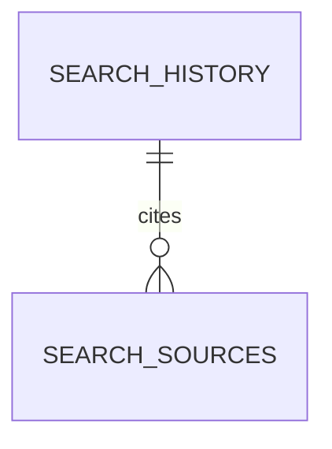

### `search_history`

**Purpose:** Persisted record of research-style queries and their generated answers.

| Column | Type | Constraints |
|---|---|---|
| id | UUID | PK |
| user_id | UUID | NOT NULL, FK → `users.id` |
| query | TEXT | NOT NULL |
| result_summary | TEXT | NULL |
| created_at | TIMESTAMPTZ | NOT NULL, DEFAULT now() |

**Indexes:** index on `(user_id, created_at DESC)`.
**Search Architecture:** the Search Service writes one row here per executed query, and one or more `search_sources` rows for the citations backing that answer.
**Expected Growth:** proportional to search usage frequency; moderate.

### `search_sources`

**Purpose:** The citation records backing a search answer — implements the PRD's Source Citations requirement at the data level.

| Column | Type | Constraints |
|---|---|---|
| id | UUID | PK |
| search_history_id | UUID | NOT NULL, FK → `search_history.id` |
| url | TEXT | NOT NULL |
| title | TEXT | NULL |
| snippet | TEXT | NULL |
| cited | BOOLEAN | NOT NULL, DEFAULT TRUE |
| position | INTEGER | NULL |

**Indexes:** index on `search_history_id`.
**Citation Storage:** stores enough to render a clickable, attributed citation in the UI without re-fetching the source at render time.
**Expected Growth:** several rows per `search_history` row; moderate, bounded by search frequency.

### `search_cache`

**Purpose:** Short-lived cache of normalized query → response, to avoid redundant provider calls for repeated/near-duplicate queries.

| Column | Type | Constraints |
|---|---|---|
| id | UUID | PK |
| query_hash | TEXT | NOT NULL, UNIQUE |
| cached_response | JSONB | NOT NULL |
| created_at | TIMESTAMPTZ | NOT NULL, DEFAULT now() |
| expires_at | TIMESTAMPTZ | NOT NULL |

**Caching Strategy:** `query_hash` is a normalized hash of the search query; rows past `expires_at` are treated as misses and are safe to hard-delete (no retention value once expired — unlike most other tables in this schema).
**Indexes:** unique index on `query_hash`; index on `expires_at` for efficient cache-eviction sweeps.
**Expected Growth:** self-limiting by design — a scheduled job deletes expired rows, keeping this table small regardless of total historical search volume.

---

# Monitoring Domain

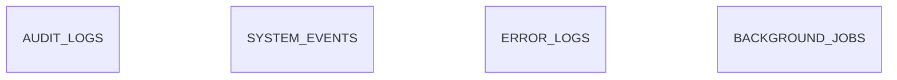

### `audit_logs`

**Purpose:** Records meaningful user/system actions for traceability (e.g., "memory deleted," "knowledge base created").

| Column | Type | Constraints |
|---|---|---|
| id | UUID | PK |
| user_id | UUID | NULL, FK → `users.id` |
| action | TEXT | NOT NULL |
| entity_type | TEXT | NOT NULL |
| entity_id | UUID | NULL |
| metadata | JSONB | NULL |
| created_at | TIMESTAMPTZ | NOT NULL, DEFAULT now() |

**Indexes:** index on `(user_id, created_at DESC)`; index on `(entity_type, entity_id)`.
**Operational Visibility:** this table answers "what changed, and when" for support/debugging purposes, distinct from `error_logs` (failures) and `system_events` (operational signals).
**Retention Strategy:** retained for a defined window (e.g., 1 year) then archived to R2 as a batch export, consistent with the platform's general archival-not-deletion bias for audit data.
**Expected Growth:** moderate — proportional to mutating actions across the whole platform.

### `system_events`

**Purpose:** Operational signals that aren't errors but are worth recording (e.g., "provider fallback triggered," "free-tier storage threshold crossed").

| Column | Type | Constraints |
|---|---|---|
| id | UUID | PK |
| event_type | TEXT | NOT NULL |
| severity | TEXT | NOT NULL, CHECK IN (`info`,`warning`,`critical`) |
| message | TEXT | NOT NULL |
| metadata | JSONB | NULL |
| created_at | TIMESTAMPTZ | NOT NULL, DEFAULT now() |

**Indexes:** index on `(severity, created_at DESC)`.
**Monitoring Strategy:** feeds the Admin Dashboard's system-health view alongside Sentry-reported errors; this table captures *application-level* signals that Sentry (designed for exceptions) isn't the natural home for.
**Expected Growth:** low to moderate; pruned on a retention window similar to `audit_logs`.

### `error_logs`

**Purpose:** A queryable record of backend errors, cross-referenced to the corresponding Sentry event.

| Column | Type | Constraints |
|---|---|---|
| id | UUID | PK |
| service_name | TEXT | NOT NULL |
| error_type | TEXT | NOT NULL |
| message | TEXT | NOT NULL |
| stack_trace | TEXT | NULL |
| sentry_event_id | TEXT | NULL |
| created_at | TIMESTAMPTZ | NOT NULL, DEFAULT now() |

**Indexes:** index on `(service_name, created_at DESC)`.
**Operational Visibility:** lets the Admin Dashboard show "recent errors" via a direct query, while `sentry_event_id` provides a one-click path to the full Sentry trace for deep debugging.
**Retention Strategy:** shorter retention window than audit logs (errors are operationally useful mainly while recent); pruned more aggressively.
**Expected Growth:** ideally low; spikes during incidents, which is itself a useful signal.

### `background_jobs`

**Purpose:** Generic tracking for any asynchronous job not already covered by `file_processing_jobs` (e.g., aggregation jobs, archival sweeps, health checks).

| Column | Type | Constraints |
|---|---|---|
| id | UUID | PK |
| job_type | TEXT | NOT NULL |
| status | TEXT | NOT NULL, CHECK IN (`queued`,`running`,`complete`,`failed`), DEFAULT `queued` |
| payload | JSONB | NULL |
| attempts | INTEGER | NOT NULL, DEFAULT 0 |
| last_error | TEXT | NULL |
| created_at | TIMESTAMPTZ | NOT NULL, DEFAULT now() |
| started_at | TIMESTAMPTZ | NULL |
| completed_at | TIMESTAMPTZ | NULL |

**Indexes:** index on `(status, job_type)`.
**Expected Growth:** proportional to scheduled-job frequency (archival sweeps, rollup jobs, health checks); old completed rows are pruning candidates.

---

# Future Expansion Tables

These tables are designed now, per "generous schema, lazy code," but are intentionally minimal — they exist to anchor Phase 8 development without overengineering speculative detail the platform doesn't need yet.

### `voice_sessions`

**Purpose:** A voice interaction session, optionally tied to an existing conversation.

| Column | Type | Constraints |
|---|---|---|
| id | UUID | PK |
| user_id | UUID | NOT NULL, FK → `users.id` |
| conversation_id | UUID | NULL, FK → `conversations.id` |
| status | TEXT | NOT NULL, DEFAULT `pending` |
| started_at | TIMESTAMPTZ | NULL |
| ended_at | TIMESTAMPTZ | NULL |
| metadata | JSONB | NULL |

**Future Usage:** populated once Phase 8 Voice capability is implemented; the `conversation_id` link means voice sessions reuse the existing Chat Domain rather than needing a parallel message model.

### `agent_runs`

**Purpose:** A single invocation of an autonomous/semi-autonomous agent.

| Column | Type | Constraints |
|---|---|---|
| id | UUID | PK |
| user_id | UUID | NOT NULL, FK → `users.id` |
| agent_type | TEXT | NOT NULL |
| status | TEXT | NOT NULL, DEFAULT `pending` |
| started_at | TIMESTAMPTZ | NULL |
| completed_at | TIMESTAMPTZ | NULL |
| result_summary | TEXT | NULL |

**Future Usage:** the parent record for Phase 8 agent activity; deliberately generic (`agent_type` as a string, not an enum) since the specific agent types are explicitly undecided per `02_Product_Requirements.md`'s Future Requirements.

### `agent_tasks`

**Purpose:** Individual steps within an agent run.

| Column | Type | Constraints |
|---|---|---|
| id | UUID | PK |
| agent_run_id | UUID | NOT NULL, FK → `agent_runs.id` |
| task_order | INTEGER | NOT NULL |
| description | TEXT | NULL |
| status | TEXT | NOT NULL, DEFAULT `pending` |
| result | JSONB | NULL |

**Future Usage:** supports step-by-step visibility into what an agent run actually did — important for trust/transparency once agents can take action, not just generate text.

### `workflow_executions`

**Purpose:** A more general automation record, for triggered workflows that aren't necessarily "agentic" in the LLM-reasoning sense (e.g., scheduled or rule-based automations).

| Column | Type | Constraints |
|---|---|---|
| id | UUID | PK |
| workflow_type | TEXT | NOT NULL |
| triggered_by | TEXT | NOT NULL (`user`,`agent`,`schedule`) |
| status | TEXT | NOT NULL, DEFAULT `pending` |
| started_at | TIMESTAMPTZ | NULL |
| completed_at | TIMESTAMPTZ | NULL |
| metadata | JSONB | NULL |

**Future Usage:** kept distinct from `agent_runs` because not every Phase 8 automation is necessarily agent-initiated — some may be simple scheduled/rule-based workflows that don't need full agent reasoning.

---

# Indexing Strategy

| Domain | Key Indexes | Rationale |
|---|---|---|
| Authentication | `users(lower(email))` unique; `refresh_tokens(token_hash)` unique; `refresh_tokens(user_id, revoked_at)` | Login and token-validation are the hottest, latency-sensitive queries in this domain |
| Chat | `conversations(user_id, last_message_at DESC)`; `messages(conversation_id, created_at)` | Conversation list and paginated message history are the two highest-frequency Chat queries |
| Files | `files(user_id, created_at DESC)`; `files(status)`; `file_processing_jobs(status, job_type)` | Supports the file list view and worker polling for pending jobs without table scans |
| Knowledge Bases | `knowledge_base_documents(knowledge_base_id, file_id)` unique; `collections(knowledge_base_id)` | Membership lookups and collection browsing are the dominant access pattern |
| Vectors | HNSW on `embeddings(vector)`; `document_chunks(file_id, chunk_index)` unique; `embeddings(chunk_id, is_active)` | Similarity search performance is the single most latency-sensitive query in the platform; HNSW trades index build time/memory for fast approximate nearest-neighbor search |
| Memory | `memories(user_id, is_active)`; `memory_references(memory_id)` | Memory retrieval must be fast since it's consulted on every chat turn that incorporates memory context |
| Search | `search_history(user_id, created_at DESC)`; `search_cache(query_hash)` unique | List view and cache-hit lookup are both point/range queries that benefit directly from these indexes |
| Monitoring | `request_logs(provider, created_at)`; `error_logs(service_name, created_at DESC)` | Analytics rollups and the Admin Dashboard's "recent activity" views both filter by these column pairs |

General rule applied throughout: every foreign key has a supporting index (PostgreSQL does not auto-index FK columns), and every "list newest first, scoped to an owner" query pattern has a matching composite index in `(owner_column, timestamp_column DESC)` order.

---

# pgvector Strategy

**Vector dimension:** fixed at **768 dimensions**, per the architecture review's Embedding Strategy. Every `embeddings.vector` column is declared `VECTOR(768)`, and `embedding_dimension` is stored redundantly as an integer column specifically so a dimension mismatch is a simple `CHECK`/application-level validation, not a silent corruption.

**Embedding storage:** one `embeddings` row per chunk per embedding generation (see Vector Storage Domain). `is_active` marks the current generation in use for retrieval; inactive generations are retained briefly, then archived (not immediately deleted), supporting safe rollback if a re-embedding pass turns out to be lower quality than expected.

**Similarity metric:** **cosine similarity**, matching the `vector_cosine_ops` operator class — the standard choice for text embeddings from contemporary embedding models, where direction (semantic similarity) matters more than raw magnitude.

**Indexing approach:** an **HNSW** (Hierarchical Navigable Small World) index on `embeddings.vector` is used rather than IVFFlat. HNSW is chosen because it supports good query performance without requiring a separate "training" step that depends on already having a representative data sample — well suited to a personal-scale corpus that grows gradually rather than arriving all at once.

**Performance expectations:** at personal-scale document/chunk volumes (thousands to low tens of thousands of active chunks, not millions), HNSW-backed cosine similarity search is expected to return top-N results well within the platform's sub-second-to-low-single-digit-second performance target for any query that includes a generation step afterward (the vector search itself is a small fraction of total RAG latency; the AI Gateway generation call dominates).

**Re-embedding strategy:** triggered when (a) the platform adopts a new embedding model/dimension, or (b) an existing embedding is found to be low-quality. Process: (1) generate new embeddings for affected chunks as new `embeddings` rows with `is_active = FALSE`; (2) validate the new embeddings (e.g., spot-check retrieval quality); (3) flip `is_active` to `TRUE` on the new rows and `FALSE` on the old rows in a single transaction per chunk; (4) archive the now-inactive old rows per the Storage Lifecycle Strategy. This ensures retrieval is never served from a half-migrated state.

**Migration strategy:** because `embedding_model` and `embedding_dimension` are stored per-row, the system can technically hold multiple embedding generations simultaneously during a migration window without ambiguity — queries always filter on `is_active = TRUE`, so an in-progress re-embedding never affects live retrieval quality.

---

# Storage Lifecycle Strategy

| Data Class | Definition | Location | Lifecycle Action |
|---|---|---|---|
| Hot Data | Actively queried: active conversations, active embeddings, current file metadata, recent logs | Neon PostgreSQL | Kept fully indexed and query-ready |
| Cold Data | Inactive but retained: archived conversations' message bodies, inactive embeddings, expired token rows past grace period | Cloudflare R2 (for bulky cold data) or pruned (for small, low-value rows like expired cache) | Exported to R2 then removed from Neon, or hard-deleted if retention has no value |
| Archive Data | Long-term retained artifacts: weekly database backups, exported conversation archives | Cloudflare R2 | Retained per backup retention policy (see Backup and Recovery Design) |

**Deletion Policy:** user-owned content (conversations, memories, files) is soft-deleted first (`is_active`/equivalent flag) to support undo, then hard-deleted only after an explicit confirmation step or a defined grace period — never deleted immediately and irreversibly from a single user action.

**Retention Policy:** operational/log-style tables (`request_logs`, `error_logs`, `audit_logs`, `provider_health`) use time-based retention windows rather than indefinite retention, since their value is highest while recent and their volume is otherwise unbounded.

**Database Size Management:** the primary lever for keeping Neon's active dataset within free-tier limits is the **embeddings archival path** (Vector Storage Domain), since vectors are the fastest-growing, most storage-dense data class relative to their row count. Secondary levers are log-table retention windows and conversation archival.

---

# Backup and Recovery Design

- **Weekly backups:** a scheduled job performs a full logical backup of the Neon PostgreSQL database on a weekly cadence.
- **R2 backup storage:** each backup artifact is written to Cloudflare R2 under a dated key (e.g., `backups/primex-db-YYYY-MM-DD.sql.gz`), consistent with R2's designated role for Database Backups in the architecture review.
- **Recovery process:** restoring from backup means provisioning (or reusing) a Neon Postgres instance and replaying the most recent (or a specifically chosen historical) backup artifact from R2.
- **Restore validation:** after any restore, a validation pass confirms row counts on a known set of critical tables (`users`, `conversations`, `files`, `knowledge_bases`) are consistent with expectations before the restored instance is treated as authoritative.
- **Disaster recovery workflow:** (1) identify the most recent known-good backup; (2) restore it to a fresh Neon instance; (3) run restore validation; (4) re-point the FastAPI backend's connection string to the restored instance; (5) reconcile any data created between the backup timestamp and the incident (acceptable data-loss window is bounded by the weekly backup cadence — a tighter cadence can be adopted later if this window proves too wide in practice).

---

# Migration Strategy

- **Alembic usage:** every schema change — new table, new column, new index, new constraint — is expressed as an Alembic migration. No manual `ALTER TABLE` is run directly against Neon outside of a committed migration.
- **Schema evolution:** because this schema is intentionally "generous" (tables for Memory, Search, and Future Expansion exist ahead of their consuming code), most future schema changes are expected to be additive (new columns, new tables) rather than destructive (dropped/renamed columns), directly supporting the Architecture Constraint that no phase reworks a prior phase's schema.
- **Versioning:** Alembic's revision chain is the single source of truth for schema version history; the deployed database's current revision is always inspectable via Alembic's version table.
- **Rollback strategy:** every migration that is reasonably reversible includes a corresponding `downgrade()` implementation; migrations that are not safely reversible (e.g., destructive data transformations) are flagged explicitly in their migration message rather than silently shipped as if reversible.
- **Zero-data-loss principles:** column removals are preceded by a deprecation period (stop writing to the column, confirm nothing reads it, only then drop it in a later migration) rather than dropped in the same migration that stops using them — giving a recovery window if a deprecation assumption turns out to be wrong.

---

# Performance Optimization Strategy

**Query optimization:** the Indexing Strategy section's composite indexes are designed specifically around this platform's actual access patterns (owner-scoped, recency-ordered lists; similarity search; status-filtered job polling) rather than generic per-column indexing.

**Connection management:** the FastAPI backend uses a managed connection pool (via SQLAlchemy) sized conservatively relative to Neon's connection limits, since Neon's serverless Postgres has a bounded connection ceiling appropriate to personal-scale, single-backend-instance usage. Render's web service is expected to run a small, bounded number of instances, keeping total pooled connections well within Neon's limits.

**Neon constraints:** Neon's free tier imposes storage and compute constraints (and connection limits) that directly inform several decisions above — the storage split with R2, embedding archival, and log-table retention windows are all chosen specifically to keep the active Neon footprint within free-tier bounds for as long as possible at personal scale.

**Expected growth patterns:** `request_logs` and `messages` are the highest-row-count tables over time; `embeddings`/`document_chunks` are the highest storage-density tables relative to row count. Both growth patterns are explicitly addressed (retention/partitioning candidacy for the former, archival for the latter) rather than left as open risks.

**Storage limits:** if/when approaching Neon's free-tier storage ceiling becomes a realistic near-term concern, the Admin Dashboard (per `02_Product_Requirements.md`'s Free-Tier Compatibility requirement) is expected to surface this *before* a hard limit is hit, using `vector_metadata.total_active_vectors` and aggregate table-size queries as its data source.

---

# Security Considerations

**Data ownership:** every user-owned table carries a `user_id` (direct or indirect via a parent table), making "show me everything this system stores about me" a tractable query rather than a forensic exercise — directly supporting the PRD's Memory Editing and Admin Dashboard "User Data" requirements.

**Encryption assumptions:** Neon PostgreSQL is assumed to provide encryption at rest as a platform-level guarantee; all client-server, server-database, and server-R2 traffic is encrypted in transit via TLS/HTTPS, per the Security Architecture in `03_Final_Architecture.md`. This schema does not implement additional application-level column encryption beyond credential hashing, since the threat model at personal scale is primarily about transport security and credential handling, not defending against a compromised database host.

**Token storage:** as detailed in the Authentication Domain, refresh tokens and password-reset/email-verification tokens are stored only as hashes, never as raw, usable values — a database compromise alone is not sufficient to hijack a session or reset a password.

**Audit requirements:** `audit_logs` provides a queryable trail of meaningful state changes; `memory_references` provides a similar trail specifically for memory usage, satisfying the transparency expectations set in the Vision and PRD documents (the user should always be able to see *why* the system behaved a certain way).

**PII handling:** `request_metadata` (in `request_logs`) and similar metadata/JSONB columns are explicitly documented as **sanitized** fields — raw prompt/response content and any incidental PII within it must not be written into these columns. Sentry integration similarly excludes sensitive payload fields, per `03_Final_Architecture.md`'s Security Architecture.

**Access control:** because every backend service owns exactly one set of domain tables (per the service-boundary model in `03_Final_Architecture.md`), database-level access can, if desired, be further restricted with per-service database roles/grants scoped to only the tables that service owns — a hardening step available without any schema change, should it be adopted later.

---

# Database Risks

| Risk | Mitigation |
|---|---|
| **Vector growth** outpaces Neon free-tier storage as Knowledge Bases grow | Embedding archival to R2 (`is_active = FALSE` rows past a retention threshold); `vector_metadata.total_active_vectors` tracked explicitly for visibility |
| **Storage growth** in high-volume log tables (`request_logs`, `messages`) | Time-based retention windows for logs; conversation archival (to R2) for chat history beyond an age threshold; partitioning candidacy flagged for `request_logs` if volume warrants |
| **Migration failures** mid-deployment leave schema in an inconsistent state | All migrations run through Alembic with reversible `downgrade()` paths where feasible; destructive changes use a deprecate-then-drop pattern across multiple migrations, never a single irreversible step |
| **Connection exhaustion** against Neon's connection ceiling | Backend-side connection pooling sized conservatively; serverless Neon's pooling-aware connection handling assumed and respected |
| **Data corruption** (application bug writes malformed data) | Foreign keys and `CHECK` constraints enforced at the database level (not application-only validation) for every status/role/category enum-like column; weekly backups bound the recovery window |
| **Retention failures** (a pruning job fails silently, log tables grow unbounded) | `background_jobs` tracks the pruning/archival jobs themselves, so a failed retention sweep is visible as a failed job, not a silent miss |
| **Re-embedding mistakes** corrupt active retrieval quality | New embeddings are written as `is_active = FALSE` and validated before being flipped active, never overwriting the currently-active embedding in place |

---

# Future Database Evolution

| Phase | Expected Schema Activity | Why No Redesign Is Needed |
|---|---|---|
| Phase 4 (Memory) | `memories`, `memory_categories`, `memory_scores`, `memory_references` move from structurally-present to actively-written | Tables already exist per "generous schema, lazy code" |
| Phase 5 (Provider Routing) | `provider_health` write frequency increases; routing logic reads it more heavily | No new tables required; existing structure already supports health-aware routing |
| Phase 6 (Search + Admin) | `search_history`, `search_sources`, `search_cache` become active; Admin Dashboard queries `model_usage`, `provider_usage`, `error_logs`, `vector_metadata` directly | All consumed tables already exist; Phase 6 is additive read/write activity, not new schema |
| Phase 7 (Extended File Types) | `files.mime_type` and `file_extractions.extraction_method` simply accept new values (ZIP/CSV/XLSX/PPTX-specific extraction methods) | Existing columns are intentionally generic (TEXT, not a hard enum) specifically to absorb new file types without a migration |
| Phase 8 (Voice, Agents) | `voice_sessions`, `agent_runs`, `agent_tasks`, `workflow_executions` move from idle to active | Tables already exist; likely additive columns (e.g., richer `metadata` fields) as concrete agent task types are defined |

Across all five years, the expectation is that schema evolution remains **additive**: new columns, new tables, new indexes — not renamed/dropped columns, not restructured relationships, and never a redesign of the Authentication, Chat, AI Gateway, File Intelligence, or Vector Storage domains established here.

---

# Conclusion

This database design implements every functional domain in `02_Product_Requirements.md` as a concrete, indexed, constraint-enforced PostgreSQL schema running on Neon with pgvector, fully aligned with the Database and Storage Architecture defined in `03_Final_Architecture.md`. No additional infrastructure — no separate vector database, no cache layer, no message queue, no document database — was introduced; every requirement is satisfied within Neon PostgreSQL (structured + vector data) and Cloudflare R2 (bulk/cold storage), exactly as the architecture review specified.

The schema's defining discipline is the consistent application of three principles across every domain: **extracted text is authoritative, embeddings are disposable**, and **every byte has exactly one source of truth**. Combined with "generous schema, lazy code," this is what allows the eight-phase roadmap — from Authentication through Voice and Agents — to be built as a sequence of additive changes against this one schema, rather than a sequence of schema redesigns.

A developer implementing PrimeX AI from this document alone has everything needed: every table, every column, every index, every relationship, every archival path, and every growth expectation for the platform's first 3–5 years.

---

*End of Document 4 — 04_Database_Design.md*
*This completes the core documentation set requested. Let me know if you'd like any section revised, or if you'd like to proceed to additional documentation (e.g., API design, deployment runbooks).*
