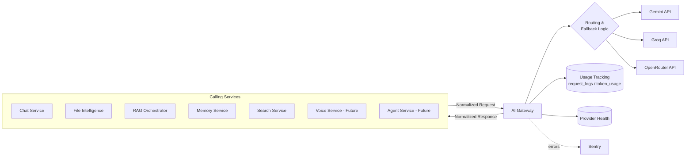
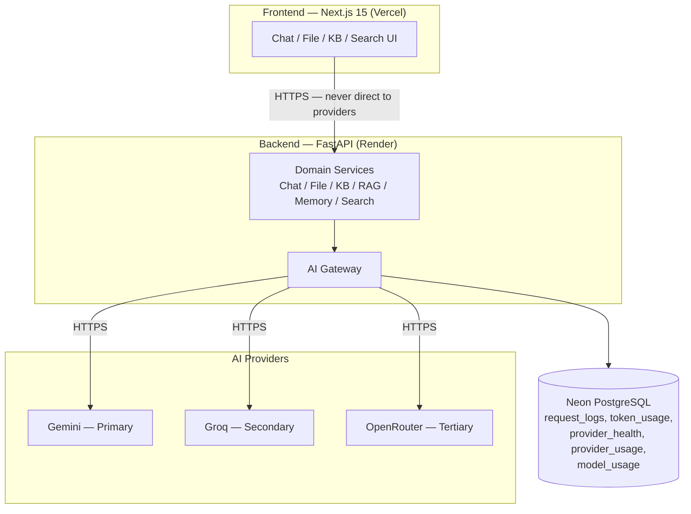
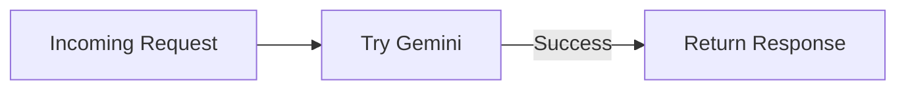
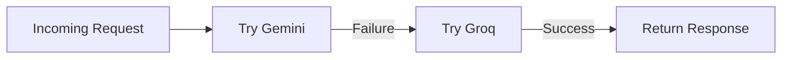
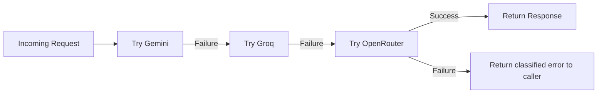
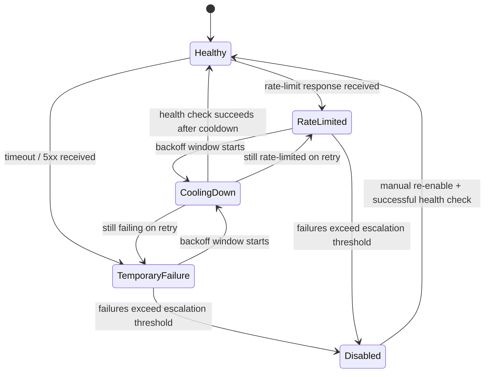
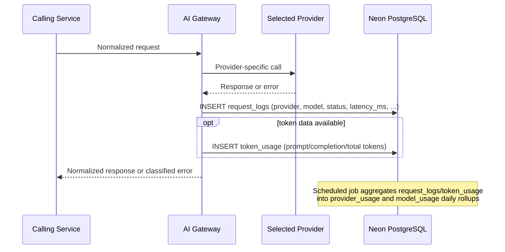

# PrimeX AI — AI Gateway Design

> Document 5 — AI Gateway Design (Master AI Interaction Reference)
> Status: Draft for approval
> Source of truth: PrimeX AI Architecture Review, 01_Project_Vision.md, 02_Product_Requirements.md, 03_Final_Architecture.md, 04_Database_Design.md

---

# Executive Summary

**Purpose of the AI Gateway.** The AI Gateway is the single component in PrimeX AI permitted to communicate with an external AI provider. Every feature that needs generation, embedding, summarization, or document analysis — Chat, File Intelligence, Knowledge Bases, RAG, Memory, Search, and the future Voice and Agent capabilities — calls the Gateway, never a provider SDK directly.

**Architectural role.** The Gateway sits inside the Application Layer (per `03_Final_Architecture.md`), between PrimeX AI's domain services and three external providers: Gemini (Primary), Groq (Secondary), and OpenRouter (Tertiary). It is simultaneously a router, a fallback engine, a usage/cost ledger, and a health monitor — but to every calling service, it presents one interface and hides all of that complexity.

**Why provider abstraction exists.** Three principles from the architecture review make this non-negotiable: **Vendor Independence** (no single AI vendor's outage, pricing change, or deprecation should be able to take down the platform or force an application-wide rewrite), **Cost Optimization** (provider selection should be a routing decision, not a re-engineering project), and **Future Extensibility** (a fourth provider, a local model, or a new capability should be addable inside the Gateway without touching Chat, File Intelligence, RAG, Memory, or Search code). This document is the master reference for how that abstraction is built and operated, for the next 3–5 years.

---

# AI Gateway Overview

**Centralized architecture.** Exactly one backend module owns all provider communication. This is enforced architecturally, not just by convention: no service other than the Gateway holds a provider API key, imports a provider SDK, or constructs a provider-specific request payload.

**Request lifecycle.** Every AI interaction in PrimeX AI follows the same shape:

1. A calling service (Chat, File Intelligence, RAG, Memory, Search, or — in the future — Voice/Agents) builds a **normalized internal request** (a provider-agnostic shape: messages/context, parameters, requesting feature, requesting user).
2. The Gateway receives the normalized request and selects a provider per the Routing Logic (below).
3. The Gateway translates the normalized request into that provider's API shape, sends it, and receives a provider-specific response.
4. The Gateway translates the response back into a **normalized internal response** and returns it to the calling service.
5. The Gateway logs the attempt (success, failure, or fallback) to Usage Tracking, regardless of outcome.

**System responsibilities.** Per the architecture review and `02_Product_Requirements.md`, the Gateway owns: Provider Selection, Routing, Fallback Logic, Rate Limit Handling, Usage Tracking, Error Handling, Health Monitoring, Token Accounting, Request Logging, and Future Model Expansion. Nothing in this list is delegated to a calling service.



---

# Gateway Design Principles

| Principle | How the Gateway Implements It |
|---|---|
| **Provider Independence** | All provider-specific code lives behind one internal interface (Provider Abstraction Layer, below); calling services never see provider identity except as metadata |
| **Separation of Concerns** | The Gateway only routes, translates, logs, and monitors — it contains no feature-specific business logic (e.g., it doesn't know what a "Knowledge Base" is; it only knows it received a normalized request from the RAG Orchestrator) |
| **Reliability** | Automatic fallback across three independent providers; no single provider failure is a platform failure |
| **Cost Optimization** | Routing decisions can account for cost/quota state, not just availability; Usage Tracking makes cost visible per provider/model/feature |
| **Free-Tier Compatibility** | Designed to operate within Gemini/Groq/OpenRouter free or low-cost tiers at personal-scale usage, with quota-awareness built into routing rather than discovered via failed requests alone |
| **Future Extensibility** | A new provider is added by implementing the same Provider Interface and registering it in the routing table — no other code changes |

---

# High-Level Architecture



**The non-negotiable boundary in this diagram:** the Frontend has no arrow to Providers, and Domain Services have no arrow to Providers — only the Gateway does. This is enforced by never issuing provider API keys to the frontend build or to any service module outside the Gateway package.

---

# Provider Abstraction Layer

Every provider integration implements the same internal interface. This is what makes routing, fallback, and future provider addition possible without touching calling-service code.

```python
class AIProvider(Protocol):
    """Common interface every provider integration must implement."""

    async def chat(
        self,
        messages: list[NormalizedMessage],
        params: GenerationParams,
    ) -> NormalizedChatResponse:
        """Conversational / generation requests (Chat, Summarization, RAG answer generation)."""
        ...

    async def embed(
        self,
        text: str,
        model: str | None = None,
    ) -> NormalizedEmbeddingResponse:
        """Returns a 768-dimensional embedding vector for the given text."""
        ...

    async def health_check(self) -> ProviderHealthStatus:
        """Lightweight liveness/latency probe used by Provider Health Monitoring."""
        ...

    async def count_tokens(
        self,
        text: str,
        model: str | None = None,
    ) -> int:
        """Returns a token count estimate for the given text under this provider's tokenizer."""
        ...

    async def summarize(
        self,
        text: str,
        params: GenerationParams,
    ) -> NormalizedChatResponse:
        """Convenience method for File Intelligence summarization; may be a thin wrapper over chat()."""
        ...

    async def analyze_document(
        self,
        extracted_text: str,
        instructions: str,
        params: GenerationParams,
    ) -> NormalizedChatResponse:
        """Document Q&A / analysis requests grounded in extracted file text."""
        ...
```

**Why all providers must implement the same interface.** The Gateway's routing logic calls `chat()`, `embed()`, etc. on whichever provider it has selected, without knowing or caring which provider that is. If Gemini's client exposed a different method signature than Groq's, every fallback path would need provider-specific branching throughout the Gateway — exactly the tight coupling the architecture review prohibits. A uniform interface means the Gateway's routing code is written once, against the interface, and provider-specific translation logic is isolated entirely inside each provider's own implementation of that interface.

**Normalized types** (`NormalizedMessage`, `GenerationParams`, `NormalizedChatResponse`, `NormalizedEmbeddingResponse`, `ProviderHealthStatus`) are defined once, in the Gateway package, and are the only request/response shapes calling services ever see.

---

# Gemini Integration

**Responsibilities:** default provider for all request types — chat generation, summarization, document analysis, and embedding generation (768-dimensional).

**Supported Models:** the current generation Gemini chat/generation model and Gemini's embedding model, configured by name (not hardcoded inline) so model upgrades are a configuration change, not a code change.

**Request Flow:** normalized request → Gemini-specific payload translation → Gemini API call → response translated back to normalized shape → Usage Tracking write.

**Error Handling:** Gemini-specific error responses (rate limit, quota exhaustion, malformed-request, 5xx) are classified into the Gateway's shared error taxonomy (Error Handling Strategy, below) so the routing layer can decide retry-vs-fallback without needing Gemini-specific branching outside the Gemini provider module.

**Usage Tracking:** every Gemini call — successful or not — produces a `request_logs` row with `provider = 'gemini'`, plus a `token_usage` row when token data is available.

**Strengths:** strong general-purpose generation quality; native multimodal/document handling well suited to File Intelligence and RAG answer generation; a single vendor for both chat and embedding requests simplifies the common path.

**Limitations:** as the Primary provider, Gemini is the first to absorb personal-scale usage volume, making it the most exposed to free-tier rate limits during heavy usage days — precisely why Secondary/Tertiary fallback exists.

---

# Groq Integration

**Responsibilities:** Secondary provider; activated automatically whenever Gemini fails or is rate-limited.

**Fallback Role:** Groq's defining role in this architecture is speed-oriented fallback — when invoked, the user-visible impact of a Gemini failure should be latency, not an error message.

**Supported Models:** a fast-inference open-weight chat/generation model (configured by name), used primarily for `chat()`, `summarize()`, and `analyze_document()` fallback calls.

**Request Flow:** identical shape to Gemini's — normalized request → Groq-specific translation → Groq API call → normalized response — invoked only after the routing layer has already determined Gemini is unavailable for this request.

**Error Handling:** Groq errors are classified into the same shared error taxonomy as Gemini; a Groq failure triggers escalation to OpenRouter rather than surfacing an error to the user.

**Usage Tracking:** every Groq call produces a `request_logs` row with `provider = 'groq'` and `status = 'fallback_triggered'` (since, by definition, Groq is only invoked after a Gemini attempt failed) plus the corresponding `token_usage` row.

**Strengths:** very low latency, making it an excellent fallback that doesn't visibly degrade the user experience; strong free-tier characteristics suited to occasional fallback traffic rather than primary-volume traffic.

**Limitations:** Groq does not serve as the platform's embedding provider in the current design — `embed()` calls remain routed to Gemini's embedding model (or, if Gemini is unavailable for embedding specifically, escalate per the same routing logic) to preserve a single consistent 768-dimensional embedding space; Groq's model selection is narrower than Gemini's broader multimodal capability set.

---

# OpenRouter Integration

**Responsibilities:** Tertiary, last-resort provider; also the platform's path to model diversity without adding a fourth direct integration, since OpenRouter itself fronts many underlying models.

**Last-Resort Provider:** invoked only when both Gemini and Groq have failed for a given request — the escalation path of last resort before the Gateway returns an error to the calling service.

**Supported Models:** a configured default model accessed through OpenRouter's unified API; because OpenRouter itself is a multi-model router, this integration can be pointed at a different underlying model via configuration without a new provider integration.

**Request Flow:** same normalized-request shape as Gemini/Groq, translated to OpenRouter's API format; invoked by the routing layer only at the escalation stage.

**Error Handling:** OpenRouter errors are classified into the same shared taxonomy; an OpenRouter failure (the final fallback tier) results in the Gateway returning a clearly classified error to the calling service, which is responsible for presenting an appropriate message to the user.

**Usage Tracking:** every OpenRouter call produces a `request_logs` row with `provider = 'openrouter'` and `status = 'fallback_triggered'`, plus `token_usage` where available.

**Strengths:** acts as a safety net independent of Gemini's and Groq's specific infrastructure; its own multi-model routing gives PrimeX AI indirect access to model diversity for future evaluation (see Future Expansion Strategy) without a fourth direct integration.

**Limitations:** as a router itself, OpenRouter introduces an additional hop versus a direct provider integration, and its available models/pricing depend on upstream provider terms it doesn't control — acceptable for its intended last-resort role, not intended as primary-volume traffic.

---

# Routing Logic

**Normal Flow:**



**Fallback Flow:**



**Escalation Flow:**



**Combined routing decision table:**

| Step | Provider Tried | On Success | On Failure |
|---|---|---|---|
| 1 | Gemini (Primary) | Return response; log `success` | Log `failure`; proceed to step 2 |
| 2 | Groq (Secondary) | Return response; log `fallback_triggered` (success) | Log `failure`; proceed to step 3 |
| 3 | OpenRouter (Tertiary) | Return response; log `fallback_triggered` (success) | Log `failure`; return classified error to caller |

**Phase 1 vs. Phase 5 behavior:** in Phase 1, this routing is purely *reactive* — each tier is only tried after the prior tier actually fails on this specific request. From Phase 5 onward, the router additionally consults live **Provider Health** state (below) before attempting a tier, allowing it to skip a tier already known to be degraded (proactive routing) rather than always paying the latency cost of a doomed attempt. The three-tier order itself (Gemini → Groq → OpenRouter) is unchanged by this enhancement — only *when* each tier is attempted becomes smarter.

---

# Provider Health Monitoring

**Provider states:**

| State | Meaning |
|---|---|
| **Healthy** | Recent requests succeeding within normal latency bounds |
| **Rate Limited** | Provider is actively rejecting requests due to quota/rate-limit responses |
| **Temporary Failure** | Recent requests failing (timeouts, 5xx) but not specifically rate-limit-classified |
| **Cooling Down** | Provider was previously Rate Limited/Temporary Failure and is in a deliberate back-off window before being retried |
| **Disabled** | Manually or automatically taken out of rotation entirely (e.g., persistent failures well beyond normal cooldown, or an operator-initiated disable) |



**Transition logic:** every provider attempt (success or failure) updates that provider's current state via a `provider_health` row (per `04_Database_Design.md`). A single failure moves a provider from `Healthy` toward `RateLimited`/`TemporaryFailure`; `consecutive_failures` crossing a defined threshold moves it to `Disabled`, requiring either a successful health check or manual intervention to recover. `CoolingDown` is a deliberate, time-boxed state — the Gateway does not retry a cooling-down provider until its cooldown window elapses, even if a request arrives during that window (it routes directly to the next tier instead).

---

# Rate Limit Strategy

| Concern | Strategy |
|---|---|
| **Quota Tracking** | Per-provider daily/periodic quota consumption is tracked via `provider_usage` rollups (request counts) and `model_usage` rollups (token counts), giving both a count-based and token-based view of quota pressure |
| **Request Counting** | Every Gateway attempt increments the relevant day's `provider_usage.request_count`, regardless of outcome |
| **Token Tracking** | `token_usage` records prompt/completion/total tokens per request; `model_usage` aggregates these daily per provider/model |
| **Provider Limits** | Each provider's known rate/quota limits are held in Gateway configuration (not hardcoded inline), so limit changes are a configuration update |
| **Fallback Triggers** | A rate-limit-classified error response from the active provider is itself a fallback trigger — the Gateway does not need to predict the limit in advance to react correctly |
| **Cooldown Strategy** | A provider entering `RateLimited` or `TemporaryFailure` starts a `CoolingDown` window (duration configurable per provider/error type) before it is attempted again |
| **Daily Usage Tracking** | `provider_usage(provider, usage_date)` is the canonical "how much of today's quota have we likely used" view, consulted by both the Admin Dashboard and, from Phase 5, the routing layer itself |

---

# Usage Tracking Architecture

The Gateway's usage tracking is implemented entirely by the tables already defined in `04_Database_Design.md` — this section documents how the Gateway *populates and uses* them, not a new schema.

| Tracked Dimension | Captured In |
|---|---|
| Timestamp | `request_logs.created_at` |
| Provider | `request_logs.provider` |
| Model | `request_logs.model` |
| Tokens | `token_usage.prompt_tokens` / `completion_tokens` / `total_tokens` |
| Latency | `request_logs.latency_ms` |
| Request Type (feature) | `request_logs.service_name` (`chat`, `file_intelligence`, `rag`, `memory`, `search`) |
| Response Status | `request_logs.status` (`success` / `failure` / `fallback_triggered`) |
| Error Type | `request_logs.error_class` |
| User | `request_logs.user_id` |
| Conversation | carried in `request_logs.request_metadata` (sanitized) where the request originated from a specific conversation, joined back via the calling service's own conversation reference |



**Why a request-level log plus daily rollups:** `request_logs`/`token_usage` give full per-request fidelity (needed for debugging and audit), while `provider_usage`/`model_usage` give cheap, pre-aggregated reads for the Admin Dashboard and Analytics — exactly the split already established in the Database Design.

---

# Error Handling Strategy

| Error Class | Examples | Gateway Behavior |
|---|---|---|
| **Provider Errors** | Malformed request rejected by provider, invalid API key, model not found | Logged with specific `error_class`; generally non-retryable — surfaced after exhausting fallback tiers |
| **Timeouts** | Provider does not respond within the configured timeout window | Retryable — triggers fallback to the next tier |
| **Network Failures** | DNS/connection failures reaching a provider | Retryable — triggers fallback to the next tier |
| **Quota Exhaustion** | Rate-limit / quota-exceeded responses | Retryable via fallback; also transitions the provider's health state toward `RateLimited` |
| **Malformed Responses** | Provider returns a response that fails schema validation during normalization | Treated as a provider error for this attempt; triggers fallback rather than propagating an unparseable response to the caller |

**Retry Policies:** within a single tier, a small number of immediate retries (for transient network blips) are attempted before that tier is considered failed for this request; this is distinct from cross-tier fallback, which happens after a tier's retries are exhausted.

**Fallback Logic:** implemented exactly as described in Routing Logic — Gemini → Groq → OpenRouter, with every transition logged. Fallback is always attempted before an error is returned to the calling service; the calling service only ever sees an error after all three tiers have been exhausted.

---

# Token Accounting

| Breakdown | Source |
|---|---|
| **Input (prompt) tokens** | `token_usage.prompt_tokens`, summed per request |
| **Output (completion) tokens** | `token_usage.completion_tokens`, summed per request |
| **Total tokens** | `token_usage.total_tokens` |
| **Per Provider** | `model_usage`/`provider_usage` grouped by `provider` |
| **Per User** | `request_logs.user_id` joined to `token_usage` (meaningful primarily if/when multi-user support is introduced; trivially "the owner" today) |
| **Per Conversation** | derivable via the calling Chat Service's own conversation reference, correlated through `request_metadata` |
| **Per Feature** | `request_logs.service_name` joined to `token_usage` |

**Analytics requirements:** the Admin Dashboard's "Provider Usage" and "Analytics" views (per `02_Product_Requirements.md`) are expected to query `model_usage` and `provider_usage` directly for performance, falling back to `request_logs`/`token_usage` only for detailed, non-aggregated investigation (e.g., debugging a specific failed request).

---

# Embedding Gateway Design

**Embedding Model:** a single configured embedding model is the platform standard at any given time, producing **768-dimensional** vectors, per the architecture review's Embedding Strategy and the Vector Storage Domain in `04_Database_Design.md`.

**768-Dimension Strategy:** the Gateway's `embed()` method always returns a vector tagged with `embedding_model` and `embedding_dimension`, and the Gateway validates that `embedding_dimension == 768` before returning — a dimension mismatch is treated as a Gateway-level error, not silently passed through to pgvector (which would reject it anyway).

**Embedding Generation:** invoked by the RAG Orchestrator at document-chunking time (one `embed()` call per chunk) and at query time (one `embed()` call per RAG/semantic-search query), always through the same Gateway path as chat requests — embedding is not a separate, parallel integration.

**Embedding Metadata:** every embedding generated through the Gateway carries `embedding_model`, `embedding_dimension`, and a generation timestamp, which the calling service (RAG Orchestrator / Knowledge Base Service) persists onto the corresponding `embeddings` row.

**Re-Embedding Strategy:** unchanged from `04_Database_Design.md` — new embeddings are generated as new, initially-inactive rows, validated, then flipped active. The Gateway's role in this is simply to serve `embed()` calls for the new model/version on request; it does not itself decide when re-embedding happens (that is an operational decision made by whoever manages the Knowledge Base/Vector Storage Domain).

**Storage Integration / pgvector Integration:** the Gateway never writes directly to `embeddings` or `document_chunks` — it returns a normalized embedding vector to the calling service, which is responsible for persistence. This preserves the service-ownership boundary from `03_Final_Architecture.md`: the Gateway owns provider communication, not Knowledge Base data.

---

# AI Feature Mapping

| Feature | Gateway Methods Used | Notes |
|---|---|---|
| **Chat** | `chat()` | Standard conversational turns; streamed where the provider supports it |
| **Files** | `summarize()`, `analyze_document()` | Operates on extracted text (per File Intelligence Domain), never raw file bytes |
| **RAG** | `embed()` (query + chunk embedding), `chat()` (answer generation over retrieved context) | Two distinct Gateway calls per RAG query: embed the query, then generate the answer |
| **Memory** | `chat()` (fact/preference extraction), retrieval itself is a database read, not a Gateway call | Memory *retrieval* doesn't need the Gateway; *extracting* a structured memory from conversational text does |
| **Search** | `chat()` (or a dedicated search-augmented generation call, depending on provider capability) | Citation assembly is a Search Service responsibility, using sources the Gateway call surfaces |
| **Future Voice** | `chat()` plus a future `transcribe()`/`synthesize()` method pair (not yet defined) | Voice's text-generation needs reuse the existing `chat()` path; audio-specific methods are new interface additions, not a new Gateway |
| **Future Agents** | `chat()` plus task-specific tool-calling support (to be defined alongside Phase 8 agent design) | Agent reasoning steps are still Gateway calls; the Gateway does not itself execute agent actions, only the LLM reasoning behind them |

---

# Security Considerations

**API Key Management:** every provider API key is held as a Render-side environment variable, accessible only to the Gateway module's process; no key is ever bundled into the Next.js frontend, logged, or stored in the database.

**Secret Storage:** consistent with `03_Final_Architecture.md`'s Security Architecture — secrets live in platform-level environment variable stores (Render/Vercel), never in source control, never in `request_metadata` or any other persisted column.

**Provider Isolation:** each provider's integration module is isolated from the others (separate classes implementing the shared `AIProvider` interface); a bug or credential issue in one provider's module cannot affect another's.

**Request Validation:** normalized requests are validated for shape and size (e.g., bounded context length) before being translated and sent to a provider, preventing malformed internal requests from reaching an external API.

**Prompt Injection Considerations:** content retrieved from files, Knowledge Bases, or search results (i.e., anything not directly typed by the user) is treated as untrusted context when assembled into a prompt — the Gateway and calling services structure prompts so retrieved content is clearly delineated from instructions, reducing (though never eliminating) the risk that retrieved content is interpreted as a new instruction. This is a defense-in-depth measure, not a guarantee, and is revisited as Phase 8 Agents introduce action-taking capability where injection risk has higher stakes.

**Audit Logging:** every Gateway request is already logged via `request_logs` (Usage Tracking); for security-relevant events specifically (e.g., a provider being manually disabled, a repeated authentication failure against a provider's API), a corresponding `audit_logs` or `system_events` row (per `04_Database_Design.md`) is also written.

---

# Monitoring and Observability

**Sentry Integration:** every unhandled exception inside the Gateway — a provider client throwing an unexpected error, a normalization failure, a configuration error — is reported to Sentry with provider and request-type context attached, excluding sensitive payload content.

**Gateway Metrics:** request volume, success rate, and fallback rate, sourced from `request_logs`/`provider_usage`, are the Gateway's core health metrics.

**Provider Health Metrics:** current state (per Provider Health Monitoring) and recent latency/error trends per provider, sourced from `provider_health`.

**Latency Tracking:** `request_logs.latency_ms` per request, rolled up for trend visibility (e.g., "Gemini's median latency this week vs. last week").

**Error Tracking:** `request_logs.error_class` distribution, cross-referenced with `error_logs`/Sentry for deep-dive debugging of specific failure types.

**Usage Dashboards:** the Admin Dashboard (Phase 6, per `02_Product_Requirements.md`) is the consumer of all the above — provider health, fallback frequency, latency trends, and cost/token usage are expected to be visible on a single owner-facing screen without direct database access.

---

# Future Expansion Strategy

| Direction | How the Current Design Absorbs It |
|---|---|
| **Additional Providers** | Implement the `AIProvider` interface for the new provider, register it in the Gateway's routing configuration at the desired priority tier — no changes to Chat, File Intelligence, RAG, Memory, or Search |
| **Local Models** | A local-model provider module implementing the same interface could be added as a further fallback tier (or even a cost-driven preferred tier for certain request types), without altering the interface contract |
| **Provider Plugins** | The shared `AIProvider` interface is, in effect, already a plugin contract — "plugin" support is a matter of formalizing provider registration (e.g., a configuration-driven provider registry) rather than new architecture |
| **Model Evaluation** | Because every request is logged with provider and model identity, comparing model quality/cost/latency across providers is a query against existing Usage Tracking data, not a new tracking system |
| **A/B Testing** | Could be implemented as a routing-layer enhancement (e.g., a percentage-based split between two models for a given request type) entirely within the Gateway's routing logic, with results measurable via existing Usage Tracking |

None of these require redesigning the Gateway's core contract: normalized request in, normalized response out, with routing, logging, and health monitoring as the Gateway's permanent responsibilities.

---

# Risks

| Risk | Mitigation |
|---|---|
| **Provider Outages** (any of Gemini/Groq/OpenRouter down) | Three-tier fallback ensures a single provider outage degrades latency, not availability |
| **Quota Changes** (a provider tightens free-tier limits) | Quota tracking and health-state transitions react automatically; Admin Dashboard surfaces the pressure before it becomes a hard outage |
| **API Changes** (a provider changes its request/response shape) | Isolated within that provider's own integration module — changes are absorbed by updating one provider's translation logic, not the Gateway's shared interface or any calling service |
| **Cost Increases** (a provider's pricing rises) | Usage Tracking already attributes cost by provider/model/feature, making a routing-priority change (e.g., demoting a provider) a config change, not a redesign |
| **Vendor Lock-In** | Actively designed against via the `AIProvider` interface — no calling service has provider-specific code paths to unwind |
| **Latency Issues** (a provider becomes slow without outright failing) | Health monitoring tracks latency trends, not just hard failures; Phase 5's proactive routing can route around a "technically up but slow" provider |

---

# Conclusion

The AI Gateway is the architectural mechanism that lets PrimeX AI treat "which AI provider handled this request" as an implementation detail rather than a load-bearing assumption baked into Chat, File Intelligence, RAG, Memory, or Search. A single provider interface, a fixed three-tier routing order (Gemini → Groq → OpenRouter), and a consistent Usage Tracking and Health Monitoring layer give the platform resilience against outages, visibility into cost, and a clear, low-risk path to adding providers, models, or even local inference over the next 3–5 years — all without revisiting the services that depend on the Gateway today.

---

*End of Document 5 — 05_AI_Gateway_Design.md*
*Let me know if you'd like any section revised, or if you'd like to proceed to additional documentation.*
