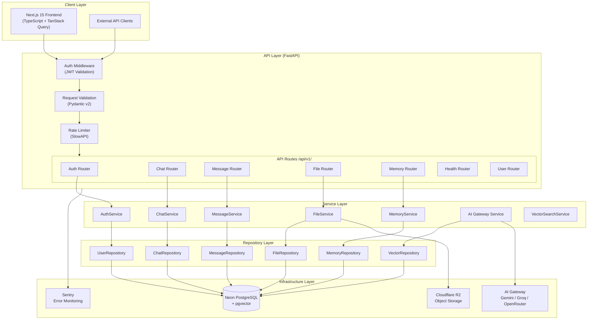
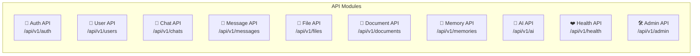
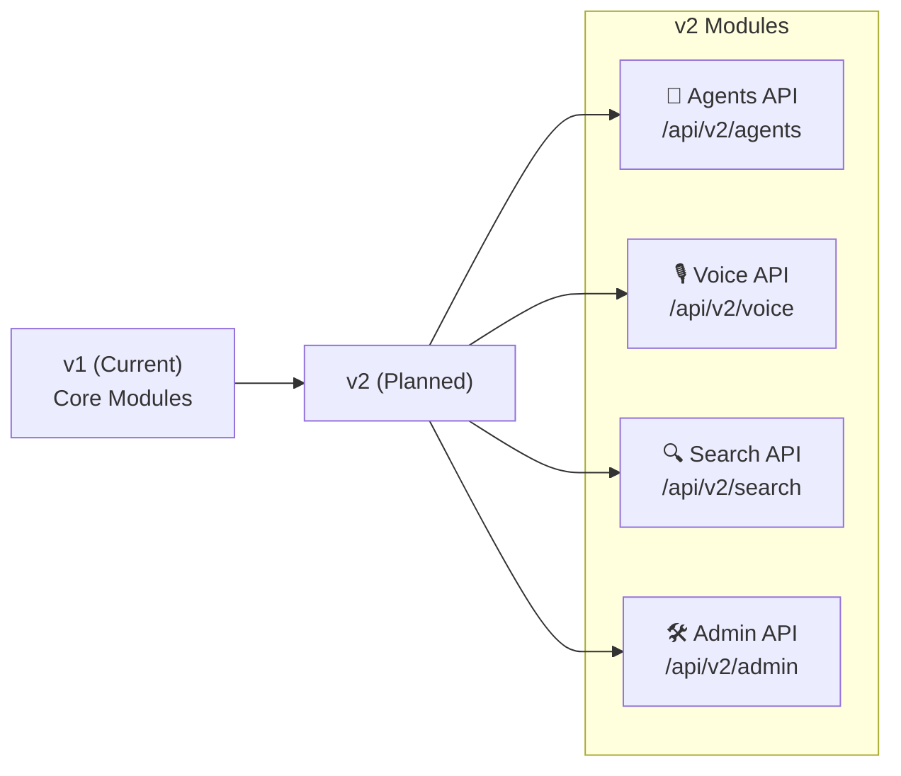

# 08 — API Design Architecture
## PrimeX AI · Enterprise API Documentation

> **Document Version:** 1.0.0
> **Status:** Production Reference
> **Project Motto:** *"Build a modular, production-grade, vendor-independent AI Operating System that can scale from free-tier infrastructure to enterprise architecture without redesign."*

---

## Table of Contents

1. [Purpose of the API Layer](#1-purpose-of-the-api-layer)
2. [API Architecture Overview](#2-api-architecture-overview)
3. [Architecture Diagram](#3-architecture-diagram)
4. [API Design Principles](#4-api-design-principles)
5. [API Versioning Strategy](#5-api-versioning-strategy)
6. [Endpoint Naming Standards](#6-endpoint-naming-standards)
7. [Standard HTTP Methods](#7-standard-http-methods)
8. [Standard Response Format](#8-standard-response-format)
9. [HTTP Status Code Standards](#9-http-status-code-standards)
10. [Core API Modules](#10-core-api-modules)
11. [Detailed Endpoint Catalog](#11-detailed-endpoint-catalog)
12. [Pagination Strategy](#12-pagination-strategy)
13. [Filtering & Sorting Standards](#13-filtering--sorting-standards)
14. [Rate Limiting Strategy](#14-rate-limiting-strategy)
15. [API Security Standards](#15-api-security-standards)
16. [Validation Rules Using Pydantic](#16-validation-rules-using-pydantic)
17. [Centralized Error Handling](#17-centralized-error-handling)
18. [OpenAPI / Swagger Strategy](#18-openapi--swagger-strategy)
19. [Future Expansion Strategy](#19-future-expansion-strategy)
20. [Final Recommendations](#20-final-recommendations)

---

## 1. Purpose of the API Layer

The API Layer is the **central nervous system** of PrimeX AI. It is the single point of entry for all client interactions, enforcing security, validation, routing, and response formatting before any business logic or data access occurs.

### Core Responsibilities

| Responsibility | Description |
|---|---|
| **Request Routing** | Map HTTP requests to the correct service handlers |
| **Authentication** | Validate JWT tokens and enforce access control |
| **Input Validation** | Reject malformed or unauthorized requests early via Pydantic |
| **Response Normalization** | Return consistent, predictable JSON envelope responses |
| **Rate Limiting** | Protect infrastructure from abuse and overconsumption |
| **Error Handling** | Convert internal exceptions into structured error responses |
| **AI Gateway Abstraction** | Shield business logic from provider-specific AI APIs |
| **Observability** | Emit structured logs and Sentry errors on every request lifecycle |
| **Versioning** | Allow backward-compatible evolution of public contracts |

### Why API-First Matters for PrimeX AI

PrimeX AI is an AI Operating System designed for **long-term maintainability and vendor independence**. An API-first architecture means:

- The frontend (Next.js) is fully decoupled from backend internals
- Any service can be replaced (Gemini → Groq, Neon → Aurora) without breaking the contract
- Mobile, CLI, or third-party clients can integrate without changes to core logic
- Testing is isolated — the API contract can be verified independently of UI

---

## 2. API Architecture Overview

PrimeX AI's API follows a **layered architecture** with strict separation of concerns:

```
Client (Next.js / External)
         │
         ▼
  ┌─────────────────┐
  │   API Layer     │  ← FastAPI Routes, Request Validation, Auth Middleware
  └────────┬────────┘
           │
           ▼
  ┌─────────────────┐
  │  Service Layer  │  ← Business Logic, Orchestration, Provider Abstraction
  └────────┬────────┘
           │
           ▼
  ┌─────────────────┐
  │Repository Layer │  ← SQLAlchemy ORM, Query Builders, Data Mappers
  └────────┬────────┘
           │
    ┌──────┴───────────────┬──────────────────┐
    ▼                      ▼                  ▼
┌──────────┐      ┌──────────────┐    ┌──────────────┐
│  Neon DB │      │  AI Gateway  │    │  Cloudflare  │
│PostgreSQL│      │Gemini/Groq/  │    │     R2       │
│+pgvector │      │  OpenRouter  │    │   Storage    │
└──────────┘      └──────────────┘    └──────────────┘
```

### Layer Responsibilities

| Layer | Technology | Responsibility |
|---|---|---|
| **API Layer** | FastAPI | Route handling, JWT auth, Pydantic validation, error formatting |
| **Service Layer** | Python classes | Business rules, AI provider orchestration, caching logic |
| **Repository Layer** | SQLAlchemy | Database queries, ORM mapping, pagination, search |
| **Database** | Neon PostgreSQL + pgvector | Persistent storage, vector embeddings, full-text search |
| **AI Gateway** | Gemini / Groq / OpenRouter | LLM inference with fallback routing |
| **Storage** | Cloudflare R2 | File uploads, document storage, presigned URLs |

---

## 3. Architecture Diagram



---

## 4. API Design Principles

### 4.1 RESTful APIs

PrimeX AI follows REST constraints for resource-based endpoints:

- Resources are **nouns**, never verbs: `/chats`, `/messages`, `/files`
- Actions are expressed via **HTTP methods**, not URL verbs
- Resources are **plural**: `/chats` not `/chat`
- Nested resources represent ownership: `/chats/{id}/messages`

```
✅  GET    /api/v1/chats
✅  POST   /api/v1/chats
✅  DELETE /api/v1/chats/{chat_id}
✅  GET    /api/v1/chats/{chat_id}/messages

❌  POST   /api/v1/createChat
❌  GET    /api/v1/getMessages?chatId=123
❌  POST   /api/v1/deleteChat
```

### 4.2 Stateless Design

Every API request must be **self-contained**. The server holds zero session state.

- Authentication state travels in the `Authorization: Bearer <token>` header
- No server-side sessions, cookies, or request-scoped memory
- Enables horizontal scaling on Render without session affinity
- Refresh tokens are validated against the database (not server memory)

### 4.3 Versioning

All public endpoints are versioned via URL path:

```
/api/v1/chats
/api/v1/messages
```

- `v1` is the stable production version
- `v2` routes can coexist for incremental migration
- Deprecated versions return a `Sunset` header before removal

### 4.4 Consistent Naming

| Convention | Rule | Example |
|---|---|---|
| URL segments | `snake_case`, plural nouns | `/chat_sessions`, `/file_uploads` |
| Query parameters | `snake_case` | `?sort_by=created_at` |
| JSON keys | `snake_case` | `{ "chat_id": "..." }` |
| Route parameters | `snake_case` | `/{chat_id}` |

### 4.5 Secure by Default

- All routes require authentication unless explicitly marked public
- Dependency injection via `Depends(get_current_user)` enforces auth
- CORS restricted to approved origins only
- All inputs validated before any business logic executes

### 4.6 JSON Responses

All responses are `application/json`. No XML, no plaintext. Every response follows the standard envelope format described in §8.

### 4.7 Idempotency

- `GET`, `PUT`, `DELETE` are idempotent by design
- `POST` endpoints that create resources accept an optional `X-Idempotency-Key` header
- Duplicate submissions within 24 hours return the cached original response

### 4.8 Pagination

All list endpoints return paginated responses using cursor or offset pagination (see §12). No unbounded list queries are permitted.

---

## 5. API Versioning Strategy

### URL Path Versioning

```
Base URL: https://api.primexai.com/api/v1/
```

**Rationale:** URL versioning is chosen over header versioning because:
- It is explicit and visible in browser history, logs, and caches
- It allows direct URL sharing and testing
- It is compatible with CDN and reverse proxy routing

### Versioning Policy

| Version State | Behavior |
|---|---|
| **Active (`v1`)** | Fully supported, no breaking changes |
| **Deprecated** | Returns `Deprecation` and `Sunset` headers; supported for 6 months |
| **Retired** | Returns `410 Gone` with migration guidance |

### Backward Compatibility Rules

Breaking changes require a new version. The following are **breaking changes**:

- Removing or renaming a field in a response
- Changing the type of a response field
- Removing an endpoint
- Adding a required request field

The following are **non-breaking** and do not require versioning:

- Adding optional fields to a response
- Adding optional request parameters
- Adding new endpoints
- Improving error messages

### Future Version Roadmap

```
v1  → Production (current)
v2  → Agent Endpoints, Voice API, Advanced Search (planned)
v3  → Admin Dashboard API, Multi-tenant support (future)
```

---

## 6. Endpoint Naming Standards

### Resource Naming Rules

```
Pattern:    /api/{version}/{resource}[/{id}][/{sub-resource}]

Examples:
GET     /api/v1/chats                     → List all chats for user
POST    /api/v1/chats                     → Create new chat
GET     /api/v1/chats/{chat_id}           → Get specific chat
DELETE  /api/v1/chats/{chat_id}           → Delete specific chat
GET     /api/v1/chats/{chat_id}/messages  → List messages in chat
POST    /api/v1/messages                  → Send a message
POST    /api/v1/files/upload              → Upload file
GET     /api/v1/memories                  → List user memories
```

### Full Endpoint Reference Table

| Method | Route | Description |
|---|---|---|
| `POST` | `/api/v1/auth/register` | Register a new user |
| `POST` | `/api/v1/auth/login` | Authenticate and get tokens |
| `POST` | `/api/v1/auth/refresh` | Refresh access token |
| `POST` | `/api/v1/auth/logout` | Revoke refresh token |
| `GET` | `/api/v1/auth/me` | Get current user profile |
| `GET` | `/api/v1/chats` | List user's chat sessions |
| `POST` | `/api/v1/chats` | Create new chat session |
| `GET` | `/api/v1/chats/{chat_id}` | Get chat details |
| `DELETE` | `/api/v1/chats/{chat_id}` | Delete chat session |
| `POST` | `/api/v1/messages` | Send message in chat |
| `GET` | `/api/v1/messages/{chat_id}` | Get messages in chat |
| `POST` | `/api/v1/files/upload` | Upload file to R2 |
| `GET` | `/api/v1/files` | List user's files |
| `DELETE` | `/api/v1/files/{file_id}` | Delete file |
| `POST` | `/api/v1/memories` | Create memory entry |
| `GET` | `/api/v1/memories` | List user memories |
| `PUT` | `/api/v1/memories/{memory_id}` | Update memory |
| `DELETE` | `/api/v1/memories/{memory_id}` | Delete memory |
| `GET` | `/api/v1/health` | System health check |
| `GET` | `/api/v1/health/providers` | AI provider health check |

---

## 7. Standard HTTP Methods

| Method | Semantics | Idempotent | Body | Use Case |
|---|---|---|---|---|
| `GET` | Read resource | ✅ Yes | None | Fetch chats, messages, files |
| `POST` | Create resource | ❌ No | JSON | Create chat, send message, upload |
| `PUT` | Full replace | ✅ Yes | JSON | Replace entire memory entry |
| `PATCH` | Partial update | ✅ Yes | JSON | Update chat title only |
| `DELETE` | Remove resource | ✅ Yes | None | Delete chat, file, memory |

### Method Usage by Endpoint Category

```
Auth        → POST (login, register, refresh, logout), GET (me)
Chats       → GET (list, detail), POST (create), DELETE (delete)
Messages    → GET (list), POST (create/send)
Files       → GET (list), POST (upload), DELETE (delete)
Memories    → GET (list), POST (create), PUT (replace), DELETE (delete)
Health      → GET (status checks only)
```

---

## 8. Standard Response Format

### 8.1 Success Response Envelope

All successful responses follow this structure:

```json
{
  "success": true,
  "data": { },
  "meta": {
    "request_id": "req_01J2K3...",
    "timestamp": "2025-01-15T10:30:00Z",
    "version": "v1"
  },
  "pagination": {
    "page": 1,
    "per_page": 20,
    "total": 143,
    "total_pages": 8,
    "has_next": true,
    "has_prev": false,
    "next_cursor": "eyJpZCI6IjEyMyJ9"
  }
}
```

> The `pagination` field is only present on list endpoints. The `data` field contains the resource or array of resources.

### 8.2 Example: Single Resource Response

```json
{
  "success": true,
  "data": {
    "id": "chat_01J2K3M4N5",
    "title": "PrimeX AI Discussion",
    "created_at": "2025-01-15T08:00:00Z",
    "updated_at": "2025-01-15T10:30:00Z",
    "message_count": 14,
    "model": "gemini-1.5-pro"
  },
  "meta": {
    "request_id": "req_01J2K3ABCDEF",
    "timestamp": "2025-01-15T10:30:00Z",
    "version": "v1"
  }
}
```

### 8.3 Example: List Response

```json
{
  "success": true,
  "data": [
    {
      "id": "chat_01J2K3",
      "title": "AI Architecture",
      "created_at": "2025-01-15T08:00:00Z"
    },
    {
      "id": "chat_01J2K4",
      "title": "RAG Pipeline Design",
      "created_at": "2025-01-14T15:20:00Z"
    }
  ],
  "meta": {
    "request_id": "req_01J2K3ABCDEF",
    "timestamp": "2025-01-15T10:30:00Z",
    "version": "v1"
  },
  "pagination": {
    "page": 1,
    "per_page": 20,
    "total": 42,
    "total_pages": 3,
    "has_next": true,
    "has_prev": false
  }
}
```

### 8.4 Error Response Envelope

```json
{
  "success": false,
  "error": {
    "code": "VALIDATION_ERROR",
    "message": "Request validation failed",
    "details": [
      {
        "field": "email",
        "message": "Invalid email address format",
        "type": "value_error.email"
      },
      {
        "field": "password",
        "message": "Password must be at least 8 characters",
        "type": "value_error.min_length"
      }
    ],
    "docs_url": "https://docs.primexai.com/errors/VALIDATION_ERROR"
  },
  "meta": {
    "request_id": "req_01J2K3ABCDEF",
    "timestamp": "2025-01-15T10:30:00Z",
    "version": "v1"
  }
}
```

### 8.5 Pydantic Response Models

```python
from pydantic import BaseModel
from typing import Any, List, Optional
from datetime import datetime

class Meta(BaseModel):
    request_id: str
    timestamp: datetime
    version: str = "v1"

class Pagination(BaseModel):
    page: int
    per_page: int
    total: int
    total_pages: int
    has_next: bool
    has_prev: bool
    next_cursor: Optional[str] = None

class SuccessResponse(BaseModel):
    success: bool = True
    data: Any
    meta: Meta
    pagination: Optional[Pagination] = None

class ErrorDetail(BaseModel):
    field: Optional[str] = None
    message: str
    type: str

class ErrorBody(BaseModel):
    code: str
    message: str
    details: Optional[List[ErrorDetail]] = None
    docs_url: Optional[str] = None

class ErrorResponse(BaseModel):
    success: bool = False
    error: ErrorBody
    meta: Meta
```

---

## 9. HTTP Status Code Standards

| Code | Name | When to Use |
|---|---|---|
| `200 OK` | Success | Successful GET, PUT, PATCH |
| `201 Created` | Created | Successful POST that creates a resource |
| `204 No Content` | No Content | Successful DELETE; no body returned |
| `400 Bad Request` | Bad Request | Malformed JSON, missing required fields |
| `401 Unauthorized` | Unauthorized | Missing, expired, or invalid JWT token |
| `403 Forbidden` | Forbidden | Valid token but insufficient permissions |
| `404 Not Found` | Not Found | Resource does not exist or is not accessible |
| `409 Conflict` | Conflict | Duplicate resource (e.g., email already registered) |
| `422 Unprocessable Entity` | Validation Error | Pydantic validation failure (FastAPI default) |
| `429 Too Many Requests` | Rate Limited | Rate limit exceeded; `Retry-After` header included |
| `500 Internal Server Error` | Server Error | Unhandled exception; reported to Sentry |

### Status Code Decision Tree

```
Request arrives
│
├─ Is JWT missing or invalid?          → 401 Unauthorized
├─ Does user lack permission?          → 403 Forbidden
├─ Does request body fail validation?  → 422 Unprocessable Entity
├─ Is request body malformed JSON?     → 400 Bad Request
├─ Does resource not exist?            → 404 Not Found
├─ Does duplicate resource conflict?   → 409 Conflict
├─ Has rate limit been exceeded?       → 429 Too Many Requests
├─ Did an internal error occur?        → 500 Internal Server Error
└─ Was it a successful operation?
   ├─ Created a resource?              → 201 Created
   ├─ Deleted a resource?              → 204 No Content
   └─ Read or updated?                 → 200 OK
```

---

## 10. Core API Modules

PrimeX AI's API is organized into **10 functional modules**, each with its own FastAPI router and service class.



| Module | Router Prefix | Primary Responsibility |
|---|---|---|
| **Auth API** | `/api/v1/auth` | Registration, login, token management |
| **User API** | `/api/v1/users` | Profile management, preferences |
| **Chat API** | `/api/v1/chats` | Chat session CRUD |
| **Message API** | `/api/v1/messages` | Message CRUD and AI message generation |
| **File API** | `/api/v1/files` | File upload, metadata, deletion |
| **Document API** | `/api/v1/documents` | Chunking, embedding, RAG retrieval |
| **Memory API** | `/api/v1/memories` | Long-term user memory management |
| **AI API** | `/api/v1/ai` | Direct AI gateway interaction |
| **Health API** | `/api/v1/health` | System and provider health |
| **Admin API** | `/api/v1/admin` | Usage stats, user management (future) |

---

## 11. Detailed Endpoint Catalog

### 11.1 Authentication Endpoints

---

#### `POST /api/v1/auth/register`

**Purpose:** Register a new user account.

| Field | Value |
|---|---|
| **Method** | `POST` |
| **Auth Required** | ❌ Public |
| **Rate Limit** | 5 requests/minute per IP |

**Request Schema:**
```json
{
  "email": "user@example.com",
  "password": "SecurePass123!",
  "full_name": "Jane Doe"
}
```

**Response `201 Created`:**
```json
{
  "success": true,
  "data": {
    "id": "usr_01J2K3M4",
    "email": "user@example.com",
    "full_name": "Jane Doe",
    "role": "user",
    "created_at": "2025-01-15T10:00:00Z"
  },
  "meta": { "request_id": "req_abc123", "timestamp": "2025-01-15T10:00:00Z", "version": "v1" }
}
```

---

#### `POST /api/v1/auth/login`

**Purpose:** Authenticate user and issue JWT access + refresh tokens.

| Field | Value |
|---|---|
| **Method** | `POST` |
| **Auth Required** | ❌ Public |
| **Rate Limit** | 10 requests/minute per IP |

**Request Schema:**
```json
{
  "email": "user@example.com",
  "password": "SecurePass123!"
}
```

**Response `200 OK`:**
```json
{
  "success": true,
  "data": {
    "access_token": "eyJhbGciOiJIUzI1NiIsInR5cCI6IkpXVCJ9...",
    "token_type": "bearer",
    "expires_in": 900,
    "user": {
      "id": "usr_01J2K3M4",
      "email": "user@example.com",
      "full_name": "Jane Doe",
      "role": "user"
    }
  },
  "meta": { "request_id": "req_abc123", "timestamp": "2025-01-15T10:00:00Z", "version": "v1" }
}
```

> Refresh token is set as `HttpOnly; Secure; SameSite=Strict` cookie. Not included in JSON body.

---

#### `POST /api/v1/auth/refresh`

**Purpose:** Exchange a valid refresh token for a new access token.

| Field | Value |
|---|---|
| **Method** | `POST` |
| **Auth Required** | 🍪 Refresh Token Cookie |
| **Rate Limit** | 20 requests/minute per user |

**Request:** No body. Refresh token read from cookie.

**Response `200 OK`:**
```json
{
  "success": true,
  "data": {
    "access_token": "eyJhbGciOiJIUzI1NiIsInR5cCI6IkpXVCJ9...",
    "token_type": "bearer",
    "expires_in": 900
  },
  "meta": { "request_id": "req_abc123", "timestamp": "2025-01-15T10:00:00Z", "version": "v1" }
}
```

---

#### `POST /api/v1/auth/logout`

**Purpose:** Revoke the current refresh token.

| Field | Value |
|---|---|
| **Method** | `POST` |
| **Auth Required** | 🔐 JWT Bearer |
| **Rate Limit** | Standard |

**Request:** No body.

**Response `204 No Content`** — Cookie cleared server-side.

---

#### `GET /api/v1/auth/me`

**Purpose:** Return the currently authenticated user's profile.

| Field | Value |
|---|---|
| **Method** | `GET` |
| **Auth Required** | 🔐 JWT Bearer |

**Response `200 OK`:**
```json
{
  "success": true,
  "data": {
    "id": "usr_01J2K3M4",
    "email": "user@example.com",
    "full_name": "Jane Doe",
    "role": "user",
    "created_at": "2025-01-15T08:00:00Z",
    "preferences": {
      "default_model": "gemini-1.5-pro",
      "theme": "dark"
    }
  },
  "meta": { "request_id": "req_abc123", "timestamp": "2025-01-15T10:00:00Z", "version": "v1" }
}
```

---

### 11.2 Chat Endpoints

---

#### `POST /api/v1/chats`

**Purpose:** Create a new chat session.

| Field | Value |
|---|---|
| **Method** | `POST` |
| **Auth Required** | 🔐 JWT Bearer |

**Request Schema:**
```json
{
  "title": "My New Chat",
  "model": "gemini-1.5-pro",
  "system_prompt": "You are a helpful coding assistant."
}
```

**Response `201 Created`:**
```json
{
  "success": true,
  "data": {
    "id": "chat_01J2K3M4N5",
    "title": "My New Chat",
    "model": "gemini-1.5-pro",
    "created_at": "2025-01-15T10:00:00Z",
    "message_count": 0
  },
  "meta": { "request_id": "req_abc123", "timestamp": "2025-01-15T10:00:00Z", "version": "v1" }
}
```

---

#### `GET /api/v1/chats`

**Purpose:** List all chat sessions for the authenticated user.

| Field | Value |
|---|---|
| **Method** | `GET` |
| **Auth Required** | 🔐 JWT Bearer |
| **Query Params** | `page`, `per_page`, `sort_by`, `order` |

**Response `200 OK`:** Returns paginated list of chat objects (see §8.3 format).

---

#### `DELETE /api/v1/chats/{chat_id}`

**Purpose:** Permanently delete a chat session and all its messages.

| Field | Value |
|---|---|
| **Method** | `DELETE` |
| **Auth Required** | 🔐 JWT Bearer (must own resource) |

**Response `204 No Content`**

---

### 11.3 Message Endpoints

---

#### `POST /api/v1/messages`

**Purpose:** Send a user message and receive an AI response (streaming or non-streaming).

| Field | Value |
|---|---|
| **Method** | `POST` |
| **Auth Required** | 🔐 JWT Bearer |
| **Streaming** | Optional via `Accept: text/event-stream` |

**Request Schema:**
```json
{
  "chat_id": "chat_01J2K3M4N5",
  "content": "Explain the RAG pipeline design for PrimeX AI.",
  "attachments": ["file_01J2K3"],
  "use_memory": true,
  "use_rag": true
}
```

**Response `201 Created` (non-streaming):**
```json
{
  "success": true,
  "data": {
    "id": "msg_01J2K3X",
    "chat_id": "chat_01J2K3M4N5",
    "role": "assistant",
    "content": "The RAG pipeline in PrimeX AI consists of...",
    "model": "gemini-1.5-pro",
    "provider": "gemini",
    "tokens_used": 842,
    "created_at": "2025-01-15T10:00:05Z"
  },
  "meta": { "request_id": "req_abc123", "timestamp": "2025-01-15T10:00:05Z", "version": "v1" }
}
```

---

#### `GET /api/v1/messages/{chat_id}`

**Purpose:** Retrieve paginated message history for a chat session.

| Field | Value |
|---|---|
| **Method** | `GET` |
| **Auth Required** | 🔐 JWT Bearer |
| **Query Params** | `page`, `per_page`, `before_id` (cursor) |

**Response `200 OK`:** Returns paginated list of message objects.

---

### 11.4 File Endpoints

---

#### `POST /api/v1/files/upload`

**Purpose:** Upload a file to Cloudflare R2 and store metadata.

| Field | Value |
|---|---|
| **Method** | `POST` |
| **Auth Required** | 🔐 JWT Bearer |
| **Content-Type** | `multipart/form-data` |
| **Max File Size** | 50MB |

**Request:** `multipart/form-data` with `file` field.

**Response `201 Created`:**
```json
{
  "success": true,
  "data": {
    "id": "file_01J2K3M4",
    "filename": "architecture-doc.pdf",
    "mime_type": "application/pdf",
    "size_bytes": 245760,
    "r2_key": "users/usr_01J2K3M4/files/file_01J2K3M4.pdf",
    "created_at": "2025-01-15T10:00:00Z"
  },
  "meta": { "request_id": "req_abc123", "timestamp": "2025-01-15T10:00:00Z", "version": "v1" }
}
```

---

#### `GET /api/v1/files`

**Purpose:** List all files uploaded by the authenticated user.

| Field | Value |
|---|---|
| **Method** | `GET` |
| **Auth Required** | 🔐 JWT Bearer |

**Response `200 OK`:** Returns paginated list of file metadata objects.

---

#### `DELETE /api/v1/files/{file_id}`

**Purpose:** Delete file from R2 and remove metadata from database.

| Field | Value |
|---|---|
| **Method** | `DELETE` |
| **Auth Required** | 🔐 JWT Bearer (must own resource) |

**Response `204 No Content`**

---

### 11.5 Memory Endpoints

---

#### `POST /api/v1/memories`

**Purpose:** Create a new long-term memory entry for the user.

| Field | Value |
|---|---|
| **Method** | `POST` |
| **Auth Required** | 🔐 JWT Bearer |

**Request Schema:**
```json
{
  "content": "User prefers concise technical responses with code examples.",
  "tags": ["preference", "communication"],
  "source": "manual"
}
```

**Response `201 Created`:**
```json
{
  "success": true,
  "data": {
    "id": "mem_01J2K3M4",
    "content": "User prefers concise technical responses with code examples.",
    "tags": ["preference", "communication"],
    "source": "manual",
    "embedding_id": "vec_01J2K3",
    "created_at": "2025-01-15T10:00:00Z"
  },
  "meta": { "request_id": "req_abc123", "timestamp": "2025-01-15T10:00:00Z", "version": "v1" }
}
```

---

#### `GET /api/v1/memories`

**Purpose:** List all memory entries for the authenticated user.

| Field | Value |
|---|---|
| **Method** | `GET` |
| **Auth Required** | 🔐 JWT Bearer |
| **Query Params** | `tags`, `search`, `page`, `per_page` |

---

#### `PUT /api/v1/memories/{memory_id}`

**Purpose:** Replace a memory entry entirely.

| Field | Value |
|---|---|
| **Method** | `PUT` |
| **Auth Required** | 🔐 JWT Bearer (must own resource) |

---

#### `DELETE /api/v1/memories/{memory_id}`

**Purpose:** Delete a memory entry and its vector embedding.

| Field | Value |
|---|---|
| **Method** | `DELETE` |
| **Auth Required** | 🔐 JWT Bearer (must own resource) |

**Response `204 No Content`**

---

### 11.6 Health Endpoints

---

#### `GET /api/v1/health`

**Purpose:** System health check for load balancers and uptime monitors.

| Field | Value |
|---|---|
| **Method** | `GET` |
| **Auth Required** | ❌ Public |

**Response `200 OK`:**
```json
{
  "success": true,
  "data": {
    "status": "healthy",
    "version": "1.0.0",
    "uptime_seconds": 86400,
    "database": "connected",
    "storage": "connected"
  },
  "meta": { "request_id": "req_abc123", "timestamp": "2025-01-15T10:00:00Z", "version": "v1" }
}
```

---

#### `GET /api/v1/health/providers`

**Purpose:** Check AI provider availability and latency.

| Field | Value |
|---|---|
| **Method** | `GET` |
| **Auth Required** | ❌ Public |

**Response `200 OK`:**
```json
{
  "success": true,
  "data": {
    "providers": {
      "gemini": { "status": "available", "latency_ms": 240 },
      "groq": { "status": "available", "latency_ms": 95 },
      "openrouter": { "status": "available", "latency_ms": 310 }
    },
    "active_provider": "gemini"
  },
  "meta": { "request_id": "req_abc123", "timestamp": "2025-01-15T10:00:00Z", "version": "v1" }
}
```

---

## 12. Pagination Strategy

PrimeX AI supports **two pagination modes**: offset-based for simple use cases and cursor-based for large or real-time datasets.

### 12.1 Offset Pagination

Used for: chat lists, file lists, memory lists.

```
GET /api/v1/chats?page=2&per_page=20
```

```json
"pagination": {
  "page": 2,
  "per_page": 20,
  "total": 143,
  "total_pages": 8,
  "has_next": true,
  "has_prev": true
}
```

### 12.2 Cursor Pagination

Used for: message history (real-time chat continuity).

```
GET /api/v1/messages/chat_01J2K3?before_id=msg_01J2K3X&per_page=50
```

```json
"pagination": {
  "per_page": 50,
  "has_more": true,
  "next_cursor": "eyJpZCI6Im1zZ18wMUoySTMifQ==",
  "oldest_id": "msg_01J2K3Y"
}
```

### 12.3 Pagination Defaults

| Parameter | Default | Maximum |
|---|---|---|
| `per_page` | `20` | `100` |
| `page` | `1` | Unlimited |
| `sort_by` | `created_at` | Indexed columns only |
| `order` | `desc` | `asc` / `desc` |

---

## 13. Filtering & Sorting Standards

### Filtering

```
GET /api/v1/chats?model=gemini-1.5-pro&created_after=2025-01-01
GET /api/v1/memories?tags=preference,coding
GET /api/v1/files?mime_type=application/pdf
```

| Parameter | Format | Example |
|---|---|---|
| Date range | ISO 8601 | `created_after=2025-01-01T00:00:00Z` |
| Tag filter | Comma-separated | `tags=ai,coding` |
| Enum filter | Exact match | `model=gemini-1.5-pro` |
| Text search | URL-encoded | `search=machine+learning` |

### Sorting

```
GET /api/v1/chats?sort_by=updated_at&order=desc
GET /api/v1/memories?sort_by=created_at&order=asc
```

Only indexed columns are sortable. Unsupported sort fields return `400 Bad Request`.

---

## 14. Rate Limiting Strategy

### Rate Limit Tiers

| Endpoint Category | Free Tier | Pro Tier | Admin |
|---|---|---|---|
| Auth (login/register) | 5/min per IP | 10/min per IP | Unlimited |
| AI Messages | 20/hour per user | 200/hour per user | Unlimited |
| File Uploads | 10/hour per user | 100/hour per user | Unlimited |
| General API | 100/min per user | 1000/min per user | Unlimited |
| Health Checks | 60/min per IP | 60/min per IP | Unlimited |

### Implementation

```python
from slowapi import Limiter
from slowapi.util import get_remote_address

limiter = Limiter(key_func=get_remote_address)

@router.post("/auth/login")
@limiter.limit("10/minute")
async def login(request: Request, credentials: LoginRequest):
    ...
```

### Rate Limit Response Headers

Every response includes:

```
X-RateLimit-Limit: 100
X-RateLimit-Remaining: 87
X-RateLimit-Reset: 1705312800
Retry-After: 42
```

When limit exceeded, returns `429 Too Many Requests`:

```json
{
  "success": false,
  "error": {
    "code": "RATE_LIMIT_EXCEEDED",
    "message": "Too many requests. Please retry after 42 seconds.",
    "details": null
  }
}
```

---

## 15. API Security Standards

### 15.1 Authentication

- All non-public endpoints require `Authorization: Bearer <access_token>`
- Tokens are RS256-signed JWTs (or HS256 with strong secret)
- Access tokens expire in **15 minutes**
- No token accepted after expiry under any circumstances

### 15.2 CORS Policy

```python
from fastapi.middleware.cors import CORSMiddleware

app.add_middleware(
    CORSMiddleware,
    allow_origins=[
        "https://primexai.com",
        "https://www.primexai.com",
        "http://localhost:3000",  # Development only
    ],
    allow_credentials=True,
    allow_methods=["GET", "POST", "PUT", "PATCH", "DELETE"],
    allow_headers=["Authorization", "Content-Type", "X-Request-ID"],
)
```

### 15.3 Security Headers

```python
@app.middleware("http")
async def add_security_headers(request: Request, call_next):
    response = await call_next(request)
    response.headers["X-Content-Type-Options"] = "nosniff"
    response.headers["X-Frame-Options"] = "DENY"
    response.headers["X-XSS-Protection"] = "1; mode=block"
    response.headers["Strict-Transport-Security"] = "max-age=31536000; includeSubDomains"
    response.headers["Referrer-Policy"] = "strict-origin-when-cross-origin"
    return response
```

### 15.4 Input Sanitization

- All string inputs are stripped of leading/trailing whitespace
- SQL injection prevented by SQLAlchemy ORM (parameterized queries)
- File uploads are validated for MIME type, extension, and magic bytes
- No raw SQL string interpolation permitted anywhere in codebase

### 15.5 Resource Authorization

Every data access must verify ownership:

```python
async def get_chat_or_403(
    chat_id: str,
    current_user: User = Depends(get_current_user),
    db: AsyncSession = Depends(get_db)
) -> Chat:
    chat = await chat_repo.get_by_id(db, chat_id)
    if not chat:
        raise HTTPException(status_code=404, detail="Chat not found")
    if chat.user_id != current_user.id:
        raise HTTPException(status_code=403, detail="Access forbidden")
    return chat
```

---

## 16. Validation Rules Using Pydantic

### 16.1 Request Models

```python
from pydantic import BaseModel, EmailStr, field_validator, model_validator
from typing import Optional, List
import re

class RegisterRequest(BaseModel):
    email: EmailStr
    password: str
    full_name: str

    @field_validator("password")
    @classmethod
    def validate_password(cls, v: str) -> str:
        if len(v) < 8:
            raise ValueError("Password must be at least 8 characters")
        if not re.search(r"[A-Z]", v):
            raise ValueError("Password must contain at least one uppercase letter")
        if not re.search(r"[a-z]", v):
            raise ValueError("Password must contain at least one lowercase letter")
        if not re.search(r"\d", v):
            raise ValueError("Password must contain at least one number")
        if not re.search(r"[!@#$%^&*(),.?\":{}|<>]", v):
            raise ValueError("Password must contain at least one special character")
        return v

    @field_validator("full_name")
    @classmethod
    def validate_full_name(cls, v: str) -> str:
        v = v.strip()
        if len(v) < 2:
            raise ValueError("Full name must be at least 2 characters")
        if len(v) > 100:
            raise ValueError("Full name must not exceed 100 characters")
        return v

class CreateChatRequest(BaseModel):
    title: Optional[str] = None
    model: str = "gemini-1.5-pro"
    system_prompt: Optional[str] = None

    @field_validator("model")
    @classmethod
    def validate_model(cls, v: str) -> str:
        allowed_models = {
            "gemini-1.5-pro", "gemini-1.5-flash",
            "llama-3.1-70b-versatile", "mixtral-8x7b-32768"
        }
        if v not in allowed_models:
            raise ValueError(f"Model must be one of: {', '.join(allowed_models)}")
        return v

class SendMessageRequest(BaseModel):
    chat_id: str
    content: str
    attachments: Optional[List[str]] = []
    use_memory: bool = True
    use_rag: bool = False

    @field_validator("content")
    @classmethod
    def validate_content(cls, v: str) -> str:
        v = v.strip()
        if not v:
            raise ValueError("Message content cannot be empty")
        if len(v) > 32000:
            raise ValueError("Message content must not exceed 32,000 characters")
        return v
```

### 16.2 Common Validators

```python
# Shared validators for reuse
class PaginationParams(BaseModel):
    page: int = 1
    per_page: int = 20
    sort_by: str = "created_at"
    order: str = "desc"

    @field_validator("page")
    @classmethod
    def validate_page(cls, v: int) -> int:
        if v < 1:
            raise ValueError("Page must be >= 1")
        return v

    @field_validator("per_page")
    @classmethod
    def validate_per_page(cls, v: int) -> int:
        if v < 1 or v > 100:
            raise ValueError("per_page must be between 1 and 100")
        return v

    @field_validator("order")
    @classmethod
    def validate_order(cls, v: str) -> str:
        if v not in ("asc", "desc"):
            raise ValueError("order must be 'asc' or 'desc'")
        return v
```

---

## 17. Centralized Error Handling

### 17.1 Exception Hierarchy

```python
class PrimeXException(Exception):
    """Base exception for all PrimeX AI application errors."""
    def __init__(self, message: str, code: str, status_code: int = 500):
        self.message = message
        self.code = code
        self.status_code = status_code
        super().__init__(message)

class AuthenticationError(PrimeXException):
    def __init__(self, message: str = "Authentication failed"):
        super().__init__(message, "AUTHENTICATION_ERROR", 401)

class AuthorizationError(PrimeXException):
    def __init__(self, message: str = "Access forbidden"):
        super().__init__(message, "AUTHORIZATION_ERROR", 403)

class ResourceNotFoundError(PrimeXException):
    def __init__(self, resource: str, resource_id: str):
        super().__init__(f"{resource} '{resource_id}' not found", "NOT_FOUND", 404)

class ConflictError(PrimeXException):
    def __init__(self, message: str):
        super().__init__(message, "CONFLICT", 409)

class AIProviderError(PrimeXException):
    def __init__(self, provider: str, message: str):
        super().__init__(f"AI provider '{provider}' error: {message}", "AI_PROVIDER_ERROR", 502)

class RateLimitError(PrimeXException):
    def __init__(self, retry_after: int = 60):
        super().__init__("Rate limit exceeded", "RATE_LIMIT_EXCEEDED", 429)
        self.retry_after = retry_after
```

### 17.2 Global Exception Handler

```python
from fastapi import Request
from fastapi.responses import JSONResponse
from fastapi.exceptions import RequestValidationError
import uuid
from datetime import datetime, timezone

@app.exception_handler(PrimeXException)
async def primex_exception_handler(request: Request, exc: PrimeXException):
    return JSONResponse(
        status_code=exc.status_code,
        content={
            "success": False,
            "error": {
                "code": exc.code,
                "message": exc.message,
            },
            "meta": {
                "request_id": str(uuid.uuid4()),
                "timestamp": datetime.now(timezone.utc).isoformat(),
                "version": "v1"
            }
        }
    )

@app.exception_handler(RequestValidationError)
async def validation_exception_handler(request: Request, exc: RequestValidationError):
    details = [
        {
            "field": ".".join(str(loc) for loc in err["loc"][1:]),
            "message": err["msg"],
            "type": err["type"]
        }
        for err in exc.errors()
    ]
    return JSONResponse(
        status_code=422,
        content={
            "success": False,
            "error": {
                "code": "VALIDATION_ERROR",
                "message": "Request validation failed",
                "details": details
            },
            "meta": {
                "request_id": str(uuid.uuid4()),
                "timestamp": datetime.now(timezone.utc).isoformat(),
                "version": "v1"
            }
        }
    )

@app.exception_handler(Exception)
async def generic_exception_handler(request: Request, exc: Exception):
    # Report to Sentry
    import sentry_sdk
    sentry_sdk.capture_exception(exc)
    return JSONResponse(
        status_code=500,
        content={
            "success": False,
            "error": {
                "code": "INTERNAL_SERVER_ERROR",
                "message": "An unexpected error occurred. Our team has been notified."
            },
            "meta": {
                "request_id": str(uuid.uuid4()),
                "timestamp": datetime.now(timezone.utc).isoformat(),
                "version": "v1"
            }
        }
    )
```

---

## 18. OpenAPI / Swagger Strategy

### Auto-Generated Documentation

FastAPI automatically generates OpenAPI 3.0 documentation at:

```
/api/v1/docs        → Swagger UI (interactive)
/api/v1/redoc       → ReDoc (readable)
/api/v1/openapi.json → Raw schema
```

### Configuration

```python
app = FastAPI(
    title="PrimeX AI API",
    description="""
    ## PrimeX AI — Enterprise AI Operating System

    Production-grade, modular, vendor-independent API for AI chat, RAG, 
    long-term memory, and file management.
    
    ### Authentication
    Use the `/auth/login` endpoint to obtain a JWT access token.
    Include it as: `Authorization: Bearer <token>`
    """,
    version="1.0.0",
    docs_url="/api/v1/docs",
    redoc_url="/api/v1/redoc",
    openapi_url="/api/v1/openapi.json",
    contact={
        "name": "PrimeX AI Team",
        "url": "https://primexai.com",
        "email": "api@primexai.com"
    },
    license_info={
        "name": "Proprietary",
        "url": "https://primexai.com/terms"
    }
)
```

### Security Scheme

```python
from fastapi.security import HTTPBearer, HTTPAuthorizationCredentials

security = HTTPBearer()

# Applied globally via openapi_extra or on each route
```

### Endpoint Documentation Standard

Every endpoint must include:

```python
@router.post(
    "/chats",
    response_model=SuccessResponse[ChatResponse],
    status_code=201,
    summary="Create Chat Session",
    description="Creates a new AI chat session for the authenticated user.",
    responses={
        201: {"description": "Chat session created successfully"},
        401: {"description": "JWT token missing or invalid"},
        422: {"description": "Request validation failed"},
    },
    tags=["Chats"]
)
async def create_chat(...):
    ...
```

### Documentation Access Policy

| Environment | Docs Access |
|---|---|
| Development | Public (`/api/v1/docs`) |
| Staging | Authenticated only |
| Production | Disabled or API-key protected |

---

## 19. Future Expansion Strategy

### 19.1 Planned v2 Modules



### 19.2 Agent Endpoints (v2 Preview)

```
POST   /api/v2/agents                    → Create agent
GET    /api/v2/agents                    → List agents
POST   /api/v2/agents/{id}/run          → Execute agent task
GET    /api/v2/agents/{id}/runs         → List agent run history
GET    /api/v2/agents/{id}/runs/{run_id} → Get run details
```

### 19.3 Voice Endpoints (v2 Preview)

```
POST   /api/v2/voice/transcribe          → Audio → Text (STT)
POST   /api/v2/voice/synthesize          → Text → Audio (TTS)
POST   /api/v2/voice/chat                → Voice chat session
```

### 19.4 Admin Endpoints (v2 Preview)

```
GET    /api/v2/admin/users               → List all users
GET    /api/v2/admin/usage               → Platform usage stats
GET    /api/v2/admin/costs               → AI provider cost breakdown
POST   /api/v2/admin/users/{id}/suspend  → Suspend user account
```

### 19.5 Extensibility Guidelines

To add a new module without breaking existing contracts:

1. Create a new router file: `app/api/v1/routers/new_module.py`
2. Define Pydantic request/response models in `app/schemas/new_module.py`
3. Implement service layer: `app/services/new_module_service.py`
4. Implement repository: `app/repositories/new_module_repository.py`
5. Add Alembic migration for any new tables
6. Register router in `app/main.py`: `app.include_router(new_module_router, prefix="/api/v1")`
7. Update OpenAPI tags and documentation

---

## 20. Final Recommendations

### Architecture Decisions Summary

| Decision | Choice | Rationale |
|---|---|---|
| **Framework** | FastAPI | Async-native, Pydantic integration, auto OpenAPI |
| **Validation** | Pydantic v2 | Runtime validation, serialization, OpenAPI schema gen |
| **Auth** | JWT (HS256) | Stateless, horizontally scalable, no session store needed |
| **Versioning** | URL path (`/api/v1/`) | Explicit, cache-friendly, CDN-compatible |
| **Pagination** | Offset + Cursor | Offset for simple lists; cursor for real-time message feeds |
| **Error Format** | Envelope + error code | Consistent, machine-readable, frontend-friendly |
| **Rate Limiting** | SlowAPI (Redis-backed) | Per-user and per-IP, scalable |
| **Documentation** | Auto OpenAPI/Swagger | Always in sync with code, no maintenance overhead |

### Non-Negotiable Standards

1. **Every endpoint** must have a Pydantic request and response model
2. **Every protected endpoint** must use `Depends(get_current_user)`
3. **Every data access** must verify resource ownership
4. **Every error** must go through the centralized exception handler
5. **Every response** must follow the envelope format
6. **Every list endpoint** must be paginated — no unbounded queries
7. **No raw SQL** — all queries through SQLAlchemy ORM
8. **No secrets in code** — all configuration via environment variables

### Performance Guidelines

- Use `async def` for all route handlers and DB operations
- Use connection pooling for Neon PostgreSQL (SQLAlchemy async)
- Cache health check responses for 30 seconds
- Use streaming responses for AI message generation
- Index all foreign keys and frequently filtered columns
- Limit nested query depth to avoid N+1 problems

### Monitoring & Observability

```python
import sentry_sdk
from sentry_sdk.integrations.fastapi import FastApiIntegration
from sentry_sdk.integrations.sqlalchemy import SqlalchemyIntegration

sentry_sdk.init(
    dsn=settings.SENTRY_DSN,
    environment=settings.ENVIRONMENT,
    integrations=[
        FastApiIntegration(transaction_style="endpoint"),
        SqlalchemyIntegration(),
    ],
    traces_sample_rate=0.1,  # 10% for performance monitoring
)
```

---

*Document maintained by PrimeX AI Engineering. Last updated: 2025-01-15. Version 1.0.0.*
