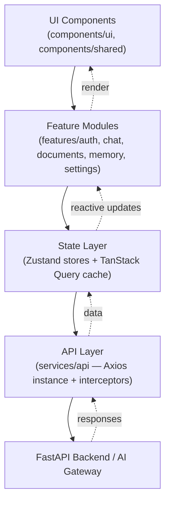
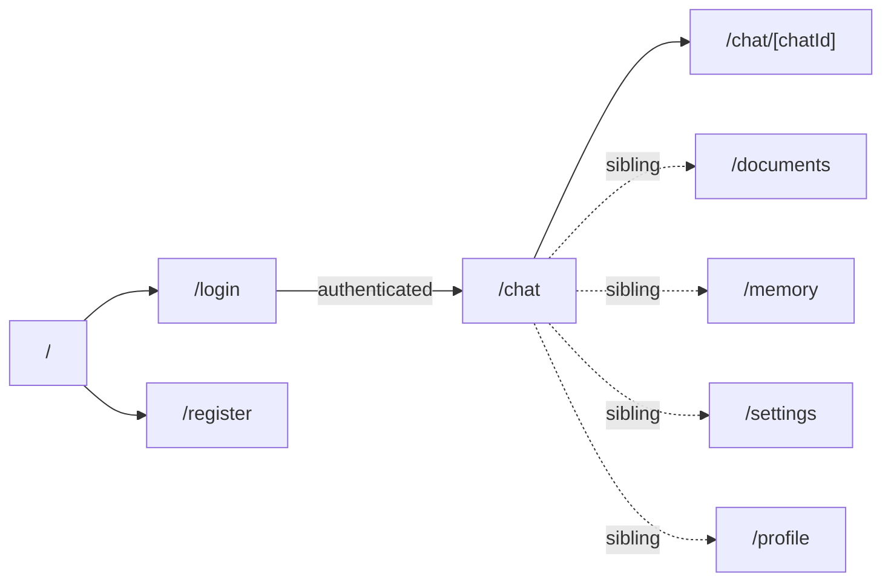
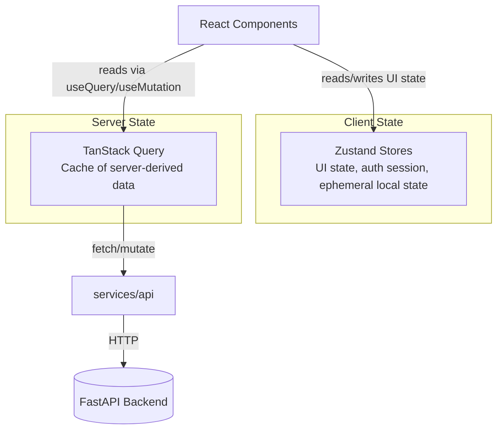
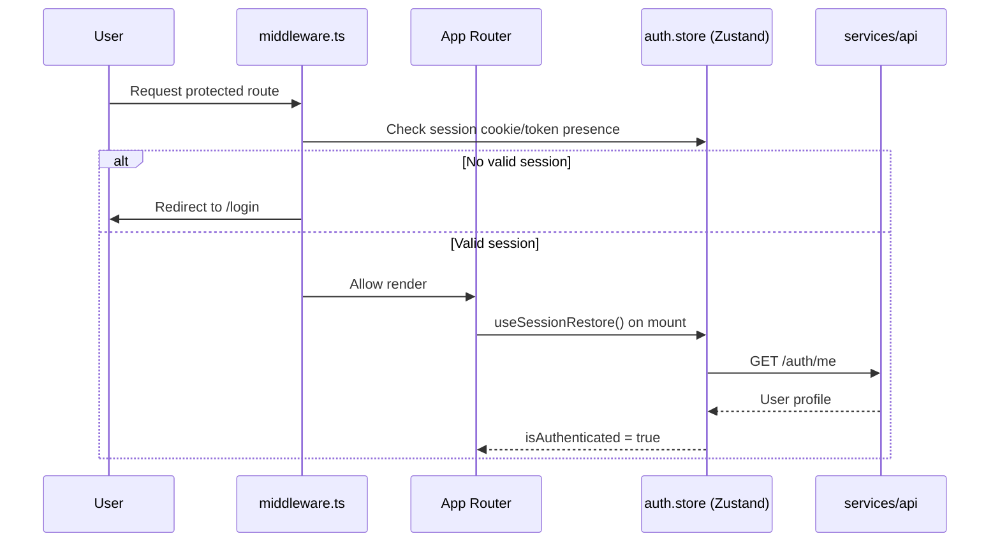
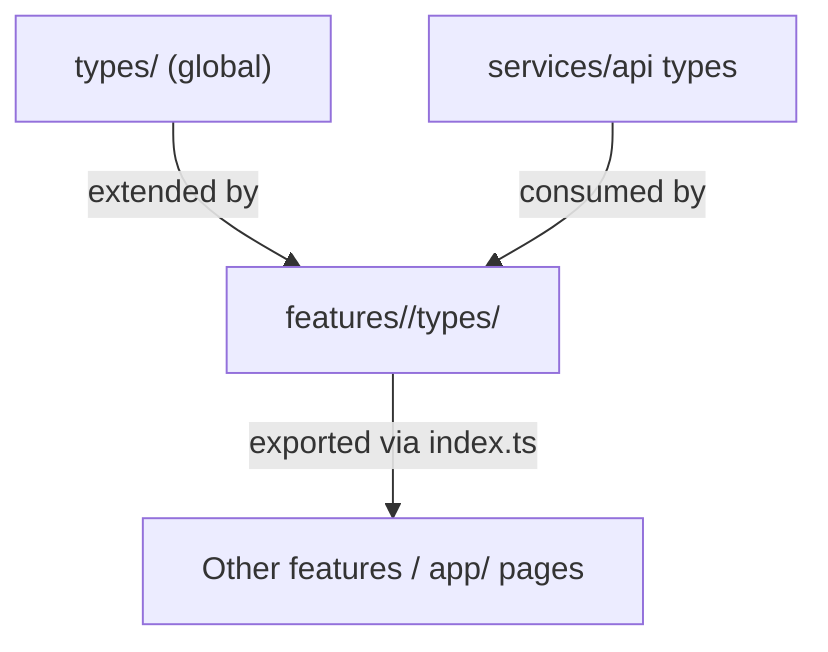

# 10. Frontend Folder Structure

**Project:** PrimeX AI — Modular AI Operating System
**Document Type:** Frontend Architecture Specification
**Status:** Production-Grade / Long-Term Reference
**Scope:** Next.js 15 (App Router) Frontend

> "Build a modular, production-grade, vendor-independent AI Operating System that scales from free-tier infrastructure to enterprise architecture without redesign."

This document defines the canonical frontend folder structure for PrimeX AI. It is not a suggestion — it is the contract that every engineer, current and future, builds against. PrimeX AI is explicitly **not** an MVP, so this structure is designed to absorb new features (Agents, Voice, Admin Dashboard, Search, Team Collaboration) without restructuring existing code.

---

## Table of Contents

1. [Frontend Architecture Goals](#1-frontend-architecture-goals)
2. [Why Feature-Based Architecture](#2-why-feature-based-architecture)
3. [High-Level Frontend Architecture Diagram](#3-high-level-frontend-architecture-diagram)
4. [Complete Production Folder Structure](#4-complete-production-folder-structure)
5. [Explain Every Folder In Detail](#5-explain-every-folder-in-detail)
6. [Feature Module Structure](#6-feature-module-structure)
7. [App Router Structure](#7-app-router-structure)
8. [State Management Architecture](#8-state-management-architecture)
9. [API Layer Architecture](#9-api-layer-architecture)
10. [Authentication Architecture](#10-authentication-architecture)
11. [Shared Component Strategy](#11-shared-component-strategy)
12. [Form Management Architecture](#12-form-management-architecture)
13. [TypeScript Type Organization](#13-typescript-type-organization)
14. [Error Handling Strategy](#14-error-handling-strategy)
15. [Loading Strategy](#15-loading-strategy)
16. [Performance Optimization](#16-performance-optimization)
17. [Coding Standards](#17-coding-standards)
18. [Future Scalability Strategy](#18-future-scalability-strategy)
19. [Final Recommendations](#19-final-recommendations)

---

## 1. Frontend Architecture Goals

PrimeX AI's frontend is treated as a long-lived product surface, not a throwaway client. Four properties are non-negotiable:

| Goal | Definition | Why It Matters for PrimeX AI |
|---|---|---|
| **Scalability** | The codebase can absorb new features (Agents, Voice, Admin, Search, Team Collaboration) without touching unrelated code. | PrimeX AI explicitly lists 5 future features. The architecture must already have a "slot" for each. |
| **Maintainability** | Any engineer can locate, understand, and safely modify a feature without reading the entire codebase. | Long-term AI OS means multi-year maintenance, possibly by rotating teams. |
| **Modularity** | Features are self-contained units with clear boundaries (components, hooks, services, types, state). | Modules can be added, removed, or rewritten independently — critical for a system that will outlive its first implementation. |
| **Reusability** | UI primitives, hooks, and utilities are written once and consumed everywhere. | Avoids duplicated logic across Chat, Documents, Memory, and future Agents/Voice modules. |

**Operating principle:** every folder, file, and naming decision in this document exists to serve one of these four goals. If a future decision conflicts with them, the structure — not the principle — should be reconsidered.

---

## 2. Why Feature-Based Architecture

PrimeX AI uses **feature-first** (a.k.a. "vertical slice") architecture instead of traditional **layer-based** architecture (`components/`, `pages/`, `services/`, `hooks/` as global, flat buckets).

### Layer-Based Architecture (Rejected)

```
src/
├── components/    ← components from ALL features mixed together
├── hooks/         ← hooks from ALL features mixed together
├── services/      ← API calls from ALL features mixed together
└── pages/
```

**Problems at scale:**
- A single `components/` folder grows to 200+ files with no feature boundary.
- Changing the Chat feature risks touching code shared (accidentally) with Documents.
- New engineers cannot tell what belongs together — everything is one giant blob organized by *technical type*, not by *business capability*.
- Deleting or extracting a feature (e.g., spinning Agents into a separate micro-frontend later) means hunting through every layer.

### Feature-Based Architecture (Adopted)

```
features/
├── auth/        ← everything Auth needs lives here
├── chat/        ← everything Chat needs lives here
├── documents/   ← everything Documents needs lives here
├── memory/      ← everything Memory needs lives here
└── settings/    ← everything Settings needs lives here
```

| Dimension | Layer-Based | Feature-Based (PrimeX AI choice) |
|---|---|---|
| Organized by | Technical type (components, hooks, services) | Business capability (auth, chat, documents) |
| Coupling | High — features entangle through shared global folders | Low — each feature is an isolated vertical slice |
| Onboarding | Hard — must understand entire layer to touch one feature | Easy — open one folder, see the whole feature |
| Scaling new features | Pollutes every layer folder | Add one new `features/<name>/` folder |
| Refactor/extraction risk | High blast radius | Contained blast radius |
| Team ownership | Difficult to assign | One team can own `features/chat/` end-to-end |
| Code deletion | Risky, scattered | Delete one folder, feature is gone |

**Conclusion:** Feature-based architecture directly satisfies the project's scalability and modularity goals. Truly global, cross-feature code (design-system primitives, generic hooks, the API client) still lives in shared top-level folders (`components/`, `hooks/`, `lib/`) — but *only* when it is genuinely feature-agnostic.

---

## 3. High-Level Frontend Architecture Diagram



**Flow explanation:**

1. **UI Components** are dumb, presentational, and reusable — they know nothing about business logic.
2. **Feature Modules** compose UI components with feature-specific hooks and logic.
3. **State Layer** separates ephemeral client state (Zustand) from server-derived cache state (TanStack Query).
4. **API Layer** is the single, centralized gateway to the backend — no feature talks to `axios` directly.
5. **Backend** (FastAPI + AI Gateway) is the system of record; the frontend never talks to AI providers directly.

---

## 4. Complete Production Folder Structure

```
frontend/
├── app/                                # Next.js App Router — routing & layouts ONLY
│   ├── (auth)/
│   │   ├── login/
│   │   │   └── page.tsx
│   │   ├── register/
│   │   │   └── page.tsx
│   │   └── layout.tsx
│   ├── (dashboard)/
│   │   ├── chat/
│   │   │   ├── page.tsx
│   │   │   ├── loading.tsx
│   │   │   └── [chatId]/
│   │   │       ├── page.tsx
│   │   │       └── loading.tsx
│   │   ├── documents/
│   │   │   ├── page.tsx
│   │   │   └── loading.tsx
│   │   ├── memory/
│   │   │   └── page.tsx
│   │   ├── settings/
│   │   │   ├── page.tsx
│   │   │   ├── profile/
│   │   │   │   └── page.tsx
│   │   │   ├── billing/
│   │   │   │   └── page.tsx
│   │   │   └── usage/
│   │   │       └── page.tsx
│   │   ├── profile/
│   │   │   └── page.tsx
│   │   └── layout.tsx
│   ├── api/                            # Next.js Route Handlers (BFF edge cases only)
│   │   └── health/
│   │       └── route.ts
│   ├── layout.tsx                      # Root layout (providers, fonts, theming)
│   ├── page.tsx                        # Landing / marketing page
│   ├── error.tsx                       # Root error boundary
│   ├── global-error.tsx
│   ├── not-found.tsx
│   └── globals.css
│
├── components/                         # GLOBAL, feature-agnostic UI ONLY
│   ├── ui/                             # shadcn/ui primitives (button, dialog, input...)
│   ├── layout/                         # AppShell, Sidebar, Topbar, Footer
│   ├── shared/                         # Reusable composite components (EmptyState, PageHeader)
│   └── feedback/                       # Toaster wrapper, ErrorBoundary, Spinner, Skeletons
│
├── features/                           # FEATURE-FIRST MODULES (core of the architecture)
│   ├── auth/
│   ├── chat/
│   ├── documents/
│   ├── memory/
│   ├── settings/
│   ├── profile/
│   └── usage/
│
├── services/                           # Cross-cutting infrastructure clients
│   ├── api/
│   │   ├── axiosInstance.ts            # Single configured Axios instance
│   │   ├── interceptors.ts             # Request/response interceptors
│   │   ├── endpoints.ts                # Centralized endpoint string constants
│   │   └── apiError.ts                 # Normalized API error class
│   └── websocket/
│       └── socketClient.ts             # Streaming/SSE client wrapper
│
├── stores/                             # GLOBAL Zustand stores (cross-feature only)
│   ├── auth.store.ts
│   ├── ui.store.ts
│   └── session.store.ts
│
├── hooks/                              # GLOBAL, feature-agnostic hooks
│   ├── useDebounce.ts
│   ├── useMediaQuery.ts
│   ├── useLocalStorage.ts
│   └── useOnClickOutside.ts
│
├── types/                              # GLOBAL TypeScript types
│   ├── global.d.ts
│   ├── api.types.ts
│   ├── env.d.ts
│   └── enums.ts
│
├── utils/                              # GLOBAL pure utility functions
│   ├── formatDate.ts
│   ├── formatNumber.ts
│   ├── cn.ts                           # className merge helper
│   └── truncate.ts
│
├── constants/                          # GLOBAL constants & config values
│   ├── routes.ts
│   ├── appConfig.ts
│   └── queryKeys.ts
│
├── lib/                                # Third-party library setup/config
│   ├── queryClient.ts                  # TanStack Query client + defaults
│   ├── zodSchemas/                     # Shared cross-feature Zod primitives
│   └── fonts.ts
│
├── styles/                             # Global Tailwind & design tokens
│   ├── globals.css
│   └── tailwind-tokens.css
│
├── public/                             # Static assets
│   ├── icons/
│   ├── images/
│   └── fonts/
│
├── middleware.ts                       # Next.js middleware (route protection)
├── next.config.ts
├── tailwind.config.ts
├── tsconfig.json
├── .env.example
└── package.json
```

---

## 5. Explain Every Folder In Detail

| Folder | Responsibility | Must NOT Contain |
|---|---|---|
| `app/` | Routing, layouts, route-level loading/error boundaries, metadata. Pages are thin — they import from `features/`. | Business logic, API calls, complex JSX |
| `components/ui/` | shadcn/ui-generated primitives (Button, Input, Dialog, Card, etc.). Pure presentation. | Feature-specific logic, data fetching |
| `components/layout/` | App shell pieces used on every authenticated page (Sidebar, Topbar). | Feature business logic |
| `components/shared/` | Composite, reusable-but-opinionated components used by 2+ features (e.g., `EmptyState`, `ConfirmDialog`). | One-off, single-feature components (those belong in the feature) |
| `components/feedback/` | Toast wrapper (Sonner), global Spinner, Skeleton primitives, ErrorBoundary component. | Feature UI |
| `features/<name>/` | Everything one business capability needs: components, hooks, services, types, schemas, store. | Cross-feature shared logic (promote to `components/`, `hooks/`, or `lib/` instead) |
| `services/api/` | Single Axios instance, interceptors, endpoint constants, normalized error shape. The *only* place HTTP is configured. | Feature-specific request logic (that lives in `features/<name>/services/`) |
| `services/websocket/` | Streaming/SSE connection management for AI Chat token streaming. | UI rendering logic |
| `stores/` | **Global** Zustand stores needed across multiple features (auth session, UI theme/sidebar state). | Feature-local state (that lives inside the feature's own `store/`) |
| `hooks/` | Generic, feature-agnostic React hooks with zero business meaning. | Hooks tied to a specific domain concept |
| `types/` | Types shared app-wide: API envelope shapes, global enums, environment typing. | Feature-specific DTOs (those live in `features/<name>/types/`) |
| `utils/` | Pure, stateless helper functions (formatting, string manipulation). | Anything with side effects or React hooks |
| `constants/` | Static configuration values: route paths, query key factories, app-wide constants. | Secrets (use `.env`) |
| `lib/` | Setup/configuration of third-party libraries (TanStack Query client instance, shared Zod primitives, font loading). | Business logic |
| `styles/` | Tailwind global stylesheet, CSS variables/design tokens. | Component-scoped styles (use Tailwind classes inline) |
| `public/` | Static, unprocessed assets served as-is. | Source code |
| `middleware.ts` | Edge-level route protection (redirect unauthenticated users before render). | Business logic |

---

## 6. Feature Module Structure

Every feature in `features/` follows an **identical internal skeleton**. This consistency is what makes the architecture scale — once an engineer learns one feature's shape, they know all of them.

### Canonical Feature Skeleton

```
features/<feature-name>/
├── components/      # UI components used only by this feature
├── hooks/           # React hooks specific to this feature's logic
├── services/        # API calls for this feature (wraps services/api)
├── types/           # TypeScript types/interfaces for this feature's domain
├── schemas/         # Zod validation schemas for this feature's forms/data
├── store/           # Zustand store for this feature's client state (if needed)
├── utils/           # Feature-local pure helper functions (optional)
└── index.ts         # Public barrel export — the feature's only public surface
```

> **Rule:** Code outside a feature folder imports **only** from that feature's `index.ts`. Nothing reaches into `features/chat/components/ChatWindow.tsx` directly. This keeps internal refactors invisible to consumers.

### 6.1 `features/auth/`

```
features/auth/
├── components/
│   ├── LoginForm.tsx
│   ├── RegisterForm.tsx
│   ├── AuthCard.tsx
│   └── PasswordStrengthIndicator.tsx
├── hooks/
│   ├── useLogin.ts
│   ├── useRegister.ts
│   ├── useLogout.ts
│   └── useSessionRestore.ts
├── services/
│   └── auth.service.ts
├── types/
│   └── auth.types.ts
├── schemas/
│   └── auth.schema.ts
├── store/
│   └── auth.store.ts
└── index.ts
```

### 6.2 `features/chat/`

```
features/chat/
├── components/
│   ├── ChatWindow.tsx
│   ├── MessageBubble.tsx
│   ├── MessageList.tsx
│   ├── ChatInput.tsx
│   ├── ChatSidebar.tsx
│   ├── ChatSessionItem.tsx
│   └── TypingIndicator.tsx
├── hooks/
│   ├── useChatSession.ts
│   ├── useSendMessage.ts
│   ├── useStreamingResponse.ts
│   └── useChatHistory.ts
├── services/
│   └── chat.service.ts
├── types/
│   └── chat.types.ts
├── schemas/
│   └── chat.schema.ts
├── store/
│   └── chat.store.ts
├── utils/
│   └── chat.utils.ts
└── index.ts
```

### 6.3 `features/documents/`

```
features/documents/
├── components/
│   ├── DocumentUploader.tsx
│   ├── DocumentList.tsx
│   ├── DocumentCard.tsx
│   ├── DocumentPreview.tsx
│   └── DocumentStatusBadge.tsx
├── hooks/
│   ├── useUploadDocument.ts
│   ├── useDocumentList.ts
│   └── useDeleteDocument.ts
├── services/
│   └── documents.service.ts
├── types/
│   └── documents.types.ts
├── schemas/
│   └── documents.schema.ts
├── store/
│   └── documents.store.ts
└── index.ts
```

### 6.4 `features/memory/`

```
features/memory/
├── components/
│   ├── MemoryTimeline.tsx
│   ├── MemoryCard.tsx
│   └── MemorySearchBar.tsx
├── hooks/
│   ├── useMemoryList.ts
│   └── useMemorySearch.ts
├── services/
│   └── memory.service.ts
├── types/
│   └── memory.types.ts
├── schemas/
│   └── memory.schema.ts
├── store/
│   └── memory.store.ts
└── index.ts
```

### 6.5 `features/settings/`

```
features/settings/
├── components/
│   ├── ProfileSettingsForm.tsx
│   ├── PreferencesForm.tsx
│   ├── UsageSummaryCard.tsx
│   └── DangerZone.tsx
├── hooks/
│   ├── useUpdateProfile.ts
│   └── useUsageStats.ts
├── services/
│   └── settings.service.ts
├── types/
│   └── settings.types.ts
├── schemas/
│   └── settings.schema.ts
├── store/
│   └── settings.store.ts
└── index.ts
```

**Index barrel example (`features/chat/index.ts`):**

```ts
export { ChatWindow } from "./components/ChatWindow";
export { ChatSidebar } from "./components/ChatSidebar";
export { useChatSession } from "./hooks/useChatSession";
export { useSendMessage } from "./hooks/useSendMessage";
export type { ChatMessage, ChatSession } from "./types/chat.types";
```

---

## 7. App Router Structure



| Route | Route Group | Auth Required | Purpose |
|---|---|---|---|
| `/` | none | No | Public landing/marketing page |
| `/login` | `(auth)` | No | Login form |
| `/register` | `(auth)` | No | Registration form |
| `/chat` | `(dashboard)` | Yes | Chat session list / new chat entry |
| `/chat/[chatId]` | `(dashboard)` | Yes | A specific multi-chat session |
| `/documents` | `(dashboard)` | Yes | Document management & RAG sources |
| `/memory` | `(dashboard)` | Yes | Long-term memory timeline |
| `/settings` | `(dashboard)` | Yes | Settings hub (profile, billing, usage) |
| `/profile` | `(dashboard)` | Yes | User profile view/edit |

### Route Organization Principles

1. **Route Groups `(auth)` and `(dashboard)`** split the app into "public/unauthenticated" and "protected" zones without affecting the URL path — purely organizational.
2. **Each route group owns one `layout.tsx`.** `(auth)/layout.tsx` renders a centered card layout; `(dashboard)/layout.tsx` renders the AppShell (Sidebar + Topbar) and enforces session presence.
3. **Pages are thin.** A `page.tsx` does data-fetch wiring (via TanStack Query hooks from the feature) and renders the feature's top-level component — it contains no business logic itself.
4. **Dynamic segments (`[chatId]`)** map 1:1 to a feature's detail view; the page simply passes the param into the feature hook.
5. **Future routes** (`/agents`, `/voice`, `/admin`, `/search`, `/teams`) slot into `(dashboard)` the same way — no structural change required (see [Section 18](#18-future-scalability-strategy)).

---

## 8. State Management Architecture

PrimeX AI strictly separates **client state** from **server state** — conflating them is one of the most common sources of bugs and stale-cache issues in production React apps.



| Concern | Owner | Examples |
|---|---|---|
| Server-derived data (anything that comes from the backend) | **TanStack Query** | Chat messages, document lists, memory items, usage stats, user profile |
| Caching, refetching, pagination, optimistic updates | **TanStack Query** | Infinite scroll for chat history, cache invalidation after upload |
| Ephemeral UI state (not persisted server-side) | **Zustand** | Sidebar collapsed/expanded, active chat ID, theme, modal open state |
| Auth session token / current user snapshot | **Zustand** (`auth.store.ts`) | `isAuthenticated`, `user`, `accessToken` (in-memory only) |
| Form state | **React Hook Form** (not Zustand, not Query) | Login form, settings form |

**Why this split matters:** TanStack Query already solves caching, deduplication, background refetch, and stale-data invalidation for anything that originates from the server. Reimplementing that in Zustand would duplicate effort and risk cache desync. Zustand is reserved for state that has **no server source of truth**.

**Query key convention** (`constants/queryKeys.ts`):

```ts
export const queryKeys = {
  chat: {
    all: ["chat", "sessions"] as const,
    session: (id: string) => ["chat", "session", id] as const,
    messages: (id: string) => ["chat", "messages", id] as const,
  },
  documents: {
    all: ["documents"] as const,
    detail: (id: string) => ["documents", id] as const,
  },
};
```

---

## 9. API Layer Architecture

All HTTP traffic flows through **one** configured Axios instance. No feature is permitted to instantiate its own Axios client.

```
services/api/
├── axiosInstance.ts   # baseURL, timeout, headers
├── interceptors.ts    # request (attach token) + response (refresh/error normalize)
├── endpoints.ts       # centralized path constants
└── apiError.ts         # ApiError class — normalized shape for the whole app
```

```ts
// services/api/axiosInstance.ts
import axios from "axios";

export const axiosInstance = axios.create({
  baseURL: process.env.NEXT_PUBLIC_API_BASE_URL,
  timeout: 30_000,
  headers: { "Content-Type": "application/json" },
});
```

```ts
// services/api/interceptors.ts
import { axiosInstance } from "./axiosInstance";
import { useAuthStore } from "@/stores/auth.store";
import { refreshAccessToken } from "@/features/auth/services/auth.service";

axiosInstance.interceptors.request.use((config) => {
  const token = useAuthStore.getState().accessToken;
  if (token) config.headers.Authorization = `Bearer ${token}`;
  return config;
});

axiosInstance.interceptors.response.use(
  (response) => response,
  async (error) => {
    const originalRequest = error.config;

    if (error.response?.status === 401 && !originalRequest._retry) {
      originalRequest._retry = true;
      try {
        const newToken = await refreshAccessToken();
        useAuthStore.getState().setAccessToken(newToken);
        originalRequest.headers.Authorization = `Bearer ${newToken}`;
        return axiosInstance(originalRequest);
      } catch (refreshError) {
        useAuthStore.getState().clearSession();
        window.location.href = "/login";
        return Promise.reject(refreshError);
      }
    }

    return Promise.reject(normalizeApiError(error));
  }
);
```

**Feature services wrap the shared instance** — they never configure HTTP themselves:

```ts
// features/chat/services/chat.service.ts
import { axiosInstance } from "@/services/api/axiosInstance";
import { endpoints } from "@/services/api/endpoints";
import type { ChatSession, ChatMessage } from "../types/chat.types";

export const chatService = {
  getSessions: () =>
    axiosInstance.get<ChatSession[]>(endpoints.chat.sessions),

  sendMessage: (chatId: string, content: string) =>
    axiosInstance.post<ChatMessage>(endpoints.chat.messages(chatId), { content }),
};
```

### Error Handling & Token Refresh Responsibilities

| Layer | Responsibility |
|---|---|
| `axiosInstance.ts` | Base config only — no business logic |
| `interceptors.ts` | Attach auth token, detect 401, perform single-flight token refresh, normalize all errors into `ApiError` |
| `apiError.ts` | Defines a consistent `{ status, code, message, details }` shape consumed by UI |
| Feature `*.service.ts` | Defines *what* endpoint to call and *what* shape comes back — nothing about *how* HTTP works |

---

## 10. Authentication Architecture



| Concern | Implementation |
|---|---|
| **Protected routes** | All routes under `(dashboard)` route group assume an authenticated session. |
| **Middleware** | `middleware.ts` runs at the edge before any page renders; checks for the presence of a session cookie and redirects unauthenticated users to `/login` before any protected UI is sent to the client. |
| **Session restoration** | On app load, `useSessionRestore()` (in `features/auth/hooks/`) calls `/auth/me` to rehydrate `auth.store` from the HTTP-only refresh cookie — access tokens are never persisted in `localStorage`. |
| **Token refresh** | Handled transparently in the Axios response interceptor (Section 9) — components never manually refresh tokens. |
| **Logout** | Clears `auth.store`, invalidates the TanStack Query cache (`queryClient.clear()`), and calls the backend logout endpoint to revoke the refresh token. |

```ts
// middleware.ts
import { NextResponse } from "next/server";
import type { NextRequest } from "next/server";

const PROTECTED_PREFIXES = ["/chat", "/documents", "/memory", "/settings", "/profile"];

export function middleware(request: NextRequest) {
  const hasSession = request.cookies.has("primex_session");
  const isProtected = PROTECTED_PREFIXES.some((p) =>
    request.nextUrl.pathname.startsWith(p)
  );

  if (isProtected && !hasSession) {
    return NextResponse.redirect(new URL("/login", request.url));
  }
  return NextResponse.next();
}

export const config = {
  matcher: ["/chat/:path*", "/documents/:path*", "/memory/:path*", "/settings/:path*", "/profile/:path*"],
};
```

---

## 11. Shared Component Strategy

| Layer | Location | Examples | Rule |
|---|---|---|---|
| **Primitives** | `components/ui/` | `Button`, `Input`, `Dialog`, `Card`, `Avatar` | Generated/managed via `shadcn/ui` CLI. Never hand-edit generated logic beyond styling tokens. |
| **Composite shared components** | `components/shared/` | `EmptyState`, `ConfirmDialog`, `PageHeader`, `DataTable` | Used by 2+ features. Promote a component here only after the second feature needs it (avoid premature abstraction). |
| **Layout components** | `components/layout/` | `AppShell`, `Sidebar`, `Topbar` | Render the persistent application frame. |
| **Feature-local components** | `features/<name>/components/` | `ChatWindow`, `DocumentUploader` | Stay local until proven reusable elsewhere. |

**shadcn/ui integration convention:**

```bash
npx shadcn@latest add button dialog input card avatar dropdown-menu
```

Generated components land in `components/ui/` untouched structurally; theme customization happens centrally via `tailwind.config.ts` design tokens and CSS variables in `styles/globals.css` — **not** by editing individual generated component internals.

**Promotion rule:** A component moves from a feature folder to `components/shared/` only when a second, unrelated feature needs the same behavior. This avoids a bloated shared layer full of one-off abstractions.

---

## 12. Form Management Architecture

Every form in PrimeX AI uses the same pattern: **React Hook Form** for form state/performance + **Zod** for schema validation, connected via `@hookform/resolvers/zod`.

```ts
// features/auth/schemas/auth.schema.ts
import { z } from "zod";

export const loginSchema = z.object({
  email: z.string().email("Enter a valid email address"),
  password: z.string().min(8, "Password must be at least 8 characters"),
});

export type LoginFormValues = z.infer<typeof loginSchema>;
```

```tsx
// features/auth/components/LoginForm.tsx
import { useForm } from "react-hook-form";
import { zodResolver } from "@hookform/resolvers/zod";
import { loginSchema, type LoginFormValues } from "../schemas/auth.schema";
import { useLogin } from "../hooks/useLogin";

export function LoginForm() {
  const form = useForm<LoginFormValues>({
    resolver: zodResolver(loginSchema),
    defaultValues: { email: "", password: "" },
  });
  const { mutate, isPending } = useLogin();

  const onSubmit = (values: LoginFormValues) => mutate(values);

  return (
    <form onSubmit={form.handleSubmit(onSubmit)}>
      {/* shadcn Form components bound to `form` */}
    </form>
  );
}
```

| Principle | Detail |
|---|---|
| **Single source of truth for validation** | Zod schema is the only place validation rules are written; both client-side and (mirrored) backend validation derive intent from the same business rules. |
| **Type inference** | `z.infer<typeof schema>` generates the form's TypeScript type — no manual interface duplication. |
| **Co-location** | Schema lives in the feature's `schemas/` folder, next to the form component that uses it. |
| **Submission** | Form `onSubmit` calls a TanStack Query `useMutation` hook (from the feature's `hooks/`) — never calls `axiosInstance` directly. |
| **Error display** | Field-level errors render from RHF's `formState.errors`; server-side/API errors render via Sonner toast (Section 14). |

---

## 13. TypeScript Type Organization



| Type Category | Location | Examples |
|---|---|---|
| **Global types** | `types/global.d.ts`, `types/enums.ts` | `PaginatedResponse<T>`, `SortOrder`, `UserRole` |
| **API envelope types** | `types/api.types.ts` | `ApiResponse<T>`, `ApiErrorShape` |
| **Environment types** | `types/env.d.ts` | Typed `process.env` declarations |
| **Feature domain types** | `features/<name>/types/*.types.ts` | `ChatMessage`, `ChatSession`, `Document`, `MemoryItem` |

**Strict typing rules (enforced via `tsconfig.json` `"strict": true`):**

- No `any` — use `unknown` plus narrowing, or generate a proper type.
- All API service functions are generically typed: `axiosInstance.get<ChatSession[]>(...)`.
- Every feature's public types are re-exported from its `index.ts`; cross-feature consumers import from there, never from a deep path.
- Shared generic API types (`ApiResponse<T>`) live globally; domain-specific shapes (`ChatMessage`) live in the feature.

```ts
// types/api.types.ts
export interface ApiResponse<T> {
  data: T;
  message: string;
  success: boolean;
}

export interface PaginatedResponse<T> {
  items: T[];
  page: number;
  pageSize: number;
  totalItems: number;
}
```

---

## 14. Error Handling Strategy

| Error Type | Handling Mechanism | Location |
|---|---|---|
| **Render-time errors (component crashes)** | Next.js `error.tsx` boundaries per route segment + a root `global-error.tsx` | `app/error.tsx`, `app/global-error.tsx` |
| **API errors (4xx/5xx)** | Normalized into `ApiError` in the Axios response interceptor, surfaced via toast | `services/api/apiError.ts` + `components/feedback` |
| **Form validation errors** | Rendered inline next to fields via RHF `formState.errors` | Feature form components |
| **Async mutation errors** | TanStack Query `onError` callback → Sonner toast | Feature hooks (`useSendMessage`, etc.) |
| **Network/offline errors** | Detected in interceptor, distinct toast copy ("You appear to be offline") | `services/api/interceptors.ts` |

```ts
// services/api/apiError.ts
export class ApiError extends Error {
  constructor(
    public status: number,
    public code: string,
    message: string,
    public details?: unknown
  ) {
    super(message);
  }
}

export function normalizeApiError(error: unknown): ApiError {
  if (axios.isAxiosError(error) && error.response) {
    const { status, data } = error.response;
    return new ApiError(status, data?.code ?? "UNKNOWN", data?.message ?? "Something went wrong", data?.details);
  }
  return new ApiError(0, "NETWORK_ERROR", "Unable to reach the server");
}
```

```tsx
// Example: surfacing an ApiError as a toast inside a mutation hook
import { toast } from "sonner";

export function useSendMessage(chatId: string) {
  return useMutation({
    mutationFn: (content: string) => chatService.sendMessage(chatId, content),
    onError: (error: ApiError) => toast.error(error.message),
  });
}
```

**Principle:** UI components never see a raw Axios error — by the time an error reaches a component or hook, it is already a typed, predictable `ApiError`.

---

## 15. Loading Strategy

| Pattern | Tool | Usage |
|---|---|---|
| **Route-level loading** | Next.js `loading.tsx` | Instant skeleton while a route segment's data is being fetched server-side |
| **Component-level skeletons** | `components/feedback/Skeleton*.tsx` | Chat message list skeleton, document card skeleton |
| **Query-level loading state** | TanStack Query `isLoading` / `isFetching` | Drives inline spinners and disabled states within feature components |
| **Suspense boundaries** | React `<Suspense>` around feature sections that use `useSuspenseQuery` | Streaming chat UI, document previews |
| **Optimistic UI** | TanStack Query `onMutate` optimistic updates | Sending a chat message appears instantly before server confirmation |

```
app/(dashboard)/chat/loading.tsx     → full-page skeleton for chat list
app/(dashboard)/chat/[chatId]/loading.tsx → skeleton for a specific chat thread
```

**Rule of thumb:** route-level `loading.tsx` handles the *first paint*; TanStack Query's `isFetching` handles *subsequent* refetches (e.g., pull-to-refresh, pagination) without re-triggering a full-page skeleton.

---

## 16. Performance Optimization

| Technique | Application in PrimeX AI |
|---|---|
| **Code splitting** | Each route segment is automatically split by Next.js App Router; heavy feature components (e.g., `DocumentPreview` with a PDF renderer) are additionally `dynamic()`-imported. |
| **Lazy loading** | `next/dynamic` for rarely-used, heavy components (rich markdown renderer, file preview modals). |
| **Caching** | TanStack Query cache with sensible `staleTime`/`gcTime` per query key; HTTP caching headers respected from the backend. |
| **Memoization** | `React.memo` for list items (`MessageBubble`, `DocumentCard`); `useMemo`/`useCallback` for expensive derived values and stable handler references passed to memoized children. |
| **Virtualization** | Long lists (chat history, memory timeline) use windowing to avoid rendering thousands of DOM nodes. |
| **Image optimization** | `next/image` for all static and user-uploaded preview assets. |
| **Bundle hygiene** | Feature-first structure naturally tree-shakes — importing `features/chat` doesn't pull in `features/documents` code. |
| **Streaming responses** | AI chat responses stream via SSE rather than waiting for the full payload, improving perceived performance. |

---

## 17. Coding Standards

### Naming Conventions

| Artifact | Convention | Example |
|---|---|---|
| Components | `PascalCase.tsx` | `ChatWindow.tsx` |
| Hooks | `useCamelCase.ts` | `useSendMessage.ts` |
| Services | `camelCase.service.ts` | `chat.service.ts` |
| Types | `camelCase.types.ts` | `chat.types.ts` |
| Schemas | `camelCase.schema.ts` | `chat.schema.ts` |
| Stores | `camelCase.store.ts` | `chat.store.ts` |
| Constants | `SCREAMING_SNAKE_CASE` for values, `camelCase.ts` for filenames | `MAX_FILE_SIZE_MB` |
| Folders | `kebab-case` or `camelCase` (never mixed within the same level) | `features/documents/` |

### File Conventions

- One default export per component file; the file name matches the component name.
- Co-locate a component's trivial sub-components in the same file; extract to a separate file once it exceeds ~150 lines or is reused.
- Every feature folder ends with an `index.ts` barrel — this is the feature's only public API.
- Tests live next to the file they test: `ChatWindow.test.tsx` beside `ChatWindow.tsx`.

### Import Conventions

```ts
// 1. External packages
import { useState } from "react";
import { useQuery } from "@tanstack/react-query";

// 2. Absolute internal imports (path alias "@/")
import { Button } from "@/components/ui/button";
import { useAuthStore } from "@/stores/auth.store";

// 3. Feature-relative imports (within the same feature only)
import { useSendMessage } from "../hooks/useSendMessage";
import type { ChatMessage } from "../types/chat.types";
```

- Path alias `@/*` maps to the project root — used for **all** cross-folder imports.
- Relative imports (`../`) are permitted **only inside the same feature**.
- No deep imports into another feature's internals — always go through that feature's `index.ts`.
- ESLint rule (`no-restricted-imports`) enforces the boundary between features automatically.

---

## 18. Future Scalability Strategy

The structure above already has a designed "landing slot" for every future feature listed in the project brief — no redesign required.

| Future Feature | Landing Slot | Notes |
|---|---|---|
| **Agents** | `features/agents/` + route `app/(dashboard)/agents/` | Reuses `services/api`, TanStack Query patterns, and `components/shared`. May introduce its own `store/agentRun.store.ts` for live execution state. |
| **Voice** | `features/voice/` + new `services/audio/` infra folder (parallel to `services/websocket/`) | Adds a `MediaRecorder`/audio-streaming client; integrates into `chat/` via composition, not modification. |
| **Admin Dashboard** | `features/admin/` + route group `app/(admin)/` | Gets its own route group and layout, isolated from `(dashboard)`; reuses `components/ui` and `components/shared` (e.g., `DataTable`). |
| **Search** | `features/search/` + global `components/shared/CommandPalette.tsx` | Cross-cutting UI (a command palette) lives in `components/shared/`; search logic/services stay feature-scoped. |
| **Team Collaboration** | `features/teams/` + extends `auth.store` with active-team context | New permission model layered onto existing auth session shape; no breaking change to current `features/auth/`. |

**Why no redesign is needed:**

1. New features are **additive folders**, not modifications to existing ones.
2. The route-group pattern (`(auth)`, `(dashboard)`, future `(admin)`) scales horizontally.
3. The API layer (Section 9) is feature-agnostic by design — new features just add new `endpoints.ts` entries and a new `*.service.ts`.
4. State separation (Section 8) means new features bring their own Zustand store/Query keys without touching existing ones.
5. Shared component promotion (Section 11) means UI reuse grows organically instead of requiring upfront over-engineering.

---

## 19. Final Recommendations

1. **Treat `features/<name>/index.ts` as a contract.** Breaking changes to a feature's public surface should be deliberate, reviewed, and versioned in intent — even without a formal package boundary.
2. **Resist premature abstraction.** Only promote code to `components/shared/`, `hooks/`, or `lib/` once a second feature genuinely needs it.
3. **Keep `app/` thin, always.** Pages wire features to routes; they should rarely exceed 30–40 lines.
4. **Enforce boundaries with tooling, not memory.** Add ESLint import-boundary rules so a feature physically cannot import another feature's internals.
5. **Document new features the same way.** Every new `features/<name>/` should ship with the same five sub-folders (`components/`, `hooks/`, `services/`, `types/`, `schemas/`) even if one starts empty — consistency over cleverness.
6. **Review this document on every major feature addition.** It is a living architecture record, not a one-time deliverable — update Section 18 as future features become current ones.
7. **Pair this document with `13_AI_Provider_Routing.md`** to understand how the frontend's `services/api` layer connects to the backend AI Gateway without ever talking to AI providers directly.

---

*End of Document 10 — Frontend Folder Structure.*
