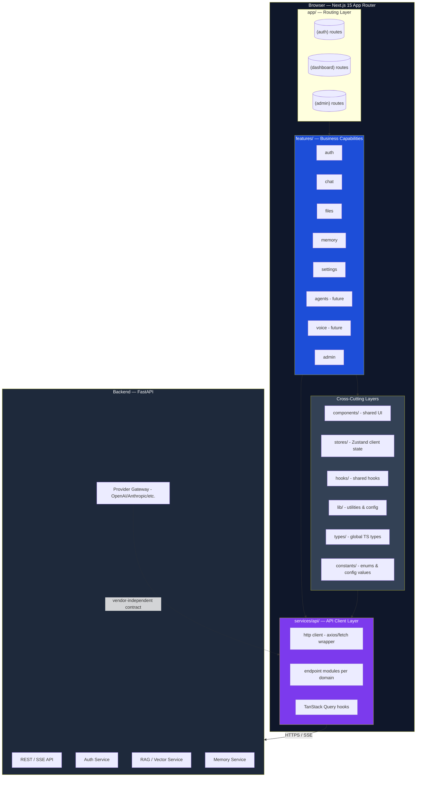
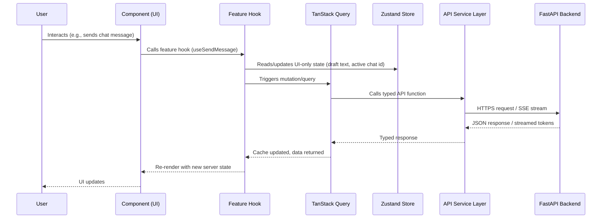
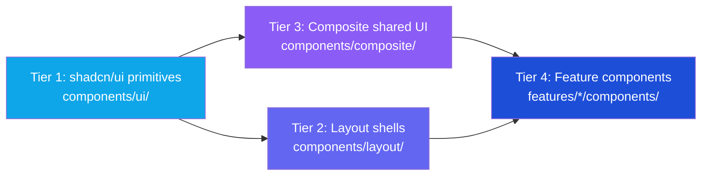
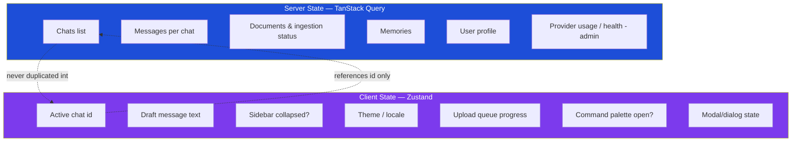
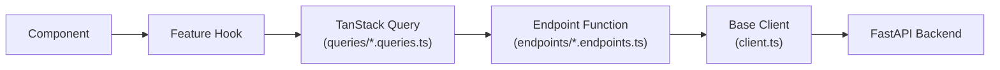
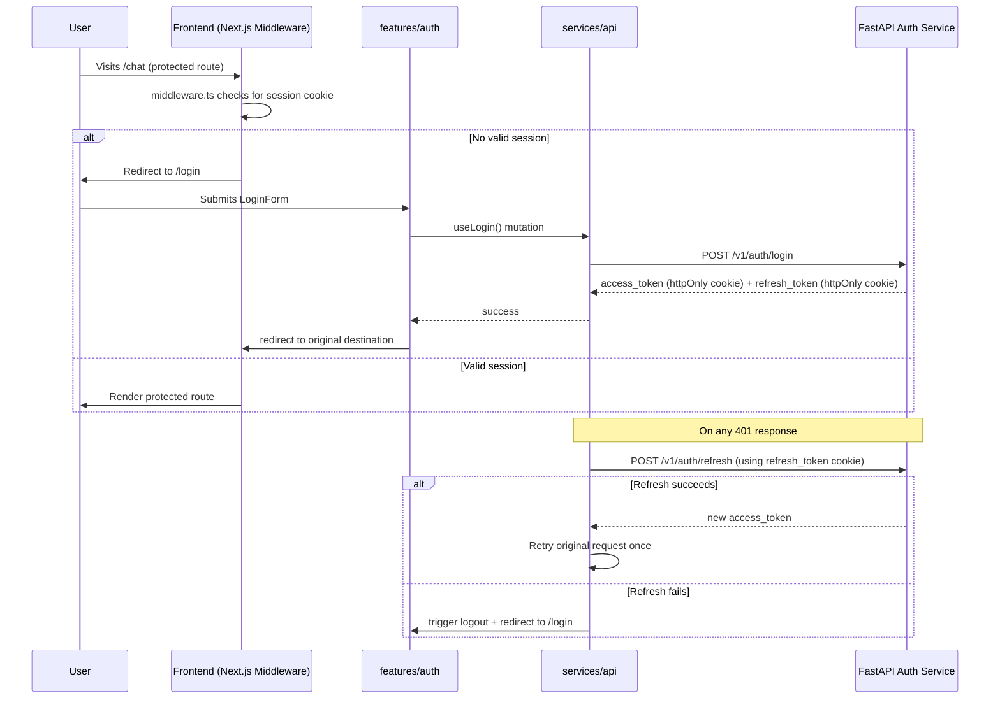
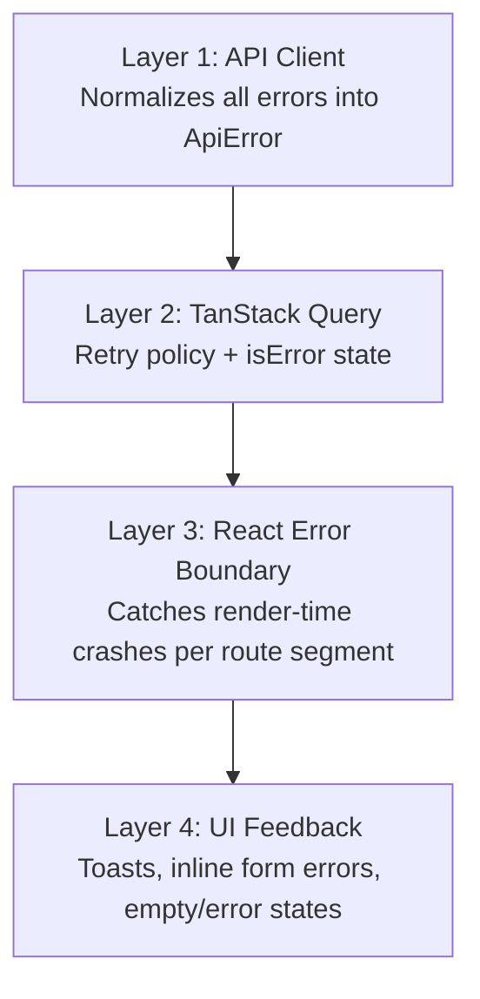
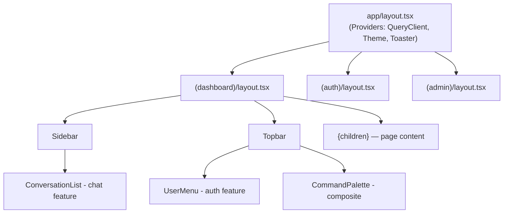
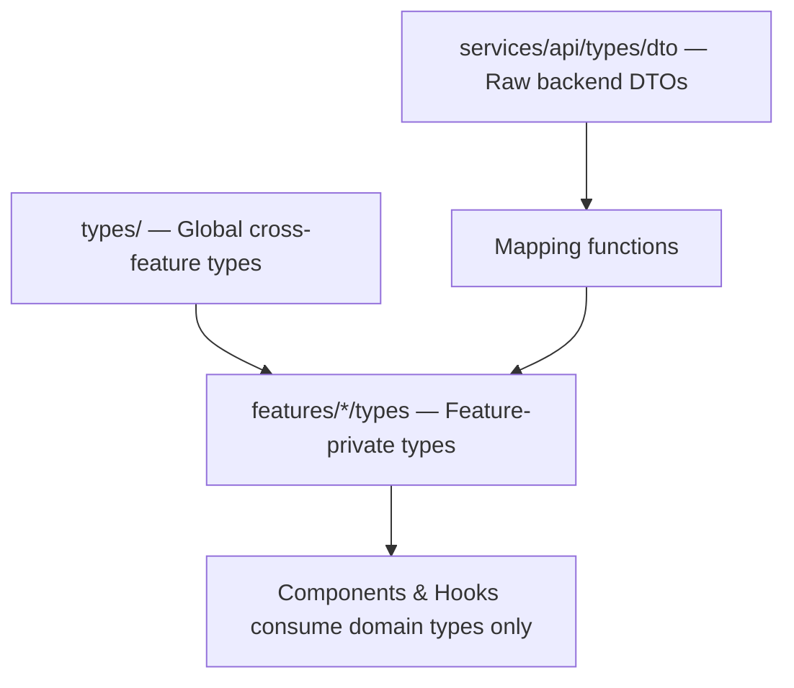
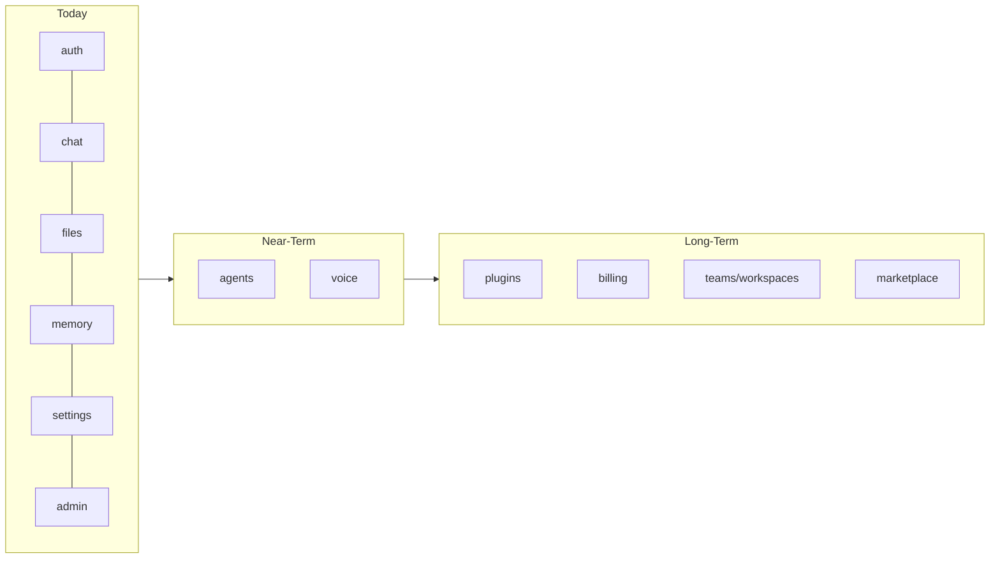

# 11_Frontend_Folder_Structure.md

## PrimeX AI — Frontend Architecture & Folder Structure Specification

**Document Owner:** Frontend Architecture Team
**Project:** PrimeX AI — AI Operating System
**Status:** Approved — Production Standard
**Applies To:** All frontend modules, current and future

> **Project Motto:** *"Build a modular, production-grade, vendor-independent AI Operating System that scales without architectural redesign."*

This document is the single source of truth for how the PrimeX AI frontend is structured, why it is structured that way, and how every engineer — present or future — should extend it. Any pull request that introduces a new top-level folder, a new cross-feature dependency, or a deviation from the conventions below must reference and update this document.

---

## Table of Contents

1. [Frontend Architecture Goals](#1-frontend-architecture-goals)
2. [Why Feature-Based Architecture](#2-why-feature-based-architecture)
3. [High-Level Frontend Architecture Diagram](#3-high-level-frontend-architecture-diagram)
4. [Complete Folder Tree](#4-complete-folder-tree)
5. [Folder-by-Folder Explanation](#5-folder-by-folder-explanation)
6. [Detailed Feature Folder Structure](#6-detailed-feature-folder-structure)
7. [Shared Components Strategy](#7-shared-components-strategy)
8. [State Management Architecture](#8-state-management-architecture)
9. [API Client Layer Design](#9-api-client-layer-design)
10. [Authentication Flow Architecture](#10-authentication-flow-architecture)
11. [Error Handling Strategy](#11-error-handling-strategy)
12. [Form Management Strategy](#12-form-management-strategy)
13. [Routing Strategy Using App Router](#13-routing-strategy-using-app-router)
14. [Loading and Skeleton UI Strategy](#14-loading-and-skeleton-ui-strategy)
15. [Global Layout Architecture](#15-global-layout-architecture)
16. [TypeScript Type Organization](#16-typescript-type-organization)
17. [Future Scalability Plan](#17-future-scalability-plan)
18. [Recommended Coding Standards](#18-recommended-coding-standards)
19. [Naming Conventions](#19-naming-conventions)
20. [Final Recommendations](#20-final-recommendations)

---

## 1. Frontend Architecture Goals

PrimeX AI is not a chatbot UI — it is the human-facing surface of an **AI Operating System**. The frontend must therefore be engineered like an OS shell, not a single-purpose app. The architecture goals below are non-negotiable design constraints, not aspirations.

| Goal | Description | Why It Matters |
|---|---|---|
| **Modularity** | Every capability (chat, files, memory, agents, voice, admin) is an isolated feature module. | New AI capabilities can be added without touching existing ones. |
| **Vendor Independence** | No UI component or store directly assumes a specific LLM provider, vector DB, or storage vendor. | Backend providers can change without frontend rewrites. |
| **Zero Architectural Redesign at Scale** | The folder structure and patterns chosen for 3 features must work unchanged for 30 features. | Avoids the "rewrite at scale" tax common in fast-shipped AI products. |
| **Strict Separation of UI and Business Logic** | Components render; hooks and services decide. | UI can be redesigned without touching business rules, and logic can be unit tested without rendering anything. |
| **API-Driven Frontend** | The frontend has zero hardcoded business rules that belong server-side (token limits, plan rules, model routing). | Backend remains the single source of truth; frontend stays a thin, swappable client. |
| **Strict Typing Everywhere** | No `any`. Every API contract, store, and component prop is typed. | Refactors become mechanical instead of dangerous; the compiler is the first reviewer. |
| **Predictable State Ownership** | Every piece of state has exactly one canonical owner (server cache vs. client store). | Eliminates "which store is this actually in" bugs as the app grows. |
| **Composable UI** | Primitive components (shadcn/ui) are never modified in place; they are composed into feature components. | Design system upgrades don't cascade into feature breakage. |
| **Operational Observability** | Errors, loading states, and async boundaries are handled consistently across every feature. | Production incidents are debuggable instead of mysterious. |

---

## 2. Why Feature-Based Architecture

PrimeX AI rejects the classic "group by file type" structure (`components/`, `pages/`, `hooks/` all flat, with no feature boundaries) in favor of **feature-first architecture**, where each business capability owns its own vertical slice of UI, logic, types, and API access.

### 2.1 The Problem With Layer-First Structure

A layer-first structure (organizing strictly by `components/`, `hooks/`, `services/` with no feature grouping) works for small apps but collapses under AI-OS scale:

- Engineers must touch 5+ unrelated top-level folders to ship one feature.
- There is no natural boundary preventing the `chat` feature from silently importing internals of the `files` feature.
- Code review diffs become unreadable (changes scattered across the whole tree).
- Deleting a feature is unsafe — nothing tells you what else depended on it.

### 2.2 Why Feature-First Wins for an AI OS

PrimeX AI will grow to include agents, voice, plugins, billing, admin tooling, and capabilities that don't exist yet. Feature-first architecture treats each of these as a **bounded context**:

| Property | Layer-First | Feature-First (PrimeX AI) |
|---|---|---|
| New feature impact | Touches many shared folders | Adds one new folder under `features/` |
| Coupling | Implicit, grows over time | Explicit, enforced via public `index.ts` exports |
| Onboarding | Must understand whole app | Must understand one feature folder |
| Code deletion safety | Risky | Safe — delete the feature folder |
| Ownership | Unclear | One team/owner per feature folder |
| Scale ceiling | Degrades past ~10 features | Holds at 50+ features |

### 2.3 The Governing Rule

> **A feature may depend on `shared/`, `lib/`, `types/`, `services/`, and `stores/` (cross-cutting layers). A feature must never directly import from another feature's internals.** Cross-feature communication happens through explicit, typed contracts (shared types, shared stores, or shared events) — never through deep imports like `features/chat/components/InternalBubble` from inside `features/memory`.

This single rule is what allows PrimeX AI to scale from 5 features to 50 without a rewrite.

---

## 3. High-Level Frontend Architecture Diagram



### 3.1 Data Flow Summary



---

## 4. Complete Folder Tree

This is the **canonical top-level structure** for the PrimeX AI frontend repository.

```text
primex-ai-frontend/
├── app/                          # Next.js 15 App Router — routes, layouts, route handlers
│   ├── (auth)/                   # Public auth routes (login, register, reset)
│   ├── (dashboard)/              # Authenticated app shell (chat, files, memory, settings)
│   ├── (admin)/                  # Admin-only dashboard routes
│   ├── api/                      # Next.js route handlers (BFF endpoints, webhooks, edge proxies)
│   ├── layout.tsx                # Root layout (providers, fonts, global shell)
│   ├── globals.css               # Tailwind base + design tokens
│   └── favicon.ico
│
├── features/                     # Feature-first business modules (see Section 6)
│   ├── auth/
│   ├── chat/
│   ├── files/
│   ├── memory/
│   ├── settings/
│   ├── agents/                   # Future module (scaffolded, see Section 17)
│   ├── voice/                    # Future module (scaffolded, see Section 17)
│   └── admin/
│
├── components/                   # Shared, feature-agnostic UI
│   ├── ui/                       # shadcn/ui primitives (button, input, dialog, etc.)
│   ├── layout/                   # Shell components (Sidebar, Topbar, PageContainer)
│   ├── feedback/                 # Toasts, alerts, empty states, error boundaries
│   ├── data-display/             # Tables, cards, badges, avatars
│   └── composite/                # Cross-feature composite UI (e.g., CommandPalette)
│
├── services/                     # All outbound communication with the backend
│   └── api/
│       ├── client.ts              # Base HTTP client (fetch/axios wrapper, interceptors)
│       ├── endpoints/             # One file per backend resource domain
│       ├── queries/                # TanStack Query hook factories per domain
│       ├── sse/                   # Server-Sent Events / streaming client utilities
│       └── types/                 # Raw API request/response DTOs (pre-mapping)
│
├── stores/                       # Zustand client-state stores (see Section 8)
│   ├── ui-store.ts
│   ├── session-store.ts
│   ├── chat-ui-store.ts
│   └── preferences-store.ts
│
├── hooks/                        # Shared, cross-feature React hooks
│   ├── use-debounce.ts
│   ├── use-media-query.ts
│   ├── use-clipboard.ts
│   └── use-keyboard-shortcut.ts
│
├── lib/                          # Framework glue, config, third-party setup
│   ├── query-client.ts            # TanStack Query client + default options
│   ├── auth/                      # Token storage, session helpers (logic, not UI)
│   ├── env.ts                      # Typed, validated environment variables
│   ├── logger.ts                   # Client-side structured logging
│   └── analytics.ts                # Vendor-independent analytics abstraction
│
├── types/                        # Global, cross-feature TypeScript types
│   ├── api.ts                      # Shared API envelope types (pagination, errors)
│   ├── domain.ts                    # Cross-feature domain entities (User, Chat, Message)
│   └── global.d.ts                  # Ambient/global declarations
│
├── utils/                        # Pure, stateless helper functions
│   ├── date.ts
│   ├── formatting.ts
│   ├── validation.ts
│   └── token-estimation.ts
│
├── constants/                    # App-wide constant values & enums
│   ├── routes.ts
│   ├── config.ts
│   └── feature-flags.ts
│
├── styles/                       # Tailwind config extensions, design tokens
│   └── tokens.css
│
├── middleware.ts                  # Next.js middleware (auth gate, locale, headers)
├── next.config.ts
├── tailwind.config.ts
├── tsconfig.json
└── package.json
```

---

## 5. Folder-by-Folder Explanation

### 5.1 `app/`
**Responsibility:** Routing, layouts, and route-level data orchestration only.
**Rule:** No business logic, no direct API calls inside page components. Pages compose feature components and feature hooks.
Route groups (`(auth)`, `(dashboard)`, `(admin)`) isolate layout and middleware concerns per audience without affecting the URL structure. Covered in depth in [Section 13](#13-routing-strategy-using-app-router).

### 5.2 `features/`
**Responsibility:** Self-contained business capabilities. Each feature folder is a vertical slice: components, hooks, services, types, and store slices that belong to that domain.
**Rule:** A feature exposes a single public surface via `index.ts`. Everything else inside the feature folder is private to that feature.

### 5.3 `components/`
**Responsibility:** UI that has no opinion about business logic and is reused across two or more features (or is generic enough that it will be).
**Sub-folders:**
- `ui/` — unmodified shadcn/ui primitives generated via the CLI.
- `layout/` — app shell pieces (Sidebar, Topbar, PageContainer, Breadcrumbs).
- `feedback/` — toasts, error boundaries, empty/loading/error states.
- `data-display/` — tables, badges, avatars, cards with zero business logic.
- `composite/` — assemblies of primitives that are still feature-agnostic (e.g., a generic `CommandPalette`, a generic `DataTable` with sorting).

### 5.4 `services/api/`
**Responsibility:** The only layer in the entire frontend allowed to know the shape of HTTP requests/responses. Fully covered in [Section 9](#9-api-client-layer-design).

### 5.5 `stores/`
**Responsibility:** Zustand stores for **client-only** state — UI state that does not come from, and is not persisted to, the server on every change. Fully covered in [Section 8](#8-state-management-architecture).

### 5.6 `hooks/`
**Responsibility:** Generic React hooks with no business meaning — `useDebounce`, `useMediaQuery`, `useClipboard`, `useKeyboardShortcut`. If a hook knows what a "chat" or a "memory" is, it belongs inside `features/*/hooks`, not here.

### 5.7 `lib/`
**Responsibility:** Framework- and infrastructure-level glue: the TanStack Query client instance, environment variable validation (e.g., via `zod`), the structured logger, the analytics abstraction, and low-level auth/session helpers (token storage primitives — not the auth *feature* itself).

### 5.8 `types/`
**Responsibility:** Types shared across **more than one feature**. Feature-specific types live inside the feature. Global types include the API response envelope, pagination shapes, and cross-feature domain entities like `User` and `Chat` that multiple features need to reference.

### 5.9 `utils/`
**Responsibility:** Pure, side-effect-free helper functions — date formatting, string formatting, validation primitives, token estimation math. Every function here must be unit-testable with no mocks required.

### 5.10 `constants/`
**Responsibility:** Literal values that must never be duplicated — route path strings, config flags, feature flag keys, enum-like constants. Prevents "magic string" drift across the codebase.

### 5.11 `styles/`
**Responsibility:** Design tokens and Tailwind theme extensions that live outside component code (CSS variables for color, spacing, radii — consumed by `tailwind.config.ts` and shadcn/ui theming).

### 5.12 `middleware.ts`
**Responsibility:** Edge-level request handling — redirecting unauthenticated users away from `(dashboard)` and `(admin)` route groups, attaching locale/region headers, and lightweight request shaping before a route is even rendered.

---

## 6. Detailed Feature Folder Structure

Every entry in `features/` follows the **same internal shape**, so once an engineer understands one feature, they understand all of them.

```text
features/
├── auth/
│   ├── components/
│   │   ├── LoginForm.tsx
│   │   ├── RegisterForm.tsx
│   │   ├── ResetPasswordForm.tsx
│   │   └── AuthGuard.tsx
│   ├── hooks/
│   │   ├── use-login.ts
│   │   ├── use-register.ts
│   │   ├── use-logout.ts
│   │   └── use-current-user.ts
│   ├── services/
│   │   └── auth.api.ts            # Thin wrapper around services/api/endpoints/auth
│   ├── store/
│   │   └── auth-slice.ts          # Session/identity client state
│   ├── types/
│   │   └── auth.types.ts
│   ├── schemas/
│   │   └── auth.schema.ts         # Zod validation schemas
│   ├── utils/
│   │   └── token.utils.ts
│   └── index.ts                   # Public exports only
│
├── chat/
│   ├── components/
│   │   ├── ChatWindow.tsx
│   │   ├── MessageBubble.tsx
│   │   ├── MessageList.tsx
│   │   ├── ChatInput.tsx
│   │   ├── ChatSidebar.tsx
│   │   ├── ConversationList.tsx
│   │   ├── StreamingIndicator.tsx
│   │   └── ChatToolbar.tsx
│   ├── hooks/
│   │   ├── use-chat-list.ts
│   │   ├── use-chat-messages.ts
│   │   ├── use-send-message.ts
│   │   ├── use-stream-response.ts
│   │   └── use-create-chat.ts
│   ├── services/
│   │   └── chat.api.ts
│   ├── store/
│   │   └── chat-ui-slice.ts       # Active chat id, draft input, scroll position
│   ├── types/
│   │   └── chat.types.ts
│   ├── schemas/
│   │   └── chat.schema.ts
│   ├── utils/
│   │   └── message-formatting.ts
│   └── index.ts
│
├── files/
│   ├── components/
│   │   ├── FileUploadZone.tsx
│   │   ├── FileList.tsx
│   │   ├── FilePreviewCard.tsx
│   │   ├── UploadProgressBar.tsx
│   │   └── DocumentViewer.tsx
│   ├── hooks/
│   │   ├── use-file-upload.ts
│   │   ├── use-file-list.ts
│   │   ├── use-document-status.ts   # Polls RAG ingestion/embedding status
│   │   └── use-delete-file.ts
│   ├── services/
│   │   └── files.api.ts
│   ├── store/
│   │   └── upload-queue-slice.ts   # In-flight upload progress (client-only)
│   ├── types/
│   │   └── files.types.ts
│   ├── schemas/
│   │   └── files.schema.ts
│   ├── utils/
│   │   └── file-validation.ts      # Size/type checks before upload
│   └── index.ts
│
├── memory/
│   ├── components/
│   │   ├── MemoryList.tsx
│   │   ├── MemoryCard.tsx
│   │   ├── MemoryEditor.tsx
│   │   └── MemoryCategoryFilter.tsx
│   ├── hooks/
│   │   ├── use-memory-list.ts
│   │   ├── use-create-memory.ts
│   │   ├── use-update-memory.ts
│   │   └── use-delete-memory.ts
│   ├── services/
│   │   └── memory.api.ts
│   ├── store/
│   │   └── memory-ui-slice.ts      # Filter/search UI state
│   ├── types/
│   │   └── memory.types.ts
│   ├── schemas/
│   │   └── memory.schema.ts
│   └── index.ts
│
├── settings/
│   ├── components/
│   │   ├── ProfileSettingsForm.tsx
│   │   ├── PreferencesPanel.tsx
│   │   ├── SecuritySettings.tsx
│   │   ├── ThemeToggle.tsx
│   │   └── BillingPanel.tsx        # Future-ready placeholder
│   ├── hooks/
│   │   ├── use-update-profile.ts
│   │   ├── use-update-preferences.ts
│   │   └── use-change-password.ts
│   ├── services/
│   │   └── settings.api.ts
│   ├── store/
│   │   └── preferences-slice.ts
│   ├── types/
│   │   └── settings.types.ts
│   ├── schemas/
│   │   └── settings.schema.ts
│   └── index.ts
│
├── agents/                        # Scaffolded for future multi-agent support
│   ├── components/
│   ├── hooks/
│   ├── services/
│   ├── store/
│   ├── types/
│   └── index.ts
│
├── voice/                         # Scaffolded for future voice features
│   ├── components/
│   ├── hooks/
│   ├── services/
│   ├── store/
│   ├── types/
│   └── index.ts
│
└── admin/
    ├── components/
    │   ├── UserManagementTable.tsx
    │   ├── ProviderHealthPanel.tsx
    │   ├── UsageAnalyticsDashboard.tsx
    │   └── SystemSettingsForm.tsx
    ├── hooks/
    │   ├── use-admin-users.ts
    │   ├── use-provider-health.ts
    │   └── use-usage-metrics.ts
    ├── services/
    │   └── admin.api.ts
    ├── store/
    │   └── admin-ui-slice.ts
    ├── types/
    │   └── admin.types.ts
    └── index.ts
```

### 6.1 Internal Feature Rules

| Sub-folder | Allowed to import from | Forbidden to import from |
|---|---|---|
| `components/` | `hooks/`, `types/`, shared `components/ui` | Other features' internals |
| `hooks/` | `services/`, `store/`, `types/`, global `stores/`, `services/api` | Other features' `components/` |
| `services/` | `services/api/endpoints/*` (global) | Other features entirely |
| `store/` | global `stores/` (composition only) | Other features' `store/` |
| `index.ts` | Everything inside the feature | — (this is the only export surface) |

### 6.2 Example Public Export Surface

```ts
// features/chat/index.ts
export { ChatWindow } from "./components/ChatWindow";
export { ChatSidebar } from "./components/ChatSidebar";
export { useChatMessages } from "./hooks/use-chat-messages";
export { useSendMessage } from "./hooks/use-send-message";
export type { Chat, Message } from "./types/chat.types";

// Anything not exported here is PRIVATE to the chat feature.
```

---

## 7. Shared Components Strategy

PrimeX AI's `components/` folder follows a **four-tier component model**, ensuring shadcn/ui primitives stay upgrade-safe while still enabling rich, opinionated UI.



| Tier | Location | Rule |
|---|---|---|
| 1 — Primitives | `components/ui/` | Generated by shadcn CLI. **Never hand-edit business logic into these.** Style only via Tailwind classes/variants. |
| 2 — Layout | `components/layout/` | App shell pieces. Knows about navigation structure, not business data. |
| 3 — Composite | `components/composite/` | Generic, reusable patterns built from Tier 1 (e.g., `DataTable`, `CommandPalette`, `ConfirmDialog`). Still feature-agnostic. |
| 4 — Feature | `features/*/components/` | Business-aware. Composes Tiers 1–3. Never imported by other features. |

### 7.1 Promotion Rule

A component is **promoted** from a feature folder into `components/composite/` only when:
1. It is used (or clearly will be used) by **2+ features**, and
2. It can be made business-agnostic via props/render-props without losing its purpose.

This prevents premature abstraction while still keeping the shared layer honest and lean.

### 7.2 Example: Composing Tiers

```tsx
// features/files/components/FileUploadZone.tsx
import { Card } from "@/components/ui/card";
import { Progress } from "@/components/ui/progress";
import { EmptyState } from "@/components/feedback/EmptyState";
import { useFileUpload } from "../hooks/use-file-upload";

export function FileUploadZone() {
  const { upload, progress, isUploading } = useFileUpload();

  return (
    <Card className="p-6 border-dashed">
      {isUploading ? (
        <Progress value={progress} />
      ) : (
        <EmptyState
          title="Drop files to add to your knowledge base"
          actionLabel="Browse files"
          onAction={() => upload()}
        />
      )}
    </Card>
  );
}
```

---

## 8. State Management Architecture

PrimeX AI draws a **strict line** between server state and client state. This is the single most important rule for avoiding state-sync bugs as the OS grows.



### 8.1 Responsibility Table

| Concern | Owner | Reason |
|---|---|---|
| Anything fetched from the backend | **TanStack Query** | Has cache invalidation, retries, dedup, and background refetch built in. Reinventing this in Zustand causes stale-data bugs. |
| Anything derived purely from server data | **TanStack Query (`select`)** | Avoid storing derived data anywhere else — recompute via selectors. |
| UI-only ephemeral state | **Zustand** | Sidebar open/closed, active modal, draft text, theme — none of this should ever hit the network. |
| Cross-feature UI signals | **Zustand** | E.g., "command palette is open" needs to be read by `layout/` and written by multiple features. |
| Form state | **React Hook Form** (local to component) | Not global — see [Section 12](#12-form-management-strategy). |
| Auth session/identity | **TanStack Query (`useCurrentUser`) + Zustand (`session-store` for token presence flag only)** | The *data* about the user is server state; whether a request is "in-flight logging out" is UI state. |

### 8.2 Zustand Store Pattern

```ts
// stores/chat-ui-store.ts
import { create } from "zustand";
import { devtools } from "zustand/middleware";

interface ChatUIState {
  activeChatId: string | null;
  draftMessage: string;
  isSidebarCollapsed: boolean;
  setActiveChatId: (id: string | null) => void;
  setDraftMessage: (text: string) => void;
  toggleSidebar: () => void;
}

export const useChatUIStore = create<ChatUIState>()(
  devtools(
    (set) => ({
      activeChatId: null,
      draftMessage: "",
      isSidebarCollapsed: false,
      setActiveChatId: (id) => set({ activeChatId: id }),
      setDraftMessage: (text) => set({ draftMessage: text }),
      toggleSidebar: () =>
        set((state) => ({ isSidebarCollapsed: !state.isSidebarCollapsed })),
    }),
    { name: "chat-ui-store" }
  )
);
```

### 8.3 TanStack Query Pattern

```ts
// services/api/queries/chat.queries.ts
import { useQuery, useMutation, useQueryClient } from "@tanstack/react-query";
import { chatEndpoints } from "../endpoints/chat.endpoints";
import type { Chat, Message, SendMessagePayload } from "@/features/chat/types/chat.types";

export const chatKeys = {
  all: ["chats"] as const,
  list: () => [...chatKeys.all, "list"] as const,
  messages: (chatId: string) => [...chatKeys.all, chatId, "messages"] as const,
};

export function useChatList() {
  return useQuery({
    queryKey: chatKeys.list(),
    queryFn: chatEndpoints.listChats,
    staleTime: 30_000,
  });
}

export function useSendMessage(chatId: string) {
  const queryClient = useQueryClient();

  return useMutation({
    mutationFn: (payload: SendMessagePayload) =>
      chatEndpoints.sendMessage(chatId, payload),
    onSuccess: (newMessage: Message) => {
      queryClient.setQueryData<Message[]>(
        chatKeys.messages(chatId),
        (old = []) => [...old, newMessage]
      );
    },
  });
}
```

### 8.4 Why Not Redux / Context for Server Data

Redux and Context require manually implemented caching, invalidation, retries, and loading/error state — all of which TanStack Query provides out of the box with a smaller API surface. Keeping Zustand scoped to *client-only* concerns means stores stay small, serializable, and free of network side effects, which keeps devtools time-travel and testing simple.

---

## 9. API Client Layer Design

The `services/api/` layer is the **only** part of the frontend permitted to know about HTTP, headers, status codes, or backend URL shapes. No component, hook, or store anywhere else may call `fetch`/`axios` directly.

```text
services/
└── api/
    ├── client.ts                  # Base HTTP client instance
    ├── interceptors/
    │   ├── auth.interceptor.ts    # Attaches access token, handles 401 refresh
    │   └── logging.interceptor.ts
    ├── endpoints/
    │   ├── auth.endpoints.ts
    │   ├── chat.endpoints.ts
    │   ├── files.endpoints.ts
    │   ├── memory.endpoints.ts
    │   ├── settings.endpoints.ts
    │   └── admin.endpoints.ts
    ├── queries/
    │   ├── auth.queries.ts
    │   ├── chat.queries.ts
    │   ├── files.queries.ts
    │   ├── memory.queries.ts
    │   └── admin.queries.ts
    ├── sse/
    │   └── chat-stream.ts          # Streaming token handler for AI responses
    └── types/
        ├── envelope.ts             # { data, meta, error } response wrapper
        └── dto/                    # Raw backend DTOs, mapped to domain types
```

### 9.1 Layered Call Pattern



### 9.2 Base Client

```ts
// services/api/client.ts
import { env } from "@/lib/env";

interface RequestOptions extends RequestInit {
  authRequired?: boolean;
}

class ApiClient {
  private baseUrl = env.NEXT_PUBLIC_API_BASE_URL;

  async request<T>(path: string, options: RequestOptions = {}): Promise<T> {
    const response = await fetch(`${this.baseUrl}${path}`, {
      ...options,
      headers: {
        "Content-Type": "application/json",
        ...options.headers,
      },
      credentials: "include",
    });

    if (!response.ok) {
      const body = await response.json().catch(() => null);
      throw new ApiError(response.status, body?.message ?? "Request failed", body);
    }

    return response.json() as Promise<T>;
  }

  get<T>(path: string, options?: RequestOptions) {
    return this.request<T>(path, { ...options, method: "GET" });
  }
  post<T>(path: string, body?: unknown, options?: RequestOptions) {
    return this.request<T>(path, { ...options, method: "POST", body: JSON.stringify(body) });
  }
  // patch, put, delete follow the same pattern
}

export class ApiError extends Error {
  constructor(public status: number, message: string, public body: unknown) {
    super(message);
  }
}

export const apiClient = new ApiClient();
```

### 9.3 Endpoint Module

```ts
// services/api/endpoints/chat.endpoints.ts
import { apiClient } from "../client";
import type { ChatDTO, MessageDTO, SendMessagePayload } from "../types/dto/chat.dto";
import { mapChatDTO, mapMessageDTO } from "@/features/chat/utils/message-formatting";

export const chatEndpoints = {
  listChats: () =>
    apiClient.get<ChatDTO[]>("/v1/chats").then((data) => data.map(mapChatDTO)),

  getMessages: (chatId: string) =>
    apiClient.get<MessageDTO[]>(`/v1/chats/${chatId}/messages`).then((data) =>
      data.map(mapMessageDTO)
    ),

  sendMessage: (chatId: string, payload: SendMessagePayload) =>
    apiClient
      .post<MessageDTO>(`/v1/chats/${chatId}/messages`, payload)
      .then(mapMessageDTO),
};
```

### 9.4 Why DTO Mapping Matters

Backend DTOs (`ChatDTO`, `MessageDTO`) are **never** passed directly into components. Every endpoint maps DTOs into domain types (`Chat`, `Message`) defined in the feature's `types/`. This is what makes PrimeX AI **vendor-independent at the data layer** — if the backend renames a field or changes a provider's response shape, only the mapping function changes, not every component that touches that data.

### 9.5 Streaming (SSE) Client for AI Responses

```ts
// services/api/sse/chat-stream.ts
export function streamChatResponse(
  chatId: string,
  payload: { content: string },
  onToken: (token: string) => void,
  onDone: () => void,
  onError: (err: Error) => void
) {
  const controller = new AbortController();

  fetch(`${process.env.NEXT_PUBLIC_API_BASE_URL}/v1/chats/${chatId}/stream`, {
    method: "POST",
    headers: { "Content-Type": "application/json" },
    body: JSON.stringify(payload),
    credentials: "include",
    signal: controller.signal,
  }).then(async (res) => {
    const reader = res.body?.getReader();
    const decoder = new TextDecoder();
    if (!reader) return onError(new Error("No stream body"));

    while (true) {
      const { value, done } = await reader.read();
      if (done) return onDone();
      onToken(decoder.decode(value));
    }
  }).catch(onError);

  return () => controller.abort();
}
```

---

## 10. Authentication Flow Architecture



### 10.1 Design Decisions

| Decision | Rationale |
|---|---|
| **httpOnly, Secure cookies for tokens** | Prevents XSS-based token theft; tokens are never accessible to client JS. |
| **`middleware.ts` gates route groups** | Auth check happens at the edge, before React even renders, preventing protected-content flashes. |
| **Auth interceptor handles silent refresh** | A single 401-retry-once interceptor in `services/api/interceptors/auth.interceptor.ts` means no feature ever has to think about token refresh. |
| **`useCurrentUser()` is the single identity source** | A TanStack Query hook wraps `/v1/auth/me`; every feature that needs "who is logged in" calls this hook — never reads a token directly. |
| **`AuthGuard` component for in-page gating** | For UI that needs role-based conditional rendering (not full route protection), `features/auth/components/AuthGuard.tsx` wraps children. |

### 10.2 Auth Feature Hook Example

```ts
// features/auth/hooks/use-current-user.ts
import { useQuery } from "@tanstack/react-query";
import { authEndpoints } from "@/services/api/endpoints/auth.endpoints";

export function useCurrentUser() {
  return useQuery({
    queryKey: ["auth", "me"],
    queryFn: authEndpoints.getCurrentUser,
    staleTime: 5 * 60_000,
    retry: false,
  });
}
```

---

## 11. Error Handling Strategy

PrimeX AI handles errors at **four distinct layers**, each with a different responsibility, so a single thrown error never has to be handled in more than one place.



| Layer | Location | Responsibility |
|---|---|---|
| 1. Normalization | `services/api/client.ts` | Every failed request throws a typed `ApiError` with `status`, `message`, `body`. No raw `fetch` errors leak upward. |
| 2. Query-level | `services/api/queries/*` | Configures retry count/backoff per query type (e.g., never retry 4xx, retry 5xx up to 2x). |
| 3. Boundary | `app/(dashboard)/error.tsx`, feature-level `error.tsx` | Next.js error boundaries per route segment catch render crashes and show a recoverable fallback instead of a blank screen. |
| 4. Feedback | `components/feedback/` | `Toast` for transient errors, `InlineFieldError` for form validation, `EmptyState`/`ErrorState` for failed data fetches. |

### 11.1 Typed Error Model

```ts
// services/api/client.ts (excerpt)
export class ApiError extends Error {
  constructor(
    public status: number,
    message: string,
    public body: unknown
  ) {
    super(message);
    this.name = "ApiError";
  }

  get isAuthError() { return this.status === 401; }
  get isValidationError() { return this.status === 422; }
  get isServerError() { return this.status >= 500; }
}
```

### 11.2 Route-Level Error Boundary

```tsx
// app/(dashboard)/chat/error.tsx
"use client";

import { ErrorState } from "@/components/feedback/ErrorState";

export default function ChatError({
  error,
  reset,
}: { error: Error; reset: () => void }) {
  return (
    <ErrorState
      title="Something went wrong loading your chats"
      description={error.message}
      onRetry={reset}
    />
  );
}
```

### 11.3 Global Mutation Error Toasting

```ts
// lib/query-client.ts
import { QueryClient } from "@tanstack/react-query";
import { toast } from "@/components/feedback/use-toast";
import { ApiError } from "@/services/api/client";

export const queryClient = new QueryClient({
  defaultOptions: {
    queries: { retry: (count, err) => (err instanceof ApiError && err.isServerError ? count < 2 : false) },
    mutations: {
      onError: (error) => {
        const message = error instanceof ApiError ? error.message : "Unexpected error";
        toast({ variant: "destructive", title: "Action failed", description: message });
      },
    },
  },
});
```

---

## 12. Form Management Strategy

| Concern | Tool | Reason |
|---|---|---|
| Form state & validation | **React Hook Form** | Uncontrolled-by-default performance, minimal re-renders, large ecosystem. |
| Schema validation | **Zod** | Single schema definition reused for both client validation and (mirrored) backend contract awareness. |
| Bridging RHF + Zod | **`@hookform/resolvers/zod`** | Standard, type-safe bridge — form values are fully typed from the Zod schema, no duplicate typing. |
| Server submission errors | **Mapped back into RHF field errors** | A 422 `ApiError` body is mapped to `setError(fieldName, ...)` so server and client validation feel identical to the user. |

### 12.1 Schema-First Pattern

```ts
// features/auth/schemas/auth.schema.ts
import { z } from "zod";

export const loginSchema = z.object({
  email: z.string().email("Enter a valid email address"),
  password: z.string().min(8, "Password must be at least 8 characters"),
});

export type LoginFormValues = z.infer<typeof loginSchema>;
```

```tsx
// features/auth/components/LoginForm.tsx
import { useForm } from "react-hook-form";
import { zodResolver } from "@hookform/resolvers/zod";
import { loginSchema, type LoginFormValues } from "../schemas/auth.schema";
import { useLogin } from "../hooks/use-login";
import { Input } from "@/components/ui/input";
import { Button } from "@/components/ui/button";
import { ApiError } from "@/services/api/client";

export function LoginForm() {
  const form = useForm<LoginFormValues>({ resolver: zodResolver(loginSchema) });
  const { mutateAsync, isPending } = useLogin();

  const onSubmit = async (values: LoginFormValues) => {
    try {
      await mutateAsync(values);
    } catch (err) {
      if (err instanceof ApiError && err.isValidationError) {
        form.setError("email", { message: "Invalid credentials" });
      }
    }
  };

  return (
    <form onSubmit={form.handleSubmit(onSubmit)} className="space-y-4">
      <Input {...form.register("email")} placeholder="Email" />
      <Input {...form.register("password")} type="password" placeholder="Password" />
      <Button type="submit" disabled={isPending}>Log In</Button>
    </form>
  );
}
```

### 12.2 Rule: Forms Are Always Local State

Form values **never** live in Zustand or TanStack Query while being edited. Only on successful submission does data move into server state (via a mutation) or, rarely, into a Zustand store (e.g., a multi-step onboarding wizard's in-progress step index).

---

## 13. Routing Strategy Using App Router

```text
app/
├── (auth)/
│   ├── login/page.tsx
│   ├── register/page.tsx
│   ├── reset-password/page.tsx
│   └── layout.tsx                 # Minimal centered layout, no sidebar
│
├── (dashboard)/
│   ├── layout.tsx                 # Sidebar + Topbar shell, wraps all authenticated routes
│   ├── chat/
│   │   ├── page.tsx                # New chat / chat list landing
│   │   ├── [chatId]/page.tsx       # Specific conversation
│   │   └── loading.tsx
│   ├── files/
│   │   ├── page.tsx
│   │   └── [fileId]/page.tsx
│   ├── memory/
│   │   └── page.tsx
│   ├── settings/
│   │   ├── page.tsx
│   │   ├── profile/page.tsx
│   │   ├── preferences/page.tsx
│   │   └── security/page.tsx
│   └── error.tsx
│
├── (admin)/
│   ├── layout.tsx                  # Separate shell + role-gate middleware check
│   ├── dashboard/page.tsx
│   ├── users/page.tsx
│   ├── providers/page.tsx
│   └── usage/page.tsx
│
├── api/
│   └── health/route.ts             # Lightweight BFF route handlers only
│
└── layout.tsx                       # Root: fonts, providers, <html>/<body>
```

### 13.1 Principles

| Principle | Detail |
|---|---|
| **Route groups define audience, not URL** | `(auth)`, `(dashboard)`, `(admin)` parentheses don't appear in the URL — they exist purely to scope layouts and middleware. |
| **Dynamic segments map to entities** | `[chatId]`, `[fileId]` — never `[id]` generically, for readability and type-safety with `params`. |
| **Pages are thin** | A `page.tsx` imports a feature component and passes route params. It does not contain JSX markup for the feature itself. |
| **Parallel & intercepting routes reserved for future UX** | E.g., a future `@modal` parallel route for a quick file preview without losing chat state — structure is ready, not yet used. |
| **`loading.tsx` co-located per segment** | Pairs with [Section 14](#14-loading-and-skeleton-ui-strategy). |

### 13.2 Example Thin Page

```tsx
// app/(dashboard)/chat/[chatId]/page.tsx
import { ChatWindow } from "@/features/chat";

export default function ChatPage({ params }: { params: { chatId: string } }) {
  return <ChatWindow chatId={params.chatId} />;
}
```

---

## 14. Loading and Skeleton UI Strategy

| Mechanism | Use Case |
|---|---|
| **Next.js `loading.tsx`** | Route-level navigation loading (segment-level Suspense boundary), automatic. |
| **`<Suspense>` + skeleton** | Component-level loading inside a page that has multiple independently-loading regions. |
| **TanStack Query `isPending` / `isFetching`** | Fine-grained loading state for a specific query (e.g., refetch spinner on a button). |
| **Skeleton components** | `components/feedback/Skeleton*.tsx` — shape-matched placeholders, never a generic spinner for content-heavy UI. |

### 14.1 Rule: Skeletons Match Final Layout

Every skeleton component mirrors the exact dimensions/grid of its loaded counterpart, to avoid layout shift (CLS).

```tsx
// features/chat/components/ConversationList.tsx
import { useChatList } from "../hooks/use-chat-list";
import { ConversationListSkeleton } from "@/components/feedback/ConversationListSkeleton";
import { EmptyState } from "@/components/feedback/EmptyState";

export function ConversationList() {
  const { data, isPending, isError } = useChatList();

  if (isPending) return <ConversationListSkeleton rows={6} />;
  if (isError) return <EmptyState title="Couldn't load conversations" />;
  if (data.length === 0) return <EmptyState title="No conversations yet" />;

  return (
    <ul>
      {data.map((chat) => <ConversationListItem key={chat.id} chat={chat} />)}
    </ul>
  );
}
```

### 14.2 Route-Level Loading

```tsx
// app/(dashboard)/chat/loading.tsx
import { ChatWindowSkeleton } from "@/components/feedback/ChatWindowSkeleton";

export default function Loading() {
  return <ChatWindowSkeleton />;
}
```

---

## 15. Global Layout Architecture



### 15.1 Root Providers

```tsx
// app/layout.tsx
import { QueryClientProvider } from "@tanstack/react-query";
import { queryClient } from "@/lib/query-client";
import { ThemeProvider } from "@/components/layout/ThemeProvider";
import { Toaster } from "@/components/feedback/Toaster";
import "./globals.css";

export default function RootLayout({ children }: { children: React.ReactNode }) {
  return (
    <html lang="en" suppressHydrationWarning>
      <body>
        <QueryClientProvider client={queryClient}>
          <ThemeProvider attribute="class" defaultTheme="dark">
            {children}
            <Toaster />
          </ThemeProvider>
        </QueryClientProvider>
      </body>
    </html>
  );
}
```

### 15.2 Dashboard Shell

```tsx
// app/(dashboard)/layout.tsx
import { Sidebar } from "@/components/layout/Sidebar";
import { Topbar } from "@/components/layout/Topbar";

export default function DashboardLayout({ children }: { children: React.ReactNode }) {
  return (
    <div className="flex h-screen overflow-hidden">
      <Sidebar />
      <div className="flex flex-1 flex-col">
        <Topbar />
        <main className="flex-1 overflow-y-auto">{children}</main>
      </div>
    </div>
  );
}
```

### 15.3 Layout Composition Rule

`components/layout/` pieces (`Sidebar`, `Topbar`) are themselves feature-agnostic shells — they accept feature-specific content as children/slots (e.g., `<Sidebar><ConversationList /></Sidebar>`) rather than importing feature components internally. This keeps the layout layer reusable even if the dashboard's primary feature changes.

---

## 16. TypeScript Type Organization



| Location | Contains | Example |
|---|---|---|
| `services/api/types/dto/` | Exact backend response/request shapes (snake_case allowed here) | `ChatDTO`, `MessageDTO` |
| `features/*/types/` | Domain types used inside that feature (camelCase, UI-ready) | `Chat`, `Message`, `ChatStatus` |
| `types/` (global) | Types referenced by **2+ features** | `User`, `PaginatedResponse<T>`, `ApiEnvelope<T>` |
| `types/global.d.ts` | Ambient declarations (e.g., env var typing, window extensions) | `declare global { interface Window {...} }` |

### 16.1 Rules

1. **No `any`.** `unknown` + narrowing is the only acceptable escape hatch, and only at I/O boundaries (e.g., parsing JSON before validation).
2. **DTOs never leak past the `services/api` layer.** Mapping functions convert DTO → domain type immediately.
3. **Discriminated unions for state machines.** E.g., upload state:

```ts
// features/files/types/files.types.ts
export type UploadState =
  | { status: "idle" }
  | { status: "uploading"; progress: number }
  | { status: "processing" } // backend embedding/ingestion in progress
  | { status: "ready"; documentId: string }
  | { status: "error"; message: string };
```

4. **Shared API envelope:**

```ts
// types/api.ts
export interface ApiEnvelope<T> {
  data: T;
  meta?: { page?: number; totalPages?: number };
}

export interface PaginatedResponse<T> {
  items: T[];
  nextCursor: string | null;
}
```

---

## 17. Future Scalability Plan

PrimeX AI's structure is explicitly designed to absorb the roadmap below **without touching existing feature folders**.



| Future Capability | How It Slots In |
|---|---|
| **Agents (multi-agent orchestration)** | New `features/agents/` folder; reuses `services/api` SSE client pattern for agent-step streaming; reuses `components/composite/DataTable` for agent run history. |
| **Voice (STT/TTS)** | New `features/voice/` folder; adds `services/api/sse/voice-stream.ts` following the existing streaming pattern; UI lives entirely inside the feature. |
| **Plugins / Tool Marketplace** | New `features/plugins/`; introduces a `PluginRegistry` Zustand store (client state: which plugins are enabled in this session) backed by server state (`usePluginCatalog` query). |
| **Billing/Usage Plans** | New `features/billing/`; consumes the same `admin` usage-tracking endpoints already scaffolded in [12_Database_Schema.md] `provider_usage`. |
| **Teams / Workspaces** | Introduces a `WorkspaceContext` at the `(dashboard)/layout.tsx` level; existing features gain a `workspaceId` parameter in their API calls without restructuring. |
| **White-labeling / Theming** | Already supported via `styles/tokens.css` + shadcn theming — no structural change needed. |
| **Mobile / React Native reuse** | `services/api`, `types/`, `utils/`, and Zustand stores are framework-agnostic by design and can be extracted into a shared package if a native app is built later. |

### 17.1 The Scaling Invariant

> Adding a new capability should always mean **adding a new folder**, never **modifying the internals of an existing feature folder.** If a change request requires editing two unrelated features at once, that is a signal the shared contract (a type in `types/`, a store in `stores/`, or an endpoint in `services/api`) was incomplete — fix the contract, not the features.

---

## 18. Recommended Coding Standards

| Standard | Rule |
|---|---|
| **Strict TypeScript** | `"strict": true` in `tsconfig.json`. `noUncheckedIndexedAccess` enabled. |
| **No default exports for components** | Except Next.js special files (`page.tsx`, `layout.tsx`, `loading.tsx`, `error.tsx`) which Next.js requires as default exports. |
| **One component per file** | File name matches component name exactly. |
| **Hooks own logic, components own markup** | A component file should rarely exceed ~150 lines; logic above that threshold belongs in a hook. |
| **No inline business logic in JSX** | Extract to a named function or hook — `onClick={() => handleSend()}`, not multi-line logic inline. |
| **Co-locate tests** | `ComponentName.test.tsx` next to `ComponentName.tsx`. |
| **Lint/format gates** | ESLint (strict + `eslint-plugin-react-hooks` + `@typescript-eslint`) and Prettier run as pre-commit hooks and CI gates — no merge without a clean run. |
| **Absolute imports only** | `@/features/chat` not `../../../features/chat`, enforced via `tsconfig.json` paths. |
| **No cross-feature deep imports** | Enforced via ESLint `no-restricted-imports` rule pointing only at each feature's `index.ts`. |
| **Server Components by default** | `"use client"` only when a component needs state, effects, or browser APIs — keeps bundle size minimal. |
| **Accessibility is non-optional** | All interactive elements keyboard-navigable; shadcn/ui (Radix-based) primitives used precisely because they ship this by default. |

### 18.1 Example ESLint Boundary Rule

```js
// .eslintrc.js (excerpt)
rules: {
  "no-restricted-imports": ["error", {
    patterns: [
      {
        group: ["@/features/*/components/*", "@/features/*/hooks/*", "@/features/*/store/*"],
        message: "Import from a feature's public index.ts instead of its internals.",
      },
    ],
  }],
}
```

---

## 19. Naming Conventions

| Item | Convention | Example |
|---|---|---|
| Component files & names | `PascalCase` | `ChatWindow.tsx`, `MessageBubble.tsx` |
| Hooks | `camelCase`, prefixed `use` | `useSendMessage.ts` → exports `useSendMessage` |
| Zustand stores | `kebab-case` file, `useXStore` export | `chat-ui-store.ts` → `useChatUIStore` |
| Service/endpoint files | `kebab-case` or `dot.case`, suffixed by role | `chat.endpoints.ts`, `chat.queries.ts` |
| Types/interfaces | `PascalCase`, no `I` prefix | `Chat`, `Message`, not `IChat` |
| Type-only files | `*.types.ts` | `chat.types.ts` |
| Zod schemas | `*.schema.ts`, exported as `xSchema` | `auth.schema.ts` → `loginSchema` |
| Constants | `UPPER_SNAKE_CASE` for primitives, `PascalCase` for const objects/enums-as-objects | `MAX_FILE_SIZE_MB`, `Routes.Chat` |
| Folders | `kebab-case`, plural for collections | `features/`, `components/`, `agents/` |
| Boolean variables/props | `is/has/should` prefix | `isLoading`, `hasError`, `shouldRetry` |
| Event handler props | `on` prefix | `onSend`, `onDelete` |
| Route params | Descriptive, never generic `id` | `[chatId]`, `[documentId]` |
| CSS/Tailwind custom classes | `kebab-case`, BEM-free (utility-first) | `chat-bubble--assistant` only when a custom class is unavoidable |

---

## 20. Final Recommendations

1. **Treat this document as a contract, not a suggestion.** Every new feature PR should be reviewable against this file section-by-section.
2. **Enforce the feature boundary in CI, not just in review.** The ESLint `no-restricted-imports` rule in [Section 18](#18-recommended-coding-standards) must be a required CI check, not a guideline engineers remember to follow.
3. **Keep `services/api` the single chokepoint to the backend.** Every time a new backend capability ships (agents, voice, plugins), add an endpoint module + query module here first, before any UI is built against it.
4. **Resist premature shared abstractions.** Use the promotion rule in [Section 7.1](#71-promotion-rule) — two real usages, not anticipated ones, justify moving something into `components/composite/`.
5. **Re-validate this document at each major milestone** (after agents ship, after voice ships, after multi-workspace ships) to confirm the folder structure is still holding without modification — that is the test of whether the "no architectural redesign" goal is being met.
6. **Pair this document with `12_Database_Schema.md`** so frontend domain types (`Chat`, `Message`, `Document`, `Memory`) stay mapped 1:1 with backend schema entities, keeping the vendor-independence and auditability goals aligned end-to-end.

---

*End of 11_Frontend_Folder_Structure.md*
