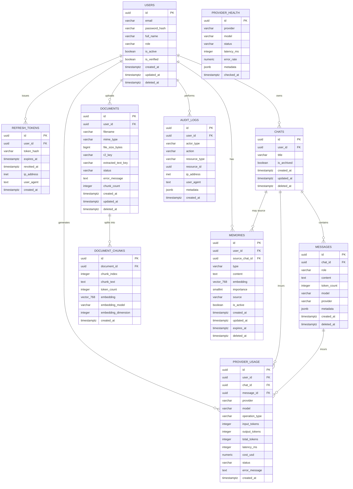
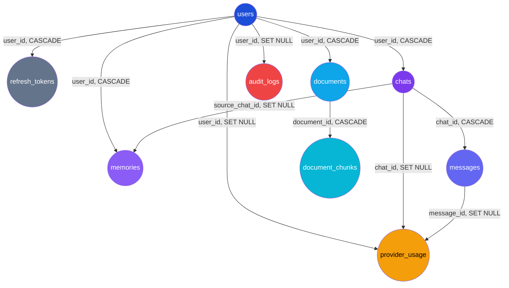

# 12_Database_Schema.md

## PrimeX AI — Database Schema & Data Architecture Specification

**Document Owner:** Backend & Data Architecture Team
**Project:** PrimeX AI — AI Operating System
**Status:** Approved — Production Standard
**Stack:** FastAPI · SQLAlchemy · Alembic · Neon PostgreSQL · pgvector · Cloudflare R2

> **Project Motto:** *"Build a modular, production-grade, vendor-independent AI Operating System that scales without architectural redesign."*

This document is the canonical specification for every table, relationship, index, and migration convention used by PrimeX AI. Any new table, column, or index must be proposed as a diff against this document before being implemented in an Alembic migration.

---

## Table of Contents

1. [Database Design Goals](#1-database-design-goals)
2. [ER Diagram](#2-er-diagram)
3. [Database Naming Conventions](#3-database-naming-conventions)
4. [Primary Key Strategy (UUID)](#4-primary-key-strategy-uuid)
5. [Timestamp Standards](#5-timestamp-standards)
6. [Soft Delete Strategy](#6-soft-delete-strategy)
7. [Table Schemas](#7-table-schemas)
   - 7.1 [users](#71-users)
   - 7.2 [refresh_tokens](#72-refresh_tokens)
   - 7.3 [chats](#73-chats)
   - 7.4 [messages](#74-messages)
   - 7.5 [documents](#75-documents)
   - 7.6 [document_chunks](#76-document_chunks)
   - 7.7 [memories](#77-memories)
   - 7.8 [provider_usage](#78-provider_usage)
   - 7.9 [provider_health](#79-provider_health)
   - 7.10 [audit_logs](#710-audit_logs)
8. [Foreign Key Relationship Diagram](#8-foreign-key-relationship-diagram)
9. [Indexing Strategy](#9-indexing-strategy)
10. [pgvector Indexing Strategy](#10-pgvector-indexing-strategy)
11. [Migration Recommendations (Alembic)](#11-migration-recommendations-alembic)
12. [Partitioning — Future Strategy](#12-partitioning--future-strategy)
13. [Backup Strategy](#13-backup-strategy)
14. [Final Recommendations](#14-final-recommendations)

---

## 1. Database Design Goals

| Goal | Description |
|---|---|
| **PostgreSQL as Source of Truth** | Every durable fact about the system — identity, conversations, documents, memory, usage — lives in Neon PostgreSQL. Nothing critical is "only" in cache, vector store, or object storage. |
| **Embeddings Are Disposable** | Vector embeddings in `document_chunks.embedding` and `memories.embedding` can be **deleted and regenerated** at any time (new embedding model, dimension change, provider switch) without data loss, because... |
| **Extracted Text Is Source of Truth** | The raw extracted text of a document (`documents.extracted_text_key` → Cloudflare R2) and `document_chunks.chunk_text` are authoritative. Embeddings are a derived index over this text, never the only copy of it. |
| **Normalized Schema** | Third normal form by default. Denormalization (e.g., `chats.message_count`) is only introduced deliberately, documented, and kept in sync via application logic or triggers — never as an accident. |
| **Auditability** | Every sensitive state change (auth events, deletions, role changes, admin actions) is recorded in `audit_logs`, independent of soft-delete history on the entity tables themselves. |
| **Future Scalability** | Schema anticipates partitioning (`messages`, `provider_usage`, `audit_logs`), multi-provider tracking, and multi-tenancy (`workspace_id` can be added without breaking existing FKs) from day one. |
| **Vendor Independence** | No table hardcodes a single AI provider's schema. `provider`, `model`, and `embedding_model` are free-text/enum columns, not foreign keys into a provider-specific table — providers can be swapped without DDL changes. |
| **Referential Integrity** | All relationships are enforced via real foreign keys with explicit `ON DELETE` behavior — never application-only enforcement. |

---

## 2. ER Diagram



---

## 3. Database Naming Conventions

| Object | Convention | Example |
|---|---|---|
| Tables | `snake_case`, plural | `users`, `document_chunks` |
| Columns | `snake_case` | `created_at`, `r2_key` |
| Primary key | Always `id` | `id UUID PRIMARY KEY` |
| Foreign key | `<singular_referenced_table>_id` | `user_id`, `chat_id`, `document_id` |
| Boolean columns | `is_`/`has_` prefix | `is_active`, `has_attachments` |
| Timestamp columns | `_at` suffix | `created_at`, `expires_at`, `revoked_at` |
| Indexes | `ix_<table>_<column(s)>` | `ix_messages_chat_id` |
| Unique constraints | `uq_<table>_<column(s)>` | `uq_users_email` |
| Foreign key constraints | `fk_<table>_<referenced_table>` | `fk_chats_users` |
| Check constraints | `ck_<table>_<rule>` | `ck_messages_role_valid` |
| Enums (Postgres native or check-based) | `snake_case`, singular | `message_role`, `document_status` |
| Migration files (Alembic) | `<rev>_<verb>_<description>.py` | `0007_add_document_chunks_table.py` |

**Rule:** All identifiers are lowercase `snake_case`. No camelCase, no abbreviations that aren't industry-standard (`id`, `url`, `r2_key` are fine; `usr_nm` is not).

---

## 4. Primary Key Strategy (UUID)

PrimeX AI uses **UUIDv7-style, time-ordered UUIDs** (via `uuid_generate_v7()`-equivalent application-side generation, or Postgres `gen_random_uuid()` where strict time-ordering is not required) as the primary key for every table.

| Reason | Explanation |
|---|---|
| **No central sequence bottleneck** | Unlike `SERIAL`/`BIGSERIAL`, UUIDs can be generated client-side or in any service instance without coordinating with the database, which matters once PrimeX AI has multiple backend replicas or edge workers. |
| **Safe to expose in URLs/APIs** | Sequential integer IDs leak record counts and enable enumeration attacks (`/chats/1042`). UUIDs do not. |
| **Merge-safe across environments** | Data can be copied between staging/prod, or merged from offline-generated records (e.g., a future local-first client), without primary key collisions. |
| **Vendor independence** | UUIDs are portable if PrimeX AI ever needs to shard, migrate off Neon, or replicate into a different store — no auto-increment sequence state to reconcile. |

### 4.1 Standard Column Definition

```sql
id UUID PRIMARY KEY DEFAULT gen_random_uuid()
```

> **Note:** `gen_random_uuid()` requires the `pgcrypto` extension (enabled by default on Neon). For high-volume tables (`messages`, `provider_usage`, `audit_logs`) where insertion-order locality improves index performance, the application layer (SQLAlchemy) generates **UUIDv7** values instead, which are monotonically sortable by creation time while remaining globally unique. This is configured once in a shared `GUID` SQLAlchemy type rather than per-model.

```python
# app/db/types.py
import uuid
from uuid_extensions import uuid7  # time-ordered UUIDv7 generator
from sqlalchemy import Column
from sqlalchemy.dialects.postgresql import UUID as PG_UUID

def uuid7_default() -> uuid.UUID:
    return uuid7()

def UUIDPrimaryKey():
    return Column(PG_UUID(as_uuid=True), primary_key=True, default=uuid7_default)
```

---

## 5. Timestamp Standards

| Rule | Detail |
|---|---|
| **Type** | All timestamps use `TIMESTAMPTZ` (`timestamp with time zone`). Never `TIMESTAMP` without time zone — this avoids ambiguity once PrimeX AI has users/servers in multiple regions. |
| **Storage timezone** | Postgres always stores UTC internally regardless of session timezone; the application (FastAPI/SQLAlchemy) treats every datetime as UTC-aware (`datetime.now(timezone.utc)`), never naive. |
| **Standard columns** | Every table has `created_at`. Mutable tables also have `updated_at`. Soft-deletable tables also have `deleted_at`. |
| **Default generation** | `DEFAULT now()` at the database level (not application level) for `created_at`, so the timestamp is correct even for direct SQL/migrations. |
| **`updated_at` maintenance** | Maintained via a shared Postgres trigger function (`set_updated_at()`), not scattered manually across SQLAlchemy models — guarantees correctness even for bulk `UPDATE` statements that bypass the ORM. |

### 5.1 Shared `updated_at` Trigger

```sql
CREATE OR REPLACE FUNCTION set_updated_at()
RETURNS TRIGGER AS $$
BEGIN
    NEW.updated_at = now();
    RETURN NEW;
END;
$$ LANGUAGE plpgsql;

-- Applied per table, e.g.:
CREATE TRIGGER trg_users_updated_at
BEFORE UPDATE ON users
FOR EACH ROW
EXECUTE FUNCTION set_updated_at();
```

---

## 6. Soft Delete Strategy

PrimeX AI uses **soft deletes** (`deleted_at TIMESTAMPTZ NULL`) on all user-facing, auditable entities: `users`, `chats`, `messages`, `documents`, `memories`. Pure event/log tables (`provider_usage`, `provider_health`, `audit_logs`, `refresh_tokens`) are **hard-deleted or retention-expired** instead, since they represent immutable historical facts, not editable user content.

| Rule | Detail |
|---|---|
| **Column** | `deleted_at TIMESTAMPTZ NULL` — `NULL` means "active", a timestamp means "soft-deleted at this time." |
| **Querying** | Every default query filters `WHERE deleted_at IS NULL`. Enforced centrally via a SQLAlchemy mixin + query-level default filter, never repeated ad hoc per query. |
| **Uniqueness with soft delete** | Unique constraints that must allow re-use after deletion (e.g., re-registering a deleted user's email) use a **partial unique index**: `CREATE UNIQUE INDEX uq_users_email_active ON users (email) WHERE deleted_at IS NULL;` |
| **Cascade behavior** | Soft-deleting a `chat` cascades a soft-delete to its `messages` via an application-level service call (transaction), not a DB trigger — this keeps the business rule visible and testable in code. |
| **Hard purge policy** | A scheduled job permanently hard-deletes soft-deleted rows older than the retention window (default: 90 days) to satisfy storage and compliance requirements, after first writing a summary record to `audit_logs`. |

### 6.1 SQLAlchemy Mixin

```python
# app/db/mixins.py
from sqlalchemy import Column, DateTime
from sqlalchemy.sql import func

class SoftDeleteMixin:
    deleted_at = Column(DateTime(timezone=True), nullable=True, index=True)

    @property
    def is_deleted(self) -> bool:
        return self.deleted_at is not None
```

---

## 7. Table Schemas

Every table below includes purpose, full column/type/constraint listing, indexes, relationships, and the complete `CREATE TABLE` DDL.

### 7.1 `users`

**Purpose:** Canonical identity record for every authenticated principal in the system (end users and admins).

| Column | Type | Constraints |
|---|---|---|
| `id` | `UUID` | `PRIMARY KEY`, default `gen_random_uuid()` |
| `email` | `VARCHAR(255)` | `NOT NULL`; unique while active (partial unique index) |
| `password_hash` | `VARCHAR(255)` | `NOT NULL` — bcrypt/argon2 hash, never plaintext |
| `full_name` | `VARCHAR(255)` | `NULL` |
| `role` | `VARCHAR(20)` | `NOT NULL DEFAULT 'user'`, `CHECK` in (`user`,`admin`,`superadmin`) |
| `is_active` | `BOOLEAN` | `NOT NULL DEFAULT true` |
| `is_verified` | `BOOLEAN` | `NOT NULL DEFAULT false` |
| `created_at` | `TIMESTAMPTZ` | `NOT NULL DEFAULT now()` |
| `updated_at` | `TIMESTAMPTZ` | `NOT NULL DEFAULT now()` |
| `deleted_at` | `TIMESTAMPTZ` | `NULL` |

**Indexes:** partial unique on `email` (active rows), index on `role`, partial index on `is_active`.
**Relationships:** parent of `refresh_tokens`, `chats`, `documents`, `memories`, `provider_usage`, `audit_logs`.

```sql
CREATE TABLE users (
    id              UUID PRIMARY KEY DEFAULT gen_random_uuid(),
    email           VARCHAR(255) NOT NULL,
    password_hash   VARCHAR(255) NOT NULL,
    full_name       VARCHAR(255),
    role            VARCHAR(20) NOT NULL DEFAULT 'user',
    is_active       BOOLEAN NOT NULL DEFAULT true,
    is_verified     BOOLEAN NOT NULL DEFAULT false,
    created_at      TIMESTAMPTZ NOT NULL DEFAULT now(),
    updated_at      TIMESTAMPTZ NOT NULL DEFAULT now(),
    deleted_at      TIMESTAMPTZ NULL,
    CONSTRAINT ck_users_role_valid CHECK (role IN ('user', 'admin', 'superadmin'))
);

CREATE UNIQUE INDEX uq_users_email_active ON users (email) WHERE deleted_at IS NULL;
CREATE INDEX ix_users_role ON users (role);
CREATE INDEX ix_users_is_active ON users (is_active) WHERE deleted_at IS NULL;

CREATE TRIGGER trg_users_updated_at
BEFORE UPDATE ON users FOR EACH ROW EXECUTE FUNCTION set_updated_at();
```

---

### 7.2 `refresh_tokens`

**Purpose:** Tracks issued refresh tokens for session renewal, enabling per-device revocation and rotation without invalidating access at the access-token level.

| Column | Type | Constraints |
|---|---|---|
| `id` | `UUID` | `PRIMARY KEY`, default `gen_random_uuid()` |
| `user_id` | `UUID` | `NOT NULL`, `FK → users.id ON DELETE CASCADE` |
| `token_hash` | `VARCHAR(255)` | `NOT NULL`, `UNIQUE` — SHA-256 hash of the token, raw token never stored |
| `expires_at` | `TIMESTAMPTZ` | `NOT NULL` |
| `revoked_at` | `TIMESTAMPTZ` | `NULL` |
| `ip_address` | `INET` | `NULL` |
| `user_agent` | `TEXT` | `NULL` |
| `created_at` | `TIMESTAMPTZ` | `NOT NULL DEFAULT now()` |

**Indexes:** unique on `token_hash`, index on `user_id`, index on `expires_at` (for cleanup jobs).
**Relationships:** child of `users`.

```sql
CREATE TABLE refresh_tokens (
    id              UUID PRIMARY KEY DEFAULT gen_random_uuid(),
    user_id         UUID NOT NULL REFERENCES users(id) ON DELETE CASCADE,
    token_hash      VARCHAR(255) NOT NULL,
    expires_at      TIMESTAMPTZ NOT NULL,
    revoked_at      TIMESTAMPTZ NULL,
    ip_address      INET,
    user_agent      TEXT,
    created_at      TIMESTAMPTZ NOT NULL DEFAULT now(),
    CONSTRAINT uq_refresh_tokens_token_hash UNIQUE (token_hash)
);

CREATE INDEX ix_refresh_tokens_user_id ON refresh_tokens (user_id);
CREATE INDEX ix_refresh_tokens_expires_at ON refresh_tokens (expires_at);
```

---

### 7.3 `chats`

**Purpose:** A conversation container — the unit a user opens, names, and exchanges messages within. Supports the multi-chat requirement directly.

| Column | Type | Constraints |
|---|---|---|
| `id` | `UUID` | `PRIMARY KEY`, default `gen_random_uuid()` |
| `user_id` | `UUID` | `NOT NULL`, `FK → users.id ON DELETE CASCADE` |
| `title` | `VARCHAR(500)` | `NULL` — auto-generated from first message if not set |
| `is_archived` | `BOOLEAN` | `NOT NULL DEFAULT false` |
| `created_at` | `TIMESTAMPTZ` | `NOT NULL DEFAULT now()` |
| `updated_at` | `TIMESTAMPTZ` | `NOT NULL DEFAULT now()` |
| `deleted_at` | `TIMESTAMPTZ` | `NULL` |

**Indexes:** index on `user_id`, composite index on `(user_id, updated_at DESC)` for chat-list ordering, partial index on `is_archived`.
**Relationships:** child of `users`; parent of `messages`, `provider_usage`; optionally referenced by `memories.source_chat_id`.

```sql
CREATE TABLE chats (
    id              UUID PRIMARY KEY DEFAULT gen_random_uuid(),
    user_id         UUID NOT NULL REFERENCES users(id) ON DELETE CASCADE,
    title           VARCHAR(500),
    is_archived     BOOLEAN NOT NULL DEFAULT false,
    created_at      TIMESTAMPTZ NOT NULL DEFAULT now(),
    updated_at      TIMESTAMPTZ NOT NULL DEFAULT now(),
    deleted_at      TIMESTAMPTZ NULL
);

CREATE INDEX ix_chats_user_id ON chats (user_id) WHERE deleted_at IS NULL;
CREATE INDEX ix_chats_user_updated ON chats (user_id, updated_at DESC) WHERE deleted_at IS NULL;

CREATE TRIGGER trg_chats_updated_at
BEFORE UPDATE ON chats FOR EACH ROW EXECUTE FUNCTION set_updated_at();
```

---

### 7.4 `messages`

**Purpose:** Every individual turn within a chat — user prompts, assistant responses, system instructions, and tool/function-call records.

| Column | Type | Constraints |
|---|---|---|
| `id` | `UUID` | `PRIMARY KEY`, default UUIDv7 |
| `chat_id` | `UUID` | `NOT NULL`, `FK → chats.id ON DELETE CASCADE` |
| `role` | `VARCHAR(20)` | `NOT NULL`, `CHECK` in (`user`,`assistant`,`system`,`tool`) |
| `content` | `TEXT` | `NOT NULL` |
| `token_count` | `INTEGER` | `NULL`, `CHECK (token_count IS NULL OR token_count >= 0)` |
| `model` | `VARCHAR(100)` | `NULL` — model identifier used to generate this message, if applicable |
| `provider` | `VARCHAR(50)` | `NULL` — vendor-independent provider tag (`openai`, `anthropic`, `local`, etc.) |
| `metadata` | `JSONB` | `NULL` — tool calls, citations, RAG source chunk IDs, etc. |
| `created_at` | `TIMESTAMPTZ` | `NOT NULL DEFAULT now()` |
| `deleted_at` | `TIMESTAMPTZ` | `NULL` |

**Indexes:** index on `chat_id`, composite index on `(chat_id, created_at)` for ordered retrieval, GIN index on `metadata` for citation/tool-call lookups.
**Relationships:** child of `chats`; parent (optionally) of `provider_usage`.

```sql
CREATE TABLE messages (
    id              UUID PRIMARY KEY DEFAULT gen_random_uuid(),
    chat_id         UUID NOT NULL REFERENCES chats(id) ON DELETE CASCADE,
    role            VARCHAR(20) NOT NULL,
    content         TEXT NOT NULL,
    token_count     INTEGER,
    model           VARCHAR(100),
    provider        VARCHAR(50),
    metadata        JSONB,
    created_at      TIMESTAMPTZ NOT NULL DEFAULT now(),
    deleted_at      TIMESTAMPTZ NULL,
    CONSTRAINT ck_messages_role_valid CHECK (role IN ('user', 'assistant', 'system', 'tool')),
    CONSTRAINT ck_messages_token_count_nonneg CHECK (token_count IS NULL OR token_count >= 0)
);

CREATE INDEX ix_messages_chat_id ON messages (chat_id) WHERE deleted_at IS NULL;
CREATE INDEX ix_messages_chat_created ON messages (chat_id, created_at) WHERE deleted_at IS NULL;
CREATE INDEX ix_messages_metadata_gin ON messages USING GIN (metadata);
```

---

### 7.5 `documents`

**Purpose:** Metadata record for every file a user uploads for RAG. The actual binary lives in Cloudflare R2; this row tracks where it lives and its ingestion lifecycle.

| Column | Type | Constraints |
|---|---|---|
| `id` | `UUID` | `PRIMARY KEY`, default `gen_random_uuid()` |
| `user_id` | `UUID` | `NOT NULL`, `FK → users.id ON DELETE CASCADE` |
| `filename` | `VARCHAR(500)` | `NOT NULL` |
| `mime_type` | `VARCHAR(150)` | `NULL` |
| `file_size_bytes` | `BIGINT` | `NULL`, `CHECK (file_size_bytes IS NULL OR file_size_bytes >= 0)` |
| `r2_key` | `VARCHAR(1000)` | `NOT NULL`, `UNIQUE` — Cloudflare R2 object key for the original binary |
| `extracted_text_key` | `VARCHAR(1000)` | `NULL` — R2 key for extracted plain text (source of truth for content) |
| `status` | `VARCHAR(30)` | `NOT NULL DEFAULT 'pending'`, `CHECK` in (`pending`,`processing`,`embedding`,`ready`,`failed`) |
| `error_message` | `TEXT` | `NULL` |
| `chunk_count` | `INTEGER` | `NOT NULL DEFAULT 0` |
| `created_at` | `TIMESTAMPTZ` | `NOT NULL DEFAULT now()` |
| `updated_at` | `TIMESTAMPTZ` | `NOT NULL DEFAULT now()` |
| `deleted_at` | `TIMESTAMPTZ` | `NULL` |

**Indexes:** unique on `r2_key`, index on `user_id`, index on `status` (for ingestion worker polling).
**Relationships:** child of `users`; parent of `document_chunks`.

```sql
CREATE TABLE documents (
    id                  UUID PRIMARY KEY DEFAULT gen_random_uuid(),
    user_id             UUID NOT NULL REFERENCES users(id) ON DELETE CASCADE,
    filename            VARCHAR(500) NOT NULL,
    mime_type           VARCHAR(150),
    file_size_bytes     BIGINT,
    r2_key              VARCHAR(1000) NOT NULL,
    extracted_text_key  VARCHAR(1000),
    status              VARCHAR(30) NOT NULL DEFAULT 'pending',
    error_message       TEXT,
    chunk_count         INTEGER NOT NULL DEFAULT 0,
    created_at          TIMESTAMPTZ NOT NULL DEFAULT now(),
    updated_at          TIMESTAMPTZ NOT NULL DEFAULT now(),
    deleted_at          TIMESTAMPTZ NULL,
    CONSTRAINT uq_documents_r2_key UNIQUE (r2_key),
    CONSTRAINT ck_documents_status_valid CHECK (status IN ('pending','processing','embedding','ready','failed')),
    CONSTRAINT ck_documents_file_size_nonneg CHECK (file_size_bytes IS NULL OR file_size_bytes >= 0)
);

CREATE INDEX ix_documents_user_id ON documents (user_id) WHERE deleted_at IS NULL;
CREATE INDEX ix_documents_status ON documents (status) WHERE deleted_at IS NULL;

CREATE TRIGGER trg_documents_updated_at
BEFORE UPDATE ON documents FOR EACH ROW EXECUTE FUNCTION set_updated_at();
```

---

### 7.6 `document_chunks`

**Purpose:** RAG retrieval unit — a chunk of a document's extracted text plus its vector embedding. This is the table queried by similarity search at chat time.

| Column | Type | Constraints |
|---|---|---|
| `id` | `UUID` | `PRIMARY KEY`, default `gen_random_uuid()` |
| `document_id` | `UUID` | `NOT NULL`, `FK → documents.id ON DELETE CASCADE` |
| `chunk_index` | `INTEGER` | `NOT NULL`, `CHECK (chunk_index >= 0)` |
| `chunk_text` | `TEXT` | `NOT NULL` — authoritative content of this chunk |
| `token_count` | `INTEGER` | `NULL` |
| `embedding` | `VECTOR(768)` | `NULL` — pgvector column; disposable/regeneratable |
| `embedding_model` | `VARCHAR(100)` | `NOT NULL` — e.g., `text-embedding-3-small`, tracked for re-embedding migrations |
| `embedding_dimension` | `INTEGER` | `NOT NULL DEFAULT 768`, `CHECK (embedding_dimension = 768)` |
| `created_at` | `TIMESTAMPTZ` | `NOT NULL DEFAULT now()` |

**Constraints:** unique on `(document_id, chunk_index)`.
**Indexes:** btree on `document_id`; **HNSW vector index** on `embedding` (see [Section 10](#10-pgvector-indexing-strategy)).
**Relationships:** child of `documents`.

```sql
-- Requires: CREATE EXTENSION IF NOT EXISTS vector;

CREATE TABLE document_chunks (
    id                   UUID PRIMARY KEY DEFAULT gen_random_uuid(),
    document_id          UUID NOT NULL REFERENCES documents(id) ON DELETE CASCADE,
    chunk_index          INTEGER NOT NULL,
    chunk_text           TEXT NOT NULL,
    token_count          INTEGER,
    embedding            VECTOR(768),
    embedding_model      VARCHAR(100) NOT NULL,
    embedding_dimension  INTEGER NOT NULL DEFAULT 768,
    created_at           TIMESTAMPTZ NOT NULL DEFAULT now(),
    CONSTRAINT uq_document_chunks_doc_index UNIQUE (document_id, chunk_index),
    CONSTRAINT ck_document_chunks_index_nonneg CHECK (chunk_index >= 0),
    CONSTRAINT ck_document_chunks_dimension_fixed CHECK (embedding_dimension = 768)
);

CREATE INDEX ix_document_chunks_document_id ON document_chunks (document_id);

-- HNSW vector index for cosine similarity search (see Section 10)
CREATE INDEX ix_document_chunks_embedding_hnsw
ON document_chunks USING hnsw (embedding vector_cosine_ops)
WITH (m = 16, ef_construction = 64);
```

> **Why 768 dimensions, fixed:** PrimeX AI standardizes on a 768-dimension embedding model across the platform so that all chunks remain comparable in a single index, and so the `VECTOR(768)` column type can be a fixed-width, validated contract rather than a variable one. Switching embedding models that change dimensionality requires a full **re-embedding migration** (see [Section 11.3](#113-re-embedding-migration-pattern)), not a column type change.

---

### 7.7 `memories`

**Purpose:** Long-term memory store powering personalization — user preferences, learned facts, stated goals, and standing instructions that persist across chats.

| Column | Type | Constraints |
|---|---|---|
| `id` | `UUID` | `PRIMARY KEY`, default `gen_random_uuid()` |
| `user_id` | `UUID` | `NOT NULL`, `FK → users.id ON DELETE CASCADE` |
| `type` | `VARCHAR(20)` | `NOT NULL`, `CHECK` in (`preference`,`fact`,`goal`,`instruction`) |
| `content` | `TEXT` | `NOT NULL` |
| `embedding` | `VECTOR(768)` | `NULL` — enables semantic memory retrieval; disposable |
| `importance` | `SMALLINT` | `NOT NULL DEFAULT 5`, `CHECK (importance BETWEEN 1 AND 10)` |
| `source` | `VARCHAR(20)` | `NOT NULL DEFAULT 'chat'`, `CHECK` in (`chat`,`manual`,`system`) |
| `source_chat_id` | `UUID` | `NULL`, `FK → chats.id ON DELETE SET NULL` |
| `is_active` | `BOOLEAN` | `NOT NULL DEFAULT true` |
| `created_at` | `TIMESTAMPTZ` | `NOT NULL DEFAULT now()` |
| `updated_at` | `TIMESTAMPTZ` | `NOT NULL DEFAULT now()` |
| `expires_at` | `TIMESTAMPTZ` | `NULL` — for time-bound goals |
| `deleted_at` | `TIMESTAMPTZ` | `NULL` |

**Indexes:** index on `user_id`, composite index on `(user_id, type)`, HNSW vector index on `embedding`.
**Relationships:** child of `users`; optional reference to `chats` as provenance.

```sql
CREATE TABLE memories (
    id              UUID PRIMARY KEY DEFAULT gen_random_uuid(),
    user_id         UUID NOT NULL REFERENCES users(id) ON DELETE CASCADE,
    type            VARCHAR(20) NOT NULL,
    content         TEXT NOT NULL,
    embedding       VECTOR(768),
    importance      SMALLINT NOT NULL DEFAULT 5,
    source          VARCHAR(20) NOT NULL DEFAULT 'chat',
    source_chat_id  UUID REFERENCES chats(id) ON DELETE SET NULL,
    is_active       BOOLEAN NOT NULL DEFAULT true,
    created_at      TIMESTAMPTZ NOT NULL DEFAULT now(),
    updated_at      TIMESTAMPTZ NOT NULL DEFAULT now(),
    expires_at      TIMESTAMPTZ NULL,
    deleted_at      TIMESTAMPTZ NULL,
    CONSTRAINT ck_memories_type_valid CHECK (type IN ('preference','fact','goal','instruction')),
    CONSTRAINT ck_memories_source_valid CHECK (source IN ('chat','manual','system')),
    CONSTRAINT ck_memories_importance_range CHECK (importance BETWEEN 1 AND 10)
);

CREATE INDEX ix_memories_user_id ON memories (user_id) WHERE deleted_at IS NULL AND is_active;
CREATE INDEX ix_memories_user_type ON memories (user_id, type) WHERE deleted_at IS NULL AND is_active;

CREATE INDEX ix_memories_embedding_hnsw
ON memories USING hnsw (embedding vector_cosine_ops)
WITH (m = 16, ef_construction = 64);

CREATE TRIGGER trg_memories_updated_at
BEFORE UPDATE ON memories FOR EACH ROW EXECUTE FUNCTION set_updated_at();
```

---

### 7.8 `provider_usage`

**Purpose:** Per-call ledger of every AI provider invocation — the basis for cost tracking, rate-limit accounting, and per-user/per-model analytics.

| Column | Type | Constraints |
|---|---|---|
| `id` | `UUID` | `PRIMARY KEY`, default UUIDv7 |
| `user_id` | `UUID` | `NULL`, `FK → users.id ON DELETE SET NULL` |
| `chat_id` | `UUID` | `NULL`, `FK → chats.id ON DELETE SET NULL` |
| `message_id` | `UUID` | `NULL`, `FK → messages.id ON DELETE SET NULL` |
| `provider` | `VARCHAR(50)` | `NOT NULL` — e.g., `openai`, `anthropic`, `local` |
| `model` | `VARCHAR(100)` | `NOT NULL` |
| `operation_type` | `VARCHAR(30)` | `NOT NULL`, `CHECK` in (`chat_completion`,`embedding`,`tts`,`stt`,`rerank`) |
| `input_tokens` | `INTEGER` | `NOT NULL DEFAULT 0`, `CHECK (>= 0)` |
| `output_tokens` | `INTEGER` | `NOT NULL DEFAULT 0`, `CHECK (>= 0)` |
| `total_tokens` | `INTEGER` | `NOT NULL DEFAULT 0`, `CHECK (>= 0)` |
| `latency_ms` | `INTEGER` | `NULL`, `CHECK (latency_ms IS NULL OR latency_ms >= 0)` |
| `cost_usd` | `NUMERIC(12,6)` | `NULL`, `CHECK (cost_usd IS NULL OR cost_usd >= 0)` |
| `status` | `VARCHAR(20)` | `NOT NULL`, `CHECK` in (`success`,`error`,`timeout`) |
| `error_message` | `TEXT` | `NULL` |
| `created_at` | `TIMESTAMPTZ` | `NOT NULL DEFAULT now()` |

**Indexes:** index on `provider`, index on `created_at` (partitioning candidate), index on `user_id`, composite `(provider, model, created_at)` for analytics rollups.
**Relationships:** optional child of `users`, `chats`, `messages` (all `SET NULL` on delete — usage history must survive entity deletion for billing/audit integrity).

```sql
CREATE TABLE provider_usage (
    id              UUID PRIMARY KEY DEFAULT gen_random_uuid(),
    user_id         UUID REFERENCES users(id) ON DELETE SET NULL,
    chat_id         UUID REFERENCES chats(id) ON DELETE SET NULL,
    message_id      UUID REFERENCES messages(id) ON DELETE SET NULL,
    provider        VARCHAR(50) NOT NULL,
    model           VARCHAR(100) NOT NULL,
    operation_type  VARCHAR(30) NOT NULL,
    input_tokens    INTEGER NOT NULL DEFAULT 0,
    output_tokens   INTEGER NOT NULL DEFAULT 0,
    total_tokens    INTEGER NOT NULL DEFAULT 0,
    latency_ms      INTEGER,
    cost_usd        NUMERIC(12,6),
    status          VARCHAR(20) NOT NULL,
    error_message   TEXT,
    created_at      TIMESTAMPTZ NOT NULL DEFAULT now(),
    CONSTRAINT ck_provider_usage_operation_valid CHECK (operation_type IN ('chat_completion','embedding','tts','stt','rerank')),
    CONSTRAINT ck_provider_usage_status_valid CHECK (status IN ('success','error','timeout')),
    CONSTRAINT ck_provider_usage_tokens_nonneg CHECK (input_tokens >= 0 AND output_tokens >= 0 AND total_tokens >= 0),
    CONSTRAINT ck_provider_usage_cost_nonneg CHECK (cost_usd IS NULL OR cost_usd >= 0)
);

CREATE INDEX ix_provider_usage_provider ON provider_usage (provider);
CREATE INDEX ix_provider_usage_created_at ON provider_usage (created_at);
CREATE INDEX ix_provider_usage_user_id ON provider_usage (user_id);
CREATE INDEX ix_provider_usage_analytics ON provider_usage (provider, model, created_at);
```

---

### 7.9 `provider_health`

**Purpose:** Time-series health snapshots for each AI provider/model combination, powering the admin dashboard's provider status panel and automated failover decisions.

| Column | Type | Constraints |
|---|---|---|
| `id` | `UUID` | `PRIMARY KEY`, default `gen_random_uuid()` |
| `provider` | `VARCHAR(50)` | `NOT NULL` |
| `model` | `VARCHAR(100)` | `NULL` — `NULL` means provider-wide check, not model-specific |
| `status` | `VARCHAR(20)` | `NOT NULL`, `CHECK` in (`healthy`,`degraded`,`down`) |
| `latency_ms` | `INTEGER` | `NULL`, `CHECK (>= 0)` |
| `error_rate` | `NUMERIC(5,2)` | `NULL`, `CHECK (error_rate BETWEEN 0 AND 100)` |
| `metadata` | `JSONB` | `NULL` — raw probe response, region, etc. |
| `checked_at` | `TIMESTAMPTZ` | `NOT NULL DEFAULT now()` |

**Indexes:** composite `(provider, checked_at DESC)` for latest-status lookups, index on `status`.
**Relationships:** standalone time-series table; logically related to `provider_usage.provider` by convention (not an FK, since provider is a free-text vendor identifier, not an owned entity).

```sql
CREATE TABLE provider_health (
    id           UUID PRIMARY KEY DEFAULT gen_random_uuid(),
    provider     VARCHAR(50) NOT NULL,
    model        VARCHAR(100),
    status       VARCHAR(20) NOT NULL,
    latency_ms   INTEGER,
    error_rate   NUMERIC(5,2),
    metadata     JSONB,
    checked_at   TIMESTAMPTZ NOT NULL DEFAULT now(),
    CONSTRAINT ck_provider_health_status_valid CHECK (status IN ('healthy','degraded','down')),
    CONSTRAINT ck_provider_health_latency_nonneg CHECK (latency_ms IS NULL OR latency_ms >= 0),
    CONSTRAINT ck_provider_health_error_rate_range CHECK (error_rate IS NULL OR error_rate BETWEEN 0 AND 100)
);

CREATE INDEX ix_provider_health_provider_checked ON provider_health (provider, checked_at DESC);
CREATE INDEX ix_provider_health_status ON provider_health (status);
```

---

### 7.10 `audit_logs`

**Purpose:** Immutable, append-only record of security- and compliance-relevant actions — authentication events, role changes, deletions, admin overrides.

| Column | Type | Constraints |
|---|---|---|
| `id` | `UUID` | `PRIMARY KEY`, default UUIDv7 |
| `user_id` | `UUID` | `NULL`, `FK → users.id ON DELETE SET NULL` — `NULL` for system-initiated actions |
| `actor_type` | `VARCHAR(20)` | `NOT NULL`, `CHECK` in (`user`,`admin`,`system`) |
| `action` | `VARCHAR(100)` | `NOT NULL` — e.g., `user.login`, `document.delete`, `role.change` |
| `resource_type` | `VARCHAR(50)` | `NULL` — e.g., `chat`, `document`, `user` |
| `resource_id` | `UUID` | `NULL` — not a strict FK (target row may already be hard-deleted) |
| `ip_address` | `INET` | `NULL` |
| `user_agent` | `TEXT` | `NULL` |
| `metadata` | `JSONB` | `NULL` — before/after diff, request context |
| `created_at` | `TIMESTAMPTZ` | `NOT NULL DEFAULT now()` |

**Indexes:** index on `user_id`, index on `action`, composite `(resource_type, resource_id)`, index on `created_at` (partitioning candidate).
**Relationships:** optional child of `users`; logically references arbitrary resources via `(resource_type, resource_id)` rather than strict FKs, since audit rows must outlive the rows they describe.

```sql
CREATE TABLE audit_logs (
    id              UUID PRIMARY KEY DEFAULT gen_random_uuid(),
    user_id         UUID REFERENCES users(id) ON DELETE SET NULL,
    actor_type      VARCHAR(20) NOT NULL,
    action          VARCHAR(100) NOT NULL,
    resource_type   VARCHAR(50),
    resource_id     UUID,
    ip_address      INET,
    user_agent      TEXT,
    metadata        JSONB,
    created_at      TIMESTAMPTZ NOT NULL DEFAULT now(),
    CONSTRAINT ck_audit_logs_actor_type_valid CHECK (actor_type IN ('user','admin','system'))
);

CREATE INDEX ix_audit_logs_user_id ON audit_logs (user_id);
CREATE INDEX ix_audit_logs_action ON audit_logs (action);
CREATE INDEX ix_audit_logs_resource ON audit_logs (resource_type, resource_id);
CREATE INDEX ix_audit_logs_created_at ON audit_logs (created_at);
```

> **Immutability rule:** Application code must never issue `UPDATE` against `audit_logs`. Enforce this with a database-level `REVOKE UPDATE, DELETE ON audit_logs FROM app_role;` grant, leaving only `INSERT` and `SELECT` permitted for the application's runtime database role.

---

## 8. Foreign Key Relationship Diagram



### 8.1 `ON DELETE` Policy Rationale

| Relationship | Policy | Rationale |
|---|---|---|
| `users → chats/documents/memories/refresh_tokens` | `CASCADE` | These are owned content — deleting (purging) a user should remove their owned content entirely. |
| `users → provider_usage/audit_logs` | `SET NULL` | These are historical/financial/compliance records — must survive user deletion for billing reconciliation and audit trail integrity. |
| `chats → messages` | `CASCADE` | Messages have no meaning without their parent chat. |
| `chats → memories.source_chat_id` | `SET NULL` | A memory can outlive the chat it was extracted from — provenance is informative, not load-bearing. |
| `documents → document_chunks` | `CASCADE` | Chunks are entirely derived from the document; no independent existence. |
| `messages → provider_usage` | `SET NULL` | Usage records must persist for cost accounting even if the originating message is later deleted. |

---

## 9. Indexing Strategy

| Pattern | Applied To | Rationale |
|---|---|---|
| **FK columns always indexed** | Every `*_id` foreign key | Postgres does not auto-index FK columns; every join/filter on a FK needs one explicitly. |
| **Composite indexes match query shape** | `(user_id, updated_at DESC)` on `chats`, `(chat_id, created_at)` on `messages` | Matches the exact `WHERE ... ORDER BY ...` pattern used by "list my chats" / "load this conversation" — index order matters. |
| **Partial indexes for soft delete** | `WHERE deleted_at IS NULL` on `users`, `chats`, `documents`, `memories` indexes | Keeps indexes smaller and faster by excluding rows the application almost never queries (soft-deleted history). |
| **Partial unique indexes** | `uq_users_email_active` | Allows uniqueness "while active" semantics compatible with soft delete. |
| **GIN indexes for JSONB** | `messages.metadata` | Enables efficient containment queries (`metadata @> '{"tool": "rag_search"}'`) for citation/tool-call analytics. |
| **Time-series indexes** | `provider_usage.created_at`, `audit_logs.created_at`, `provider_health.checked_at` | Supports both range-scan analytics queries and future partitioning by time. |
| **Avoid over-indexing write-heavy tables** | `messages`, `provider_usage` | Every additional index slows `INSERT` throughput; only indexes backing real query patterns are added — verified via `EXPLAIN ANALYZE` before merging. |

---

## 10. pgvector Indexing Strategy

PrimeX AI standardizes on **768-dimension embeddings** stored in `VECTOR(768)` columns (`document_chunks.embedding`, `memories.embedding`), indexed with **HNSW** (Hierarchical Navigable Small World) for approximate nearest-neighbor search.

### 10.1 Why HNSW Over IVFFlat

| Criterion | HNSW | IVFFlat |
|---|---|---|
| Build-time requirement | No training step; builds incrementally | Requires representative data present at index build time (`lists` tuned to row count) |
| Recall/speed at query time | Higher recall at comparable speed | Recall depends heavily on `lists`/`probes` tuning |
| Behavior on growing tables | Stable — new rows insert into the graph | Degrades as table grows past original `lists` estimate, requiring periodic `REINDEX` |
| Best fit for PrimeX AI | **Chosen** — `document_chunks` and `memories` grow continuously and unpredictably per user | Better suited to static, bulk-loaded datasets |

### 10.2 Index Definition

```sql
CREATE EXTENSION IF NOT EXISTS vector;

CREATE INDEX ix_document_chunks_embedding_hnsw
ON document_chunks USING hnsw (embedding vector_cosine_ops)
WITH (m = 16, ef_construction = 64);

CREATE INDEX ix_memories_embedding_hnsw
ON memories USING hnsw (embedding vector_cosine_ops)
WITH (m = 16, ef_construction = 64);
```

| Parameter | Value | Meaning |
|---|---|---|
| `vector_cosine_ops` | — | Distance operator class; cosine similarity chosen since embedding models are trained/normalized for cosine comparison. |
| `m` | `16` | Max connections per graph node — higher improves recall at the cost of index size/build time. `16` is a balanced production default. |
| `ef_construction` | `64` | Search breadth during index build — higher improves recall at the cost of build time. |
| Query-time `ef_search` | Set per-session via `SET hnsw.ef_search = 40;` (tunable) | Higher improves recall per query at the cost of latency; tuned separately for chat-time RAG (`40`) vs. admin analytics (`100`). |

### 10.3 Similarity Query Pattern

```sql
-- Retrieve top-8 most relevant chunks for a query embedding, scoped to a user's documents
SELECT
    dc.id,
    dc.chunk_text,
    dc.document_id,
    1 - (dc.embedding <=> :query_embedding) AS similarity
FROM document_chunks dc
JOIN documents d ON d.id = dc.document_id
WHERE d.user_id = :user_id
  AND d.deleted_at IS NULL
  AND d.status = 'ready'
ORDER BY dc.embedding <=> :query_embedding
LIMIT 8;
```

> The `<=>` operator is pgvector's cosine distance operator. Filtering by `d.user_id` **before** the vector sort (via the join) ensures RAG retrieval never leaks one user's documents into another's results — a hard security requirement, not just a performance optimization.

### 10.4 Embedding Disposability in Practice

Because embeddings are explicitly disposable (Section 1), re-embedding (model upgrade, dimension change, provider switch) is a **safe, replayable operation**:

```sql
-- Step 1: Null out old embeddings (or run in a new shadow column during migration)
UPDATE document_chunks SET embedding = NULL, embedding_model = NULL;

-- Step 2: Re-populate via application worker reading chunk_text (source of truth)
-- Step 3: Rebuild the HNSW index after bulk update for best graph quality
REINDEX INDEX CONCURRENTLY ix_document_chunks_embedding_hnsw;
```

---

## 11. Migration Recommendations (Alembic)

| Recommendation | Detail |
|---|---|
| **One logical change per migration** | A migration adds one table, or one column/index group — never an unrelated bundle of changes, to keep rollback safe and review focused. |
| **Autogenerate, then hand-review** | `alembic revision --autogenerate -m "add document_chunks table"` — always review the generated diff against this document before applying, since autogenerate misses things like `CHECK` constraints, custom index `WITH` options, and trigger creation. |
| **Extensions enabled in their own migration** | `CREATE EXTENSION IF NOT EXISTS vector;` and `pgcrypto` live in an early, dedicated migration (`0001_enable_extensions.py`), never bundled with a feature table migration. |
| **Reversible by default** | Every `upgrade()` has a matching `downgrade()`. For destructive changes (dropping a column), `downgrade()` recreates the column as nullable, accepting data loss is expected on rollback — documented in the migration docstring. |
| **Concurrent index creation in production** | `CREATE INDEX CONCURRENTLY` for any index added to an existing, populated table (especially `document_chunks`, `messages`) to avoid locking writes. Alembic migrations using `CONCURRENTLY` must set `op.get_bind().execute("COMMIT")` or run outside a transaction block, since Postgres disallows `CONCURRENTLY` inside a transaction. |
| **Data migrations separated from schema migrations** | A schema migration changes structure; a **separate** data migration (or an offline backfill script) populates/transforms data — never mixed in one Alembic revision for large tables. |
| **Naming convention enforced via `MetaData(naming_convention=...)`** | SQLAlchemy's `MetaData` is configured with the naming convention from [Section 3](#3-database-naming-conventions) so Alembic autogenerate produces correctly named constraints automatically. |

### 11.1 Naming Convention Wiring

```python
# app/db/base.py
from sqlalchemy import MetaData
from sqlalchemy.orm import DeclarativeBase

NAMING_CONVENTION = {
    "ix": "ix_%(table_name)s_%(column_0_N_name)s",
    "uq": "uq_%(table_name)s_%(column_0_N_name)s",
    "ck": "ck_%(table_name)s_%(constraint_name)s",
    "fk": "fk_%(table_name)s_%(referred_table_name)s",
    "pk": "pk_%(table_name)s",
}

class Base(DeclarativeBase):
    metadata = MetaData(naming_convention=NAMING_CONVENTION)
```

### 11.2 Example Migration Skeleton

```python
"""add document_chunks table

Revision ID: 0009
Revises: 0008
"""
from alembic import op
import sqlalchemy as sa
from pgvector.sqlalchemy import Vector

def upgrade() -> None:
    op.create_table(
        "document_chunks",
        sa.Column("id", sa.dialects.postgresql.UUID(as_uuid=True), primary_key=True,
                   server_default=sa.text("gen_random_uuid()")),
        sa.Column("document_id", sa.dialects.postgresql.UUID(as_uuid=True),
                   sa.ForeignKey("documents.id", ondelete="CASCADE"), nullable=False),
        sa.Column("chunk_index", sa.Integer, nullable=False),
        sa.Column("chunk_text", sa.Text, nullable=False),
        sa.Column("token_count", sa.Integer),
        sa.Column("embedding", Vector(768)),
        sa.Column("embedding_model", sa.String(100), nullable=False),
        sa.Column("embedding_dimension", sa.Integer, nullable=False, server_default="768"),
        sa.Column("created_at", sa.DateTime(timezone=True), server_default=sa.text("now()"), nullable=False),
        sa.UniqueConstraint("document_id", "chunk_index", name="uq_document_chunks_doc_index"),
        sa.CheckConstraint("chunk_index >= 0", name="ck_document_chunks_index_nonneg"),
        sa.CheckConstraint("embedding_dimension = 768", name="ck_document_chunks_dimension_fixed"),
    )
    op.create_index("ix_document_chunks_document_id", "document_chunks", ["document_id"])
    op.execute(
        "CREATE INDEX ix_document_chunks_embedding_hnsw ON document_chunks "
        "USING hnsw (embedding vector_cosine_ops) WITH (m = 16, ef_construction = 64);"
    )

def downgrade() -> None:
    op.drop_table("document_chunks")
```

### 11.3 Re-Embedding Migration Pattern

When the embedding model or dimension changes, follow this sequence rather than an in-place column type change:

1. Add a new nullable shadow column (`embedding_v2 VECTOR(<new_dim>)`) in a schema migration.
2. Backfill `embedding_v2` via an offline worker reading `chunk_text` (source of truth) — a data migration, not an Alembic schema migration.
3. Swap reads to `embedding_v2` in application code behind a feature flag.
4. Drop the old `embedding` column and rename `embedding_v2 → embedding` in a final schema migration once fully cut over.

---

## 12. Partitioning — Future Strategy

Partitioning is **not enabled at launch** (Neon Postgres + current data volumes don't yet justify the operational complexity) but the schema is designed so it can be introduced without breaking application queries.

| Table | Partition Strategy (When Needed) | Trigger Threshold |
|---|---|---|
| `messages` | `PARTITION BY RANGE (created_at)`, monthly partitions | When table exceeds ~50M rows or query latency on recent-chat loads degrades |
| `provider_usage` | `PARTITION BY RANGE (created_at)`, monthly partitions | When usage analytics queries start scanning >10M rows routinely |
| `audit_logs` | `PARTITION BY RANGE (created_at)`, monthly or quarterly partitions | Driven by compliance retention policy (e.g., 1-year hot, older archived) rather than pure size |
| `document_chunks` | `PARTITION BY HASH (document_id)` — considered, not range, since access pattern is per-document, not time-ordered | Only if a single-node Postgres vector index size becomes a bottleneck; Neon's autoscaling storage is the first lever to pull before partitioning |

### 12.1 Migration Path to Partitioning

Because every candidate table already uses **UUID primary keys** and **`created_at TIMESTAMPTZ NOT NULL`**, converting to a partitioned table later follows a standard, low-risk pattern:

1. Create a new partitioned table (`messages_partitioned`) with identical columns/constraints.
2. Attach monthly partitions covering the historical date range.
3. Backfill via `INSERT INTO messages_partitioned SELECT * FROM messages` in batches.
4. Swap table names within a single transaction (`ALTER TABLE messages RENAME TO messages_old; ALTER TABLE messages_partitioned RENAME TO messages;`).
5. Drop `messages_old` after a verification window.

No application code changes are required for this migration because partitioned tables are queried identically to regular tables in Postgres — this is precisely why the **"no architectural redesign"** project motto holds even as the data layer scales.

---

## 13. Backup Strategy

| Layer | Strategy |
|---|---|
| **Neon point-in-time recovery (PITR)** | Neon's built-in PITR is enabled with a retention window of at least 7 days (extended per compliance need), allowing recovery to any point within the window without a separate backup pipeline. |
| **Daily logical snapshot export** | A scheduled job runs `pg_dump --format=custom` nightly to an encrypted Cloudflare R2 bucket (separate from the application's document-storage bucket), retained for 35 days, as an out-of-platform safety net independent of the Neon project itself. |
| **Schema-only backups on every migration** | `pg_dump --schema-only` captured and versioned alongside each Alembic revision in CI, so the exact DDL state at any historical commit is reconstructable without restoring data. |
| **R2 object storage backup** | Cloudflare R2 buckets (original files, extracted text) are configured with versioning enabled; a separate lifecycle-managed replication bucket holds a cross-region copy, since `documents.r2_key` pointers are only as durable as the objects they reference. |
| **Embedding tables excluded from cold backups** | Per the "embeddings are disposable" principle, nightly logical backups may optionally **exclude** `document_chunks.embedding` and `memories.embedding` vector data to reduce backup size/time — these are regenerable from `chunk_text`/`content` post-restore via the re-embedding worker. |
| **Restore drills** | A quarterly restore drill restores the latest nightly dump into a scratch environment and runs the application's smoke-test suite against it, verifying backups are actually restorable, not just present. |
| **Audit log durability** | `audit_logs` is included in every backup tier without exception (no exclusion, no partition pruning shortcuts) given its compliance role. |

---

## 14. Final Recommendations

1. **Treat `extracted_text_key` and `chunk_text` as the only authoritative RAG content.** Never build a feature that reads embeddings as if they were content — they are a similarity index only.
2. **Every new table follows Sections 3–6 by default** (naming, UUID PK, `TIMESTAMPTZ` timestamps, soft-delete where user-facing) — these are not case-by-case decisions.
3. **Run `EXPLAIN ANALYZE` before adding any index**, and remove indexes that `pg_stat_user_indexes` shows as unused after a full production traffic cycle — index bloat is a real cost on a write-heavy table like `messages`.
4. **Keep `provider`/`model` as free-text columns, never enums or FK-to-provider-table**, to preserve the vendor-independence goal — adding a new AI provider must never require a schema migration.
5. **Revisit the partitioning thresholds in Section 12 quarterly** against real row counts and query latency — partition proactively, before degradation, not reactively.
6. **Keep this document synced with `11_Frontend_Folder_Structure.md`** — frontend domain types (`Chat`, `Message`, `Document`, `Memory`) must always be traceable 1:1 back to the tables defined here.

---

*End of 12_Database_Schema.md*
