# 13. AI Provider Routing

**Project:** PrimeX AI — Modular AI Operating System
**Document Type:** AI Infrastructure / Gateway Architecture Specification
**Status:** Production-Grade / Long-Term Reference
**Scope:** Centralized AI Gateway & Provider Routing Layer

> "Build a modular, production-grade, vendor-independent AI Operating System that scales from free-tier infrastructure to enterprise architecture without redesign."

This document defines how PrimeX AI routes AI requests across multiple providers without ever creating a dependency on any single vendor. The frontend **never** talks to an AI provider — every request flows:

```
Frontend → FastAPI Backend → AI Gateway → AI Providers (Gemini / Groq / OpenRouter)
```

---

## Table of Contents

1. [AI Gateway Goals](#1-ai-gateway-goals)
2. [High-Level Architecture Diagram](#2-high-level-architecture-diagram)
3. [Provider Abstraction Layer](#3-provider-abstraction-layer)
4. [Provider Architecture](#4-provider-architecture)
5. [Routing Flow](#5-routing-flow)
6. [Provider Selection Algorithm](#6-provider-selection-algorithm)
7. [Provider Health States](#7-provider-health-states)
8. [Health Check Architecture](#8-health-check-architecture)
9. [Retry Strategy](#9-retry-strategy)
10. [Automatic Fallback Logic](#10-automatic-fallback-logic)
11. [Streaming Response Architecture](#11-streaming-response-architecture)
12. [Usage Tracking](#12-usage-tracking)
13. [Database Tables](#13-database-tables)
14. [Error Handling](#14-error-handling)
15. [Cost Optimization Strategy](#15-cost-optimization-strategy)
16. [Logging Strategy](#16-logging-strategy)
17. [Future Expansion](#17-future-expansion)
18. [Security Considerations](#18-security-considerations)
19. [Sequence Diagrams](#19-sequence-diagrams)
20. [Final Recommendations](#20-final-recommendations)

---

## 1. AI Gateway Goals

PrimeX AI is built on the premise that **no single AI vendor is permanent**. Models deprecate, pricing changes, rate limits tighten, and outages happen. The AI Gateway exists to absorb all of that volatility so the rest of the system never notices.

| Goal | Why Provider Abstraction Is Required |
|---|---|
| **Vendor independence** | If Gemini changes pricing or deprecates a model, PrimeX AI must adapt by editing one provider module — not rewriting application logic spread across the codebase. |
| **No lock-in** | Business logic (chat, RAG, memory) is written against a `BaseProvider` interface, not against Gemini's or Groq's specific SDK shapes. |
| **Automatic failover** | A provider outage (common with fast-moving AI vendors) should degrade gracefully to a fallback provider instead of producing a user-facing error. |
| **Production-grade reliability** | An AI OS that powers chat, RAG, and memory cannot have a single point of failure at the model layer. |
| **Cost optimization** | Different providers have different pricing; the Gateway can route to the most cost-effective *healthy* provider for a given request. |
| **High availability** | Combining three independent providers means the system survives the simultaneous failure of any one or two of them. |
| **Future provider extensibility** | Adding Claude, OpenAI, Ollama, Mistral, or DeepSeek later should mean "write one new provider class" — never a routing-logic rewrite. |

**Core architectural rule:** the AI Gateway is the *only* component that knows provider-specific details (API shapes, auth headers, model names, rate-limit quirks). Everything above it — backend services, and especially the frontend — interacts with one uniform interface.

---

## 2. High-Level Architecture Diagram

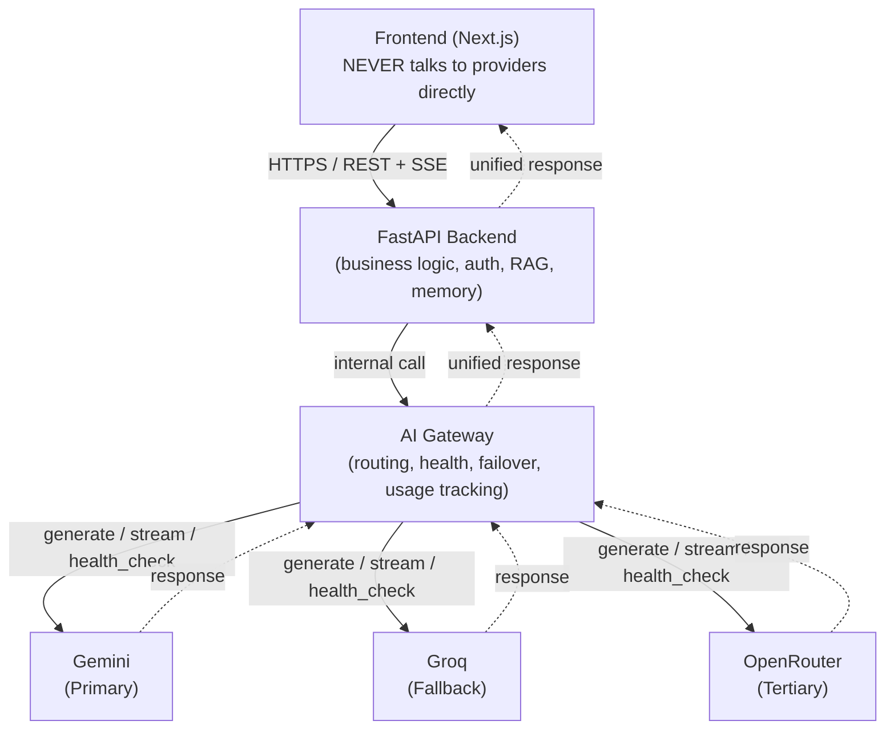

**Architectural boundary rules:**

- The **Frontend** only ever calls the FastAPI backend's own REST/SSE endpoints (e.g., `POST /chat/{id}/messages`). It has zero knowledge of Gemini, Groq, or OpenRouter.
- The **Backend** owns business logic (auth, RAG retrieval, memory injection, conversation persistence) and delegates *only* the act of generating a completion to the Gateway.
- The **AI Gateway** is a dedicated internal module/service that owns all provider routing, health monitoring, retries, fallback, and usage tracking.
- **Providers** are interchangeable, swappable implementations behind a single interface — the Gateway is the only code that imports a provider SDK.

---

## 3. Provider Abstraction Layer

Every provider — current or future — implements the same `BaseProvider` interface. This is the single most important contract in the AI Gateway.

```python
# gateway/providers/base.py
from abc import ABC, abstractmethod
from typing import AsyncIterator
from gateway.schemas import GenerateRequest, GenerateResponse, HealthStatus


class BaseProvider(ABC):
    """
    Contract that every AI provider integration must implement.
    The Gateway's routing logic depends ONLY on this interface —
    never on a provider's native SDK shape.
    """

    name: str  # e.g. "gemini", "groq", "openrouter"

    @abstractmethod
    async def generate(self, request: GenerateRequest) -> GenerateResponse:
        """
        Perform a single, non-streaming completion request.
        Must raise a normalized ProviderError on failure
        (timeout, rate limit, malformed response, etc.).
        """
        ...

    @abstractmethod
    async def stream(self, request: GenerateRequest) -> AsyncIterator[str]:
        """
        Perform a streaming completion request, yielding
        incremental text chunks (for SSE relay to the frontend).
        """
        ...

    @abstractmethod
    async def health_check(self) -> HealthStatus:
        """
        Lightweight check (ping endpoint or minimal request) used
        by the periodic health monitor. Must return quickly and
        never block the request-serving path.
        """
        ...
```

| Method | Responsibility | Failure Behavior |
|---|---|---|
| `generate()` | Synchronous-style single completion call; returns full text + usage metadata. | Raises a normalized `ProviderError` (never lets a raw SDK exception escape). |
| `stream()` | Async generator yielding text chunks for token-by-token streaming to the frontend via SSE. | Raises `ProviderError` on the first failed chunk; partial output is discarded by the router unless explicitly configured otherwise. |
| `health_check()` | Cheap liveness/capacity probe used by the background health monitor (Section 8). | Returns a `HealthStatus` object — never raises; failures are captured *as* an unhealthy status. |

**Why this abstraction is mandatory:** the Gateway's routing algorithm, retry logic, and fallback chain are written once, against `BaseProvider`. Adding a new vendor never touches that logic — it only requires a new class satisfying this interface (see [Section 17](#17-future-expansion)).

---

## 4. Provider Architecture

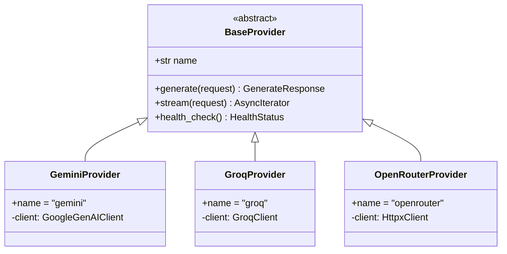

| Provider | Role | Notes |
|---|---|---|
| **GeminiProvider** | Primary | Wraps the Google Generative AI SDK. Translates `GenerateRequest` into Gemini's request shape; translates Gemini responses/errors back into the normalized `GenerateResponse` / `ProviderError`. |
| **GroqProvider** | Fallback | Wraps Groq's OpenAI-compatible chat completions API. Used when Gemini is unhealthy, rate-limited, or fails mid-request. |
| **OpenRouterProvider** | Tertiary | Wraps OpenRouter's unified API, itself a router across many underlying models — acts as PrimeX AI's "last line of defense" before surfacing an error to the user. |

**Per-provider module structure:**

```
gateway/
├── providers/
│   ├── base.py                 # BaseProvider interface
│   ├── gemini_provider.py
│   ├── groq_provider.py
│   ├── openrouter_provider.py
│   └── registry.py             # Maps provider name -> instance
├── router.py                   # Selection + fallback orchestration
├── health/
│   ├── monitor.py               # Periodic health check loop
│   └── state.py                 # In-memory/cache health state
├── schemas.py                   # GenerateRequest/Response, HealthStatus
├── usage_tracker.py
└── errors.py                    # ProviderError, RateLimitError, etc.
```

Each provider class is **independently replaceable**: deleting `groq_provider.py` and removing one line from `registry.py` fully removes Groq from the system with no other code changes — satisfying the architecture rule that providers must be independently replaceable.

---

## 5. Routing Flow

Default fallback chain, in priority order:

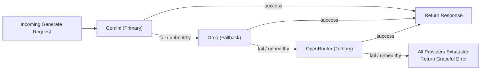

The chain is **configuration-driven**, not hardcoded:

```python
# gateway/config.py
DEFAULT_PROVIDER_CHAIN = ["gemini", "groq", "openrouter"]
```

This allows the chain order to change (e.g., promoting Groq to primary for latency-sensitive requests) without touching router logic — only configuration.

---

## 6. Provider Selection Algorithm

Provider selection is not purely "first in the list" — it weighs current health, rate-limit headroom, cost, and observed latency before falling back to static chain order.

```text
FUNCTION select_provider(chain, request):
    candidates = []

    FOR provider_name IN chain:
        state = health_state.get(provider_name)

        IF state.status == DISABLED:
            CONTINUE  # operator has manually disabled this provider

        IF state.status == FAILED AND NOT cooldown_expired(state):
            CONTINUE  # still in circuit-breaker cooldown

        score = compute_score(
            health        = state.status,           # HEALTHY > LIMITED > FAILED(recovering)
            latency_p95   = state.avg_latency_ms,
            cost_per_1k   = provider_cost_table[provider_name],
            rate_headroom = state.remaining_quota,
        )
        candidates.append((provider_name, score))

    IF candidates IS EMPTY:
        RAISE AllProvidersUnavailableError

    SORT candidates BY score DESCENDING
    RETURN candidates[0].provider_name


FUNCTION compute_score(health, latency_p95, cost_per_1k, rate_headroom):
    health_weight   = {"HEALTHY": 1.0, "LIMITED": 0.5, "FAILED": 0.0}[health]
    latency_weight  = 1 / (1 + latency_p95 / 1000)       # lower latency -> higher score
    cost_weight     = 1 / (1 + cost_per_1k)              # cheaper -> higher score
    headroom_weight = min(rate_headroom / 100, 1.0)      # more quota left -> higher score

    RETURN (
        0.5 * health_weight +
        0.2 * latency_weight +
        0.2 * cost_weight +
        0.1 * headroom_weight
    )
```

| Factor | Weight (default) | Rationale |
|---|---|---|
| Health status | 50% | Reliability dominates — never prefer a cheap, fast, *unhealthy* provider. |
| Latency (p95) | 20% | Chat is interactive; slow providers degrade perceived quality. |
| Cost per 1K tokens | 20% | Supports the project's "free-tier to enterprise without redesign" cost goals. |
| Rate-limit headroom | 10% | Avoids hammering a provider that's about to throttle. |

**Note:** when the default chain order (`gemini → groq → openrouter`) and the scoring algorithm agree, the system behaves exactly like a simple fallback chain. The scoring algorithm only changes behavior when health/cost/latency signals diverge from that default — e.g., temporarily preferring Groq if Gemini is `LIMITED`.

---

## 7. Provider Health States

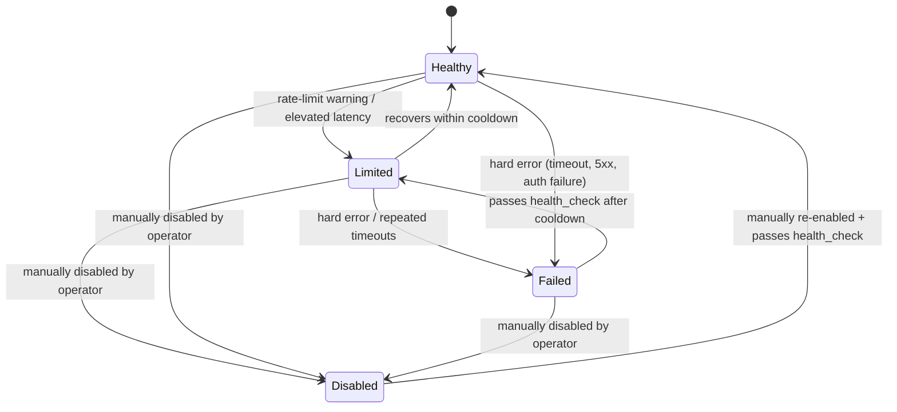

| State | Meaning | Routing Behavior |
|---|---|---|
| **Healthy** | Passing health checks, normal latency, quota available. | Eligible for selection at full priority. |
| **Limited** | Approaching rate limits or showing elevated latency/error rate. | Still eligible, but scored lower — deprioritized in favor of healthier providers. |
| **Failed** | Hard failure (timeout, 5xx, auth error) or circuit breaker tripped. | Excluded from selection until cooldown expires and a health check passes. |
| **Disabled** | Manually turned off by an operator (e.g., maintenance, contract issue). | Always excluded, regardless of health checks, until manually re-enabled. |

**Transition rules:**

- `Healthy → Limited`: triggered by either a rate-limit response header nearing threshold, or a rolling latency average exceeding a configured ceiling.
- `Limited → Failed`: triggered by a hard error, or by `Limited` persisting past a configured time window without recovery.
- `Failed → Limited`: triggered automatically once a scheduled health check succeeds after the cooldown window (Section 8/9).
- `* → Disabled`: only via explicit operator action (config flag or admin endpoint) — never automatic.
- `Disabled → Healthy`: only via explicit operator action, followed by a successful health check before the provider re-enters real traffic.

---

## 8. Health Check Architecture

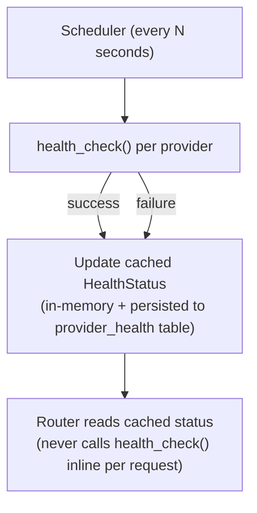

| Principle | Detail |
|---|---|
| **Periodic, not per-request** | A background scheduler (e.g., every 15–30 seconds) calls each provider's `health_check()`. The request-serving path never performs a live health check inline — that would add latency to every user request. |
| **Caching** | The latest `HealthStatus` per provider is cached in-memory (and mirrored to the `provider_health` table for observability/admin dashboards). The router reads this cache synchronously. |
| **Recovery rules** | A `Failed` provider is retried by the scheduler after a cooldown (e.g., 60s, then exponential backoff up to a cap). Two consecutive successful health checks are required before a provider transitions back to `Healthy` (prevents flapping). |
| **Fail-safe default** | If the health monitor itself has never run yet (e.g., on cold start), all providers default to `Healthy` so the system attempts real traffic immediately rather than blocking on monitor warm-up. |
| **Decoupling** | Health monitoring runs as an independent async task/loop from request handling — a slow or hung health check can never block a live chat request. |

---

## 9. Retry Strategy

| Mechanism | Configuration | Purpose |
|---|---|---|
| **Per-provider retries** | Max 2 retries per provider before moving to the next provider in the chain | Absorbs transient blips (single dropped connection, momentary 503) without immediately failing over. |
| **Timeouts** | Connect timeout: 5s · Read timeout: 30s (non-streaming) / 60s (streaming idle timeout) | Prevents a slow provider from stalling the whole request chain. |
| **Exponential backoff** | `delay = base_delay * (2 ** attempt) + jitter`, base_delay = 250ms, cap = 4s | Avoids hammering an already-struggling provider; jitter prevents thundering-herd retries across concurrent requests. |
| **Circuit breaker** | Opens after 5 consecutive failures within a rolling 60s window; stays open for a cooldown period (starts at 60s, doubles on repeated trips, caps at 10 min) | Stops sending traffic to a clearly broken provider, giving it time to recover and protecting overall request latency. |

```text
FUNCTION call_with_retry(provider, request, max_retries=2):
    FOR attempt IN 0..max_retries:
        IF circuit_breaker.is_open(provider.name):
            RAISE ProviderUnavailableError(provider.name)

        TRY:
            RETURN AWAIT provider.generate(request)
        CATCH TimeoutError, ProviderError AS err:
            circuit_breaker.record_failure(provider.name)
            IF attempt == max_retries:
                RAISE err
            delay = min(0.25 * (2 ** attempt) + random_jitter(), 4.0)
            AWAIT sleep(delay)
```

**Circuit breaker state is shared with the health-state cache** (Section 7/8) — a breaker trip immediately marks the provider `Failed`, so subsequent requests skip straight to fallback without re-attempting a known-broken provider.

---

## 10. Automatic Fallback Logic

### Step-by-Step Flow

1. Backend calls `gateway.generate(request)`.
2. Router calls `select_provider()` (Section 6) → returns highest-scoring eligible provider (e.g., Gemini).
3. Router calls `call_with_retry(gemini, request)`.
4. **If Gemini succeeds:** response is returned, usage is logged, done.
5. **If Gemini exhausts retries:** Gemini's health state is updated (→ `Limited` or `Failed`), and the router immediately re-runs `select_provider()` excluding Gemini.
6. Router selects Groq, repeats steps 3–5.
7. If Groq also fails, router selects OpenRouter, repeats steps 3–5.
8. **If all three fail:** router raises `AllProvidersUnavailableError`; backend returns a graceful, user-friendly error to the frontend (Section 14) — never a raw stack trace.

### Example

> Gemini is mid-outage (returning 503s). Request 1 arrives: Gemini retries twice (Section 9), both fail, Gemini flips to `Failed`. Router falls back to Groq within the same request — Groq succeeds. The user sees a normal response, with added latency of only the two failed Gemini attempts (roughly 1–2 seconds), and no visible error. Request 2, seconds later, skips Gemini entirely (cached `Failed` state) and goes straight to Groq — no wasted retry cost.

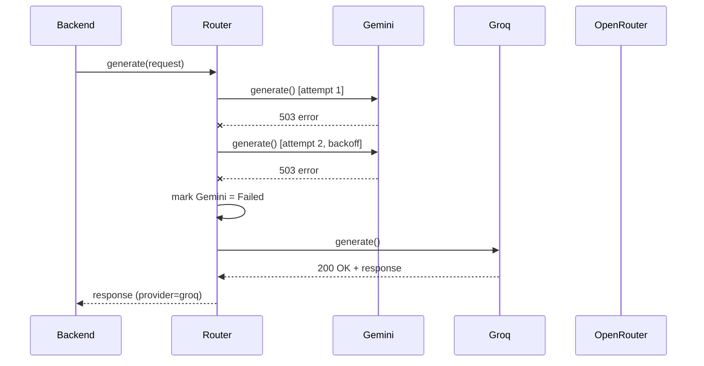

---

## 11. Streaming Response Architecture

PrimeX AI's chat experience requires token-by-token streaming, relayed end-to-end via **Server-Sent Events (SSE)**.

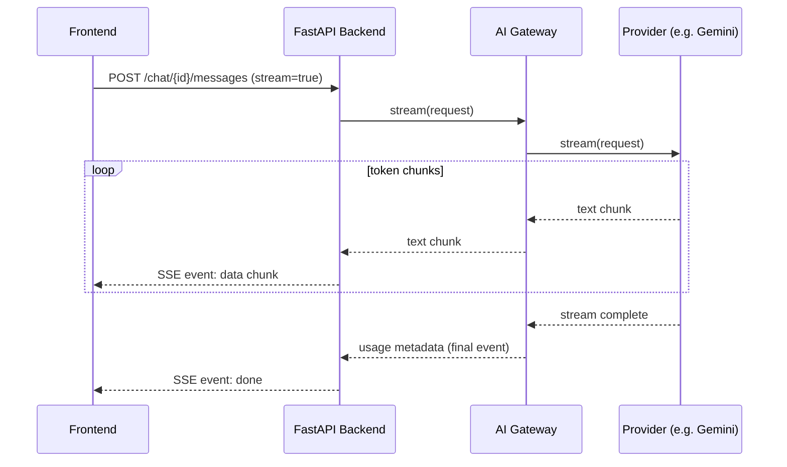

| Layer | Responsibility |
|---|---|
| **Provider `stream()`** | Yields raw text chunks as an async generator, normalized to plain strings regardless of the provider's native streaming format (Gemini's chunked JSON, Groq's OpenAI-style SSE deltas, etc.). |
| **Gateway** | Relays chunks from the selected provider; on a mid-stream failure, the Gateway **does not** silently switch providers mid-stream (that would risk duplicated/garbled output) — instead it terminates the stream with an error event, and the backend may offer a "regenerate" action that retries via fallback from scratch. |
| **Backend** | Wraps Gateway chunks into SSE `data:` events over an HTTP streaming response; appends a final `done` event carrying usage metadata for persistence. |
| **Frontend** | Consumes SSE via `EventSource`/`fetch` streaming reader inside `features/chat/services/chat.service.ts` and `services/websocket/`, appending chunks to the active message bubble in real time. |

**Why no mid-stream provider switch:** failing over mid-stream would require either discarding partial output (confusing UX) or stitching together two providers' partial completions (unreliable, inconsistent tone/format). Instead, a fresh `generate`/`stream` call restarts cleanly through the full fallback chain.

---

## 12. Usage Tracking

Every single provider call — streaming or not, successful or failed — is recorded for cost visibility, quota management, and future billing.

| Field | Type | Description |
|---|---|---|
| `user_id` | UUID | Identifies which user's request generated this usage |
| `provider` | string | `gemini` \| `groq` \| `openrouter` |
| `model` | string | Specific model used (e.g., `gemini-2.0-flash`, `llama-3.3-70b`) |
| `prompt_tokens` | integer | Tokens in the input prompt |
| `completion_tokens` | integer | Tokens in the generated output |
| `total_tokens` | integer | Sum of prompt + completion tokens |
| `latency_ms` | integer | End-to-end time from request dispatch to final token/response |
| `cost_usd` | decimal | Computed cost based on the provider's per-token pricing table |
| `timestamp` | datetime (UTC) | When the request was made |

```python
# gateway/usage_tracker.py
async def record_usage(
    user_id: UUID,
    provider: str,
    model: str,
    prompt_tokens: int,
    completion_tokens: int,
    latency_ms: int,
) -> None:
    total_tokens = prompt_tokens + completion_tokens
    cost_usd = compute_cost(provider, model, prompt_tokens, completion_tokens)

    await db.provider_usage.insert(
        user_id=user_id,
        provider=provider,
        model=model,
        prompt_tokens=prompt_tokens,
        completion_tokens=completion_tokens,
        total_tokens=total_tokens,
        latency_ms=latency_ms,
        cost_usd=cost_usd,
        timestamp=datetime.now(timezone.utc),
    )
```

Usage records feed: per-user usage dashboards (frontend `features/usage/`), cost-optimization scoring (Section 6/15), and capacity planning.

---

## 13. Database Tables

### `provider_usage`

| Column | Type | Constraints |
|---|---|---|
| `id` | `BIGSERIAL` | `PRIMARY KEY` |
| `user_id` | `UUID` | `NOT NULL`, `REFERENCES users(id) ON DELETE CASCADE` |
| `chat_id` | `UUID` | `NULL`, `REFERENCES chat_sessions(id) ON DELETE SET NULL` |
| `provider` | `VARCHAR(32)` | `NOT NULL` |
| `model` | `VARCHAR(128)` | `NOT NULL` |
| `prompt_tokens` | `INTEGER` | `NOT NULL`, `CHECK (prompt_tokens >= 0)` |
| `completion_tokens` | `INTEGER` | `NOT NULL`, `CHECK (completion_tokens >= 0)` |
| `total_tokens` | `INTEGER` | `NOT NULL`, `CHECK (total_tokens >= 0)` |
| `latency_ms` | `INTEGER` | `NOT NULL`, `CHECK (latency_ms >= 0)` |
| `cost_usd` | `NUMERIC(12,6)` | `NOT NULL DEFAULT 0` |
| `status` | `VARCHAR(16)` | `NOT NULL DEFAULT 'success'` — `success` \| `failed` |
| `created_at` | `TIMESTAMPTZ` | `NOT NULL DEFAULT now()` |

**Indexes:**
- `idx_provider_usage_user_id` on `(user_id)`
- `idx_provider_usage_created_at` on `(created_at)`
- `idx_provider_usage_provider_model` on `(provider, model)`

### `provider_health`

| Column | Type | Constraints |
|---|---|---|
| `id` | `BIGSERIAL` | `PRIMARY KEY` |
| `provider` | `VARCHAR(32)` | `NOT NULL`, `UNIQUE` |
| `status` | `VARCHAR(16)` | `NOT NULL DEFAULT 'healthy'` — `healthy` \| `limited` \| `failed` \| `disabled` |
| `consecutive_failures` | `INTEGER` | `NOT NULL DEFAULT 0` |
| `avg_latency_ms` | `INTEGER` | `NULL` |
| `last_checked_at` | `TIMESTAMPTZ` | `NOT NULL DEFAULT now()` |
| `last_success_at` | `TIMESTAMPTZ` | `NULL` |
| `last_failure_at` | `TIMESTAMPTZ` | `NULL` |
| `cooldown_until` | `TIMESTAMPTZ` | `NULL` |
| `disabled_by` | `UUID` | `NULL`, `REFERENCES users(id)` — admin who manually disabled, if applicable |
| `updated_at` | `TIMESTAMPTZ` | `NOT NULL DEFAULT now()` |

**Indexes:**
- `idx_provider_health_provider` (unique) on `(provider)`
- `idx_provider_health_status` on `(status)`

> `provider_health` holds exactly one row per provider and is upserted by the health monitor (Section 8); it is the durable mirror of the in-memory cache the router reads on every request.

---

## 14. Error Handling

| Scenario | Detection | Handling |
|---|---|---|
| **Provider timeout** | `asyncio.TimeoutError` / read timeout exceeded | Counted as a retry-able failure (Section 9); triggers fallback if retries exhausted. |
| **Rate limit exceeded** | Provider returns 429 / quota-exceeded error code | Provider marked `Limited` immediately (no need to wait for the health monitor); router fails over to the next provider for this request. |
| **Provider unavailable** | 5xx response, connection refused, or DNS failure | Treated like a timeout — retry, then fail over; provider marked `Failed` after retries exhaust. |
| **Malformed response** | Response fails schema validation (missing `text`, invalid JSON, truncated stream) | Treated as a `ProviderError`; does **not** get retried against the same provider (a malformed response usually won't fix itself) — fails over to the next provider directly. |
| **All providers exhausted** | Every provider in the chain raised | Backend catches `AllProvidersUnavailableError`, returns a clean `503`-style API error (`{"code": "AI_SERVICE_UNAVAILABLE"}`) to the frontend; frontend shows a friendly retry prompt via Sonner toast — never a raw error or stack trace. |

```python
# gateway/errors.py
class ProviderError(Exception):
    """Base class for all provider-related errors."""

class RateLimitError(ProviderError):
    """Provider responded with a rate-limit/quota error."""

class ProviderTimeoutError(ProviderError):
    """Provider did not respond within the configured timeout."""

class MalformedResponseError(ProviderError):
    """Provider responded, but the payload failed schema validation."""

class AllProvidersUnavailableError(Exception):
    """Every provider in the configured chain failed for this request."""
```

---

## 15. Cost Optimization Strategy

| Strategy | Implementation |
|---|---|
| **Prefer cheapest healthy provider when appropriate** | The scoring algorithm (Section 6) weights cost at 20% — for cost-insensitive use cases this can be raised via config; for latency-critical paths it can be lowered. |
| **Minimize token usage** | Prompt construction in the backend trims unnecessary context, deduplicates retrieved RAG chunks, and caps memory-injection size before the request ever reaches the Gateway. |
| **Cache system prompts** | Static system/instruction prompts are cached (and, where a provider supports prompt/context caching, passed via that provider's native caching mechanism) so repeated requests in the same session don't re-transmit and re-bill identical boilerplate tokens. |
| **Batch where possible** | Non-interactive workloads (e.g., bulk re-embedding, summarization jobs) are routed through the cheapest available provider rather than the latency-optimized default chain. |
| **Usage-based alerting** | `provider_usage` aggregates feed budget alerts so cost anomalies (a runaway loop, an abusive user) are caught before they become a billing surprise. |

---

## 16. Logging Strategy

All Gateway logs are **structured JSON**, designed for ingestion by any log aggregator (e.g., CloudWatch, Loki, Datadog) without custom parsing.

```json
{
  "timestamp": "2026-06-24T10:15:32.481Z",
  "level": "INFO",
  "event": "provider_request_completed",
  "trace_id": "a1b2c3d4-e5f6-7890-abcd-ef1234567890",
  "user_id": "9f3c2e10-...",
  "provider": "gemini",
  "model": "gemini-2.0-flash",
  "attempt": 1,
  "latency_ms": 842,
  "status": "success",
  "total_tokens": 512
}
```

| Practice | Detail |
|---|---|
| **Structured JSON logs** | Every log line is a single JSON object — never freeform interpolated strings — enabling reliable filtering/alerting. |
| **Request tracing** | A `trace_id` is generated at the backend entry point and threaded through every Gateway/provider log line for that request, enabling full request reconstruction across retries and fallbacks. |
| **Error logs** | Failures log the `ProviderError` subtype, the provider name, attempt number, and the resulting routing decision (e.g., "fell back to groq"). |
| **No secrets in logs** | API keys, raw user prompts, and full completions are never logged at INFO level; only metadata (token counts, latency, status) is logged by default — full payloads only at DEBUG level in non-production environments. |

---

## 17. Future Expansion

Because every provider implements `BaseProvider` (Section 3), adding a new vendor is a **closed, additive change**:

```python
# gateway/providers/claude_provider.py
class ClaudeProvider(BaseProvider):
    name = "claude"

    async def generate(self, request: GenerateRequest) -> GenerateResponse:
        ...

    async def stream(self, request: GenerateRequest) -> AsyncIterator[str]:
        ...

    async def health_check(self) -> HealthStatus:
        ...
```

```python
# gateway/providers/registry.py
PROVIDER_REGISTRY = {
    "gemini": GeminiProvider(),
    "groq": GroqProvider(),
    "openrouter": OpenRouterProvider(),
    "claude": ClaudeProvider(),      # ← new provider, zero router changes
}
```

| Future Provider | Integration Note |
|---|---|
| **Claude** | Standard cloud API provider — same shape as Gemini/Groq integration. |
| **OpenAI** | Standard cloud API provider; OpenRouter integration already proves the OpenAI-compatible chat-completions pattern works in this architecture. |
| **Ollama** | Local/self-hosted model runner — `health_check()` simply pings the local Ollama daemon; enables fully offline/on-prem deployments, directly serving the "scales from free-tier to enterprise" goal. |
| **Local LLMs** | Any self-hosted inference server (vLLM, TGI, llama.cpp server) integrates the same way as Ollama — a thin `BaseProvider` wrapper around an HTTP endpoint. |
| **Mistral** | Standard cloud API provider. |
| **DeepSeek** | Standard cloud API provider. |

**Updating the chain** to include a new provider is a one-line config change:

```python
DEFAULT_PROVIDER_CHAIN = ["gemini", "groq", "openrouter", "claude"]
```

No change to `router.py`, `health/monitor.py`, or `usage_tracker.py` is required — this is the direct payoff of the abstraction defined in Section 3.

---

## 18. Security Considerations

| Concern | Mitigation |
|---|---|
| **API key protection** | All provider API keys live server-side only (Gateway environment/secrets store); never exposed to the backend's public API surface, and never reach the frontend under any circumstance. |
| **Secrets management** | Keys are loaded from a dedicated secrets manager (e.g., environment variables injected by the deployment platform, or a vault service in production) — never committed to source control, never logged. |
| **Rate limiting (inbound)** | The backend enforces per-user rate limits *before* a request reaches the Gateway, preventing a single abusive user from exhausting provider quota for everyone. |
| **Rate limiting (outbound)** | The Gateway tracks per-provider quota usage (Section 6/12) to proactively throttle outbound requests before hitting a hard provider-side limit. |
| **Input validation** | All requests reaching the Gateway are validated against a strict `GenerateRequest` schema (Pydantic) before being forwarded to any provider — malformed or oversized payloads are rejected at the backend boundary. |
| **Least privilege** | Each provider's API key is scoped to only the capabilities PrimeX AI uses (e.g., no billing/account-management scopes), limiting blast radius if a key is ever compromised. |
| **No frontend provider exposure** | Reinforcing the core architecture rule: the frontend has no provider SDKs, no provider API keys, and no network path to any AI provider — it only ever talks to the FastAPI backend. |

---

## 19. Sequence Diagrams

### 19.1 Normal Request (Primary Provider Succeeds)

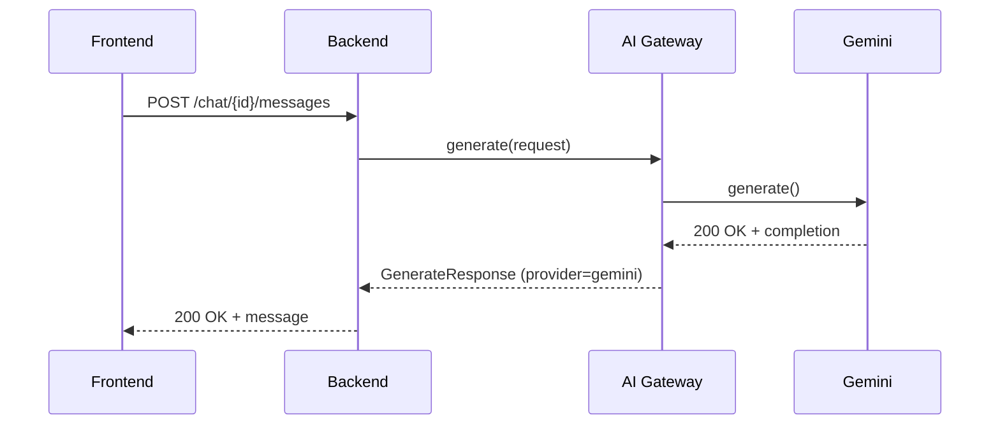

### 19.2 Fallback Request (Primary Fails, Fallback Succeeds)

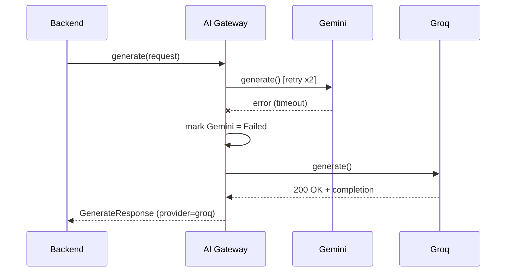

### 19.3 Provider Failure (All Providers Exhausted)

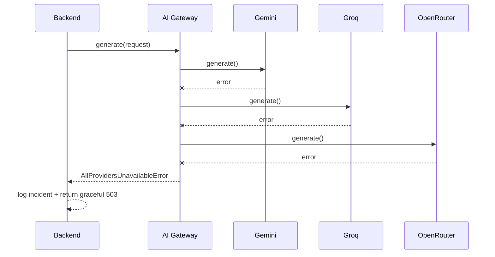

### 19.4 Streaming Request

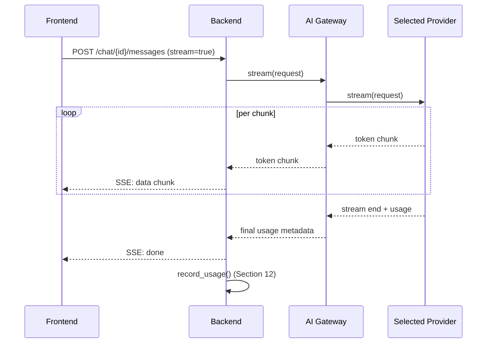

---

## 20. Final Recommendations

1. **Never let business logic import a provider SDK directly.** Only files inside `gateway/providers/` may import `google-generativeai`, `groq`, or OpenRouter's HTTP client — everything else depends on `BaseProvider` and `GenerateRequest`/`GenerateResponse` only.
2. **Treat the health cache as the single source of routing truth.** The router must never call `health_check()` synchronously inside the request path — always read the cached state populated by the background monitor (Section 8).
3. **Keep the provider chain configuration-driven.** Promoting/demoting providers, or inserting a new one, should always be a config/registry change — never a code change to `router.py`.
4. **Log every attempt, not just the final outcome.** Full request tracing (Section 16) is what makes fallback behavior debuggable in production incidents.
5. **Re-validate cost weights periodically.** Provider pricing changes; the cost table feeding the selection algorithm (Section 6) should be reviewed on a regular cadence, not hardcoded and forgotten.
6. **Design every new provider against the abstraction first.** Before integrating Claude, OpenAI, Ollama, Mistral, or DeepSeek, write the `BaseProvider` subclass and a unit test against the shared interface contract — this is what keeps the "without redesign" promise true as the provider list grows.
7. **Pair this document with `10_Frontend_Folder_Structure.md`** to see exactly how the frontend's `services/api` layer calls the backend (never the Gateway or providers directly), keeping the vendor-independence boundary intact end-to-end.

---

*End of Document 13 — AI Provider Routing.*
